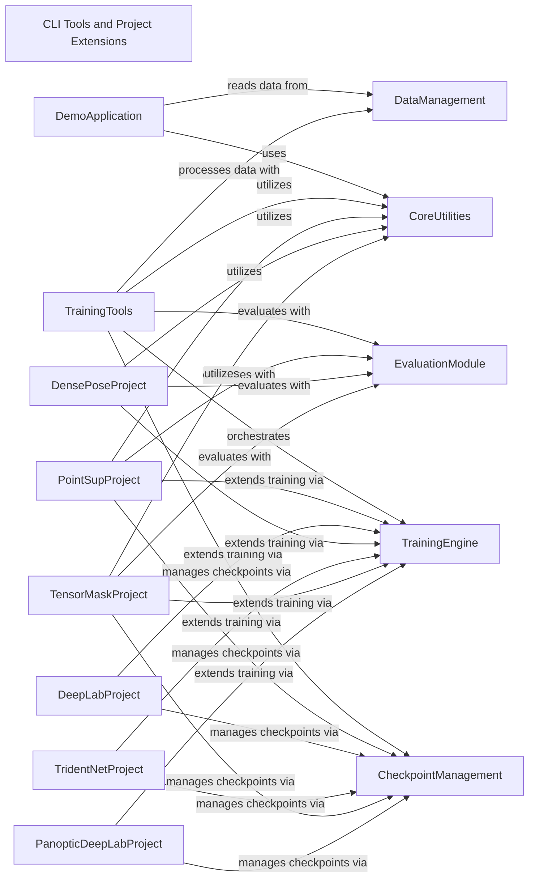

## Component Details

This graph illustrates the structure and interactions of the CLI Tools and Project Extensions subsystem within Detectron2. It highlights how various command-line entry points for training, inference, analysis, and data visualization are organized, along with specialized project-specific extensions that build upon the core framework. The system leverages core utilities, data management, and a robust training engine to provide a comprehensive and extensible platform for computer vision tasks.

### CLI Tools and Project Extensions

Provides the main command-line entry points for interacting with Detectron2, enabling users to train models, perform inference, analyze models, and visualize data. It also serves as a container for specialized project-specific implementations that extend the core framework's capabilities.

**Related Classes/Methods**:

- <a href="https://github.com/facebookresearch/detectron2/blob/master/tools/train_net.py#L124-L150" target="_blank" rel="noopener noreferrer">`detectron2.tools.train_net.main` (124:150)</a>

- <a href="https://github.com/facebookresearch/detectron2/blob/master/demo/demo.py#L93-L190" target="_blank" rel="noopener noreferrer">`detectron2.demo.demo.main` (93:190)</a>

- <a href="https://github.com/facebookresearch/detectron2/blob/master/tools/analyze_model.py#L116-L160" target="_blank" rel="noopener noreferrer">`detectron2.tools.analyze_model.main` (116:160)</a>

- <a href="https://github.com/facebookresearch/detectron2/blob/master/tools/visualize_data.py#L47-L95" target="_blank" rel="noopener noreferrer">`detectron2.tools.visualize_data.main` (47:95)</a>

- <a href="https://github.com/facebookresearch/detectron2/blob/master/tools/benchmark.py#L175-L206" target="_blank" rel="noopener noreferrer">`detectron2.tools.benchmark.main` (175:206)</a>

- <a href="https://github.com/facebookresearch/detectron2/blob/master/projects/PointSup/train_net.py#L80-L102" target="_blank" rel="noopener noreferrer">`detectron2.projects.PointSup.train_net.main` (80:102)</a>

- <a href="https://github.com/facebookresearch/detectron2/blob/master/projects/DeepLab/train_net.py#L110-L123" target="_blank" rel="noopener noreferrer">`detectron2.projects.DeepLab.train_net.main` (110:123)</a>

- <a href="https://github.com/facebookresearch/detectron2/blob/master/projects/DensePose/train_net.py#L38-L62" target="_blank" rel="noopener noreferrer">`detectron2.projects.DensePose.train_net.main` (38:62)</a>

- <a href="https://github.com/facebookresearch/detectron2/blob/master/projects/TridentNet/train_net.py#L41-L54" target="_blank" rel="noopener noreferrer">`detectron2.projects.TridentNet.train_net.main` (41:54)</a>

- <a href="https://github.com/facebookresearch/detectron2/blob/master/projects/TensorMask/train_net.py#L42-L57" target="_blank" rel="noopener noreferrer">`detectron2.projects.TensorMask.train_net.main` (42:57)</a>

- <a href="https://github.com/facebookresearch/detectron2/blob/master/projects/Panoptic-DeepLab/train_net.py#L147-L160" target="_blank" rel="noopener noreferrer">`detectron2.projects.Panoptic-DeepLab.train_net.main` (147:160)</a>

### DemoApplication

Handles demonstration-related functionalities, including argument parsing, configuration setup, image reading, and video format testing.

**Related Classes/Methods**:

- <a href="https://github.com/facebookresearch/detectron2/blob/master/demo/demo.py#L93-L190" target="_blank" rel="noopener noreferrer">`detectron2.demo.demo.main` (93:190)</a>

- <a href="https://github.com/facebookresearch/detectron2/blob/master/demo/demo.py#L39-L73" target="_blank" rel="noopener noreferrer">`detectron2.demo.demo.get_parser` (39:73)</a>

- <a href="https://github.com/facebookresearch/detectron2/blob/master/demo/demo.py#L23-L36" target="_blank" rel="noopener noreferrer">`detectron2.demo.demo.setup_cfg` (23:36)</a>

- <a href="https://github.com/facebookresearch/detectron2/blob/master/demo/demo.py#L76-L90" target="_blank" rel="noopener noreferrer">`detectron2.demo.demo.test_opencv_video_format` (76:90)</a>

### CoreUtilities

Provides essential utility functions for logging, inter-process communication, environment collection, and visualizer functionalities for displaying results.

**Related Classes/Methods**:

- <a href="https://github.com/facebookresearch/detectron2/blob/master/detectron2/utils/logger.py#L43-L113" target="_blank" rel="noopener noreferrer">`detectron2.utils.logger.setup_logger` (43:113)</a>

- <a href="https://github.com/facebookresearch/detectron2/blob/master/detectron2/utils/comm.py#L102-L103" target="_blank" rel="noopener noreferrer">`detectron2.utils.comm.is_main_process` (102:103)</a>

- <a href="https://github.com/facebookresearch/detectron2/blob/master/detectron2/utils/collect_env.py#L55-L216" target="_blank" rel="noopener noreferrer">`detectron2.utils.collect_env.collect_env_info` (55:216)</a>

- <a href="https://github.com/facebookresearch/detectron2/blob/master/detectron2/utils/visualizer.py#L331-L1281" target="_blank" rel="noopener noreferrer">`detectron2.utils.visualizer.Visualizer` (331:1281)</a>

- <a href="https://github.com/facebookresearch/detectron2/blob/master/detectron2/utils/visualizer.py#L621-L761" target="_blank" rel="noopener noreferrer">`detectron2.utils.visualizer.Visualizer.overlay_instances` (621:761)</a>

- <a href="https://github.com/facebookresearch/detectron2/blob/master/detectron2/utils/visualizer.py#L550-L619" target="_blank" rel="noopener noreferrer">`detectron2.utils.visualizer.Visualizer.draw_dataset_dict` (550:619)</a>

### DataManagement

Manages data loading, processing, and cataloging for detection tasks, including reading images, converting formats, and building data loaders.

**Related Classes/Methods**:

- <a href="https://github.com/facebookresearch/detectron2/blob/master/detectron2/data/detection_utils.py#L166-L186" target="_blank" rel="noopener noreferrer">`detectron2.data.detection_utils.read_image` (166:186)</a>

- <a href="https://github.com/facebookresearch/detectron2/blob/master/detectron2/data/detection_utils.py#L93-L116" target="_blank" rel="noopener noreferrer">`detectron2.data.detection_utils.convert_image_to_rgb` (93:116)</a>

- <a href="https://github.com/facebookresearch/detectron2/blob/master/detectron2/data/catalog.py#L194-L207" target="_blank" rel="noopener noreferrer">`detectron2.data.catalog._MetadataCatalog.get` (194:207)</a>

- <a href="https://github.com/facebookresearch/detectron2/blob/master/detectron2/data/catalog.py#L40-L58" target="_blank" rel="noopener noreferrer">`detectron2.data.catalog._DatasetCatalog.get` (40:58)</a>

- <a href="https://github.com/facebookresearch/detectron2/blob/master/detectron2/data/build.py#L521-L583" target="_blank" rel="noopener noreferrer">`detectron2.data.build.build_detection_train_loader` (521:583)</a>

- <a href="https://github.com/facebookresearch/detectron2/blob/master/detectron2/data/build.py#L77-L108" target="_blank" rel="noopener noreferrer">`detectron2.data.build.filter_images_with_few_keypoints` (77:108)</a>

### TrainingEngine

Encapsulates the core training and testing loop, including model building, checkpoint handling, hook registration, and overall training execution. It provides default implementations for common training tasks.

**Related Classes/Methods**:

- <a href="https://github.com/facebookresearch/detectron2/blob/master/detectron2/engine/defaults.py#L542-L553" target="_blank" rel="noopener noreferrer">`detectron2.engine.defaults.DefaultTrainer.build_model` (542:553)</a>

- <a href="https://github.com/facebookresearch/detectron2/blob/master/detectron2/engine/defaults.py#L613-L666" target="_blank" rel="noopener noreferrer">`detectron2.engine.defaults.DefaultTrainer.test` (613:666)</a>

- <a href="https://github.com/facebookresearch/detectron2/blob/master/detectron2/engine/defaults.py#L432-L450" target="_blank" rel="noopener noreferrer">`detectron2.engine.defaults.DefaultTrainer.resume_or_load` (432:450)</a>

- <a href="https://github.com/facebookresearch/detectron2/blob/master/detectron2/engine/defaults.py#L513-L526" target="_blank" rel="noopener noreferrer">`detectron2.engine.defaults.DefaultTrainer.train` (513:526)</a>

- <a href="https://github.com/facebookresearch/detectron2/blob/master/detectron2/engine/defaults.py#L82-L143" target="_blank" rel="noopener noreferrer">`detectron2.engine.defaults.default_argument_parser` (82:143)</a>

- <a href="https://github.com/facebookresearch/detectron2/blob/master/detectron2/engine/train_loop.py#L121-L137" target="_blank" rel="noopener noreferrer">`detectron2.engine.train_loop.TrainerBase.register_hooks` (121:137)</a>

- <a href="https://github.com/facebookresearch/detectron2/blob/master/detectron2/engine/hooks.py#L502-L564" target="_blank" rel="noopener noreferrer">`detectron2.engine.hooks.EvalHook` (502:564)</a>

- <a href="https://github.com/facebookresearch/detectron2/blob/master/detectron2/engine/launch.py#L27-L84" target="_blank" rel="noopener noreferrer">`detectron2.engine.launch.launch` (27:84)</a>

### CheckpointManagement

Handles saving and loading model checkpoints during training and inference.

**Related Classes/Methods**:

- <a href="https://github.com/facebookresearch/detectron2/blob/master/detectron2/checkpoint/detection_checkpoint.py#L16-L143" target="_blank" rel="noopener noreferrer">`detectron2.checkpoint.detection_checkpoint.DetectionCheckpointer` (16:143)</a>

### EvaluationModule

Provides functionalities for evaluating model performance and verifying results.

**Related Classes/Methods**:

- <a href="https://github.com/facebookresearch/detectron2/blob/master/detectron2/evaluation/testing.py#L31-L65" target="_blank" rel="noopener noreferrer">`detectron2.evaluation.testing.verify_results` (31:65)</a>

### TrainingTools

Contains command-line tools for training, analyzing, visualizing data, and benchmarking models within the Detectron2 framework.

**Related Classes/Methods**:

- <a href="https://github.com/facebookresearch/detectron2/blob/master/tools/train_net.py#L124-L150" target="_blank" rel="noopener noreferrer">`detectron2.tools.train_net:main` (124:150)</a>

- <a href="https://github.com/facebookresearch/detectron2/blob/master/tools/train_net.py#L112-L121" target="_blank" rel="noopener noreferrer">`detectron2.tools.train_net.setup` (112:121)</a>

- <a href="https://github.com/facebookresearch/detectron2/blob/master/tools/train_net.py#L95-L109" target="_blank" rel="noopener noreferrer">`detectron2.tools.train_net.Trainer.test_with_TTA` (95:109)</a>

- <a href="https://github.com/facebookresearch/detectron2/blob/master/tools/train_net.py#L82-L109" target="_blank" rel="noopener noreferrer">`detectron2.tools.train_net.Trainer` (82:109)</a>

- <a href="https://github.com/facebookresearch/detectron2/blob/master/tools/analyze_model.py#L116-L160" target="_blank" rel="noopener noreferrer">`detectron2.tools.analyze_model:main` (116:160)</a>

- <a href="https://github.com/facebookresearch/detectron2/blob/master/tools/analyze_model.py#L25-L37" target="_blank" rel="noopener noreferrer">`detectron2.tools.analyze_model.setup` (25:37)</a>

- <a href="https://github.com/facebookresearch/detectron2/blob/master/tools/visualize_data.py#L47-L95" target="_blank" rel="noopener noreferrer">`detectron2.tools.visualize_data:main` (47:95)</a>

- <a href="https://github.com/facebookresearch/detectron2/blob/master/tools/visualize_data.py#L27-L44" target="_blank" rel="noopener noreferrer">`detectron2.tools.visualize_data.parse_args` (27:44)</a>

- <a href="https://github.com/facebookresearch/detectron2/blob/master/tools/visualize_data.py#L17-L24" target="_blank" rel="noopener noreferrer">`detectron2.tools.visualize_data.setup` (17:24)</a>

- <a href="https://github.com/facebookresearch/detectron2/blob/master/tools/visualize_data.py#L58-L66" target="_blank" rel="noopener noreferrer">`detectron2.tools.visualize_data.main.output` (58:66)</a>

- <a href="https://github.com/facebookresearch/detectron2/blob/master/tools/benchmark.py#L175-L206" target="_blank" rel="noopener noreferrer">`detectron2.tools.benchmark:main` (175:206)</a>

- <a href="https://github.com/facebookresearch/detectron2/blob/master/tools/benchmark.py#L62-L66" target="_blank" rel="noopener noreferrer">`detectron2.tools.benchmark.RAM_msg` (62:66)</a>

### PointSupProject

Specific training and setup functionalities for the PointSup project, extending the default Detectron2 training pipeline.

**Related Classes/Methods**:

- <a href="https://github.com/facebookresearch/detectron2/blob/master/projects/PointSup/train_net.py#L80-L102" target="_blank" rel="noopener noreferrer">`detectron2.projects.PointSup.train_net:main` (80:102)</a>

- <a href="https://github.com/facebookresearch/detectron2/blob/master/projects/PointSup/train_net.py#L64-L77" target="_blank" rel="noopener noreferrer">`detectron2.projects.PointSup.train_net.setup` (64:77)</a>

- <a href="https://github.com/facebookresearch/detectron2/blob/master/projects/PointSup/train_net.py#L23-L61" target="_blank" rel="noopener noreferrer">`detectron2.projects.PointSup.train_net.Trainer` (23:61)</a>

### DeepLabProject

Specific training and setup functionalities for the DeepLab project, extending the default Detectron2 training pipeline.

**Related Classes/Methods**:

- <a href="https://github.com/facebookresearch/detectron2/blob/master/projects/DeepLab/train_net.py#L110-L123" target="_blank" rel="noopener noreferrer">`detectron2.projects.DeepLab.train_net:main` (110:123)</a>

- <a href="https://github.com/facebookresearch/detectron2/blob/master/projects/DeepLab/train_net.py#L97-L107" target="_blank" rel="noopener noreferrer">`detectron2.projects.DeepLab.train_net.setup` (97:107)</a>

- <a href="https://github.com/facebookresearch/detectron2/blob/master/projects/DeepLab/train_net.py#L42-L94" target="_blank" rel="noopener noreferrer">`detectron2.projects.DeepLab.train_net.Trainer` (42:94)</a>

### DensePoseProject

Specific training and setup functionalities for the DensePose project, including its own trainer and checkpoint handling, extending the default Detectron2 training pipeline.

**Related Classes/Methods**:

- <a href="https://github.com/facebookresearch/detectron2/blob/master/projects/DensePose/train_net.py#L38-L62" target="_blank" rel="noopener noreferrer">`detectron2.projects.DensePose.train_net:main` (38:62)</a>

- <a href="https://github.com/facebookresearch/detectron2/blob/master/projects/DensePose/train_net.py#L26-L35" target="_blank" rel="noopener noreferrer">`detectron2.projects.DensePose.train_net.setup` (26:35)</a>

- <a href="https://github.com/facebookresearch/detectron2/blob/master/projects/DensePose/densepose/modeling/densepose_checkpoint.py#L24-L37" target="_blank" rel="noopener noreferrer">`densepose.modeling.densepose_checkpoint.DensePoseCheckpointer` (24:37)</a>

- <a href="https://github.com/facebookresearch/detectron2/blob/master/projects/DensePose/densepose/engine/trainer.py#L88-L147" target="_blank" rel="noopener noreferrer">`densepose.engine.trainer.Trainer.test` (88:147)</a>

- <a href="https://github.com/facebookresearch/detectron2/blob/master/projects/DensePose/densepose/engine/trainer.py#L243-L260" target="_blank" rel="noopener noreferrer">`densepose.engine.trainer.Trainer.test_with_TTA` (243:260)</a>

- <a href="https://github.com/facebookresearch/detectron2/blob/master/projects/DensePose/densepose/engine/trainer.py#L76-L260" target="_blank" rel="noopener noreferrer">`densepose.engine.trainer.Trainer` (76:260)</a>

### TridentNetProject

Specific training and setup functionalities for the TridentNet project, extending the default Detectron2 training pipeline.

**Related Classes/Methods**:

- <a href="https://github.com/facebookresearch/detectron2/blob/master/projects/TridentNet/train_net.py#L41-L54" target="_blank" rel="noopener noreferrer">`detectron2.projects.TridentNet.train_net:main` (41:54)</a>

- <a href="https://github.com/facebookresearch/detectron2/blob/master/projects/TridentNet/train_net.py#L28-L38" target="_blank" rel="noopener noreferrer">`detectron2.projects.TridentNet.train_net.setup` (28:38)</a>

- <a href="https://github.com/facebookresearch/detectron2/blob/master/projects/TridentNet/train_net.py#L20-L25" target="_blank" rel="noopener noreferrer">`detectron2.projects.TridentNet.train_net.Trainer` (20:25)</a>

### TensorMaskProject

Specific training and setup functionalities for the TensorMask project, extending the default Detectron2 training pipeline.

**Related Classes/Methods**:

- <a href="https://github.com/facebookresearch/detectron2/blob/master/projects/TensorMask/train_net.py#L42-L57" target="_blank" rel="noopener noreferrer">`detectron2.projects.TensorMask.train_net:main` (42:57)</a>

- <a href="https://github.com/facebookresearch/detectron2/blob/master/projects/TensorMask/train_net.py#L29-L39" target="_blank" rel="noopener noreferrer">`detectron2.projects.TensorMask.train_net.setup` (29:39)</a>

- <a href="https://github.com/facebookresearch/detectron2/blob/master/projects/TensorMask/train_net.py#L21-L26" target="_blank" rel="noopener noreferrer">`detectron2.projects.TensorMask.train_net.Trainer` (21:26)</a>

### PanopticDeepLabProject

Specific training and setup functionalities for the Panoptic-DeepLab project, extending the default Detectron2 training pipeline.

**Related Classes/Methods**:

- <a href="https://github.com/facebookresearch/detectron2/blob/master/projects/Panoptic-DeepLab/train_net.py#L147-L160" target="_blank" rel="noopener noreferrer">`detectron2.projects.Panoptic-DeepLab.train_net:main` (147:160)</a>

- <a href="https://github.com/facebookresearch/detectron2/blob/master/projects/Panoptic-DeepLab/train_net.py#L134-L144" target="_blank" rel="noopener noreferrer">`detectron2.projects.Panoptic-DeepLab.train_net.setup` (134:144)</a>

- <a href="https://github.com/facebookresearch/detectron2/blob/master/projects/Panoptic-DeepLab/train_net.py#L47-L131" target="_blank" rel="noopener noreferrer">`detectron2.projects.Panoptic-DeepLab.train_net.Trainer` (47:131)</a>

### [FAQ](https://github.com/CodeBoarding/GeneratedOnBoardings/tree/main?tab=readme-ov-file#faq)