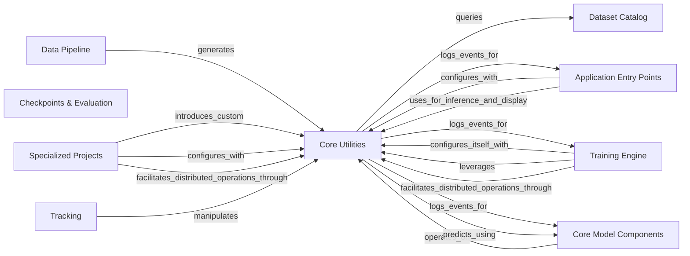

## Component Details

The Core Utilities component in Detectron2 serves as the foundational layer, offering essential functionalities across various aspects of the framework. It encompasses robust configuration management for flexible model and training pipeline setup, core data structures for representing detection-related entities like bounding boxes, masks, and keypoints, and a suite of utilities for environment setup, logging, and inter-process communication crucial for distributed operations. Additionally, it provides comprehensive visualization tools to render and display data and model outputs, enabling effective analysis and debugging.

### Core Utilities

Provides foundational utilities for configuration management, environment setup, logging, core data structures (e.g., Boxes, Instances, Masks, Keypoints, ImageList), and visualization tools for data and model outputs.

**Related Classes/Methods**:

- <a href="https://github.com/facebookresearch/detectron2/blob/master/detectron2/config/config.py#L99-L108" target="_blank" rel="noopener noreferrer">`detectron2.config.config.get_cfg` (99:108)</a>

- <a href="https://github.com/facebookresearch/detectron2/blob/master/detectron2/config/config.py#L12-L93" target="_blank" rel="noopener noreferrer">`detectron2.config.config.CfgNode` (12:93)</a>

- <a href="https://github.com/facebookresearch/detectron2/blob/master/detectron2/config/lazy.py#L174-L436" target="_blank" rel="noopener noreferrer">`detectron2.config.lazy.LazyConfig` (174:436)</a>

- <a href="https://github.com/facebookresearch/detectron2/blob/master/detectron2/utils/env.py#L98-L117" target="_blank" rel="noopener noreferrer">`detectron2.utils.env.setup_environment` (98:117)</a>

- <a href="https://github.com/facebookresearch/detectron2/blob/master/detectron2/utils/events.py#L321-L557" target="_blank" rel="noopener noreferrer">`detectron2.utils.events.EventStorage` (321:557)</a>

- <a href="https://github.com/facebookresearch/detectron2/blob/master/detectron2/utils/comm.py#L102-L103" target="_blank" rel="noopener noreferrer">`detectron2.utils.comm.is_main_process` (102:103)</a>

- <a href="https://github.com/facebookresearch/detectron2/blob/master/detectron2/utils/logger.py#L43-L113" target="_blank" rel="noopener noreferrer">`detectron2.utils.logger.setup_logger` (43:113)</a>

- <a href="https://github.com/facebookresearch/detectron2/blob/master/detectron2/structures/boxes.py#L130-L309" target="_blank" rel="noopener noreferrer">`detectron2.structures.boxes.Boxes` (130:309)</a>

- <a href="https://github.com/facebookresearch/detectron2/blob/master/detectron2/structures/instances.py#L8-L194" target="_blank" rel="noopener noreferrer">`detectron2.structures.instances.Instances` (8:194)</a>

- <a href="https://github.com/facebookresearch/detectron2/blob/master/detectron2/structures/masks.py#L88-L258" target="_blank" rel="noopener noreferrer">`detectron2.structures.masks.BitMasks` (88:258)</a>

- <a href="https://github.com/facebookresearch/detectron2/blob/master/detectron2/structures/keypoints.py#L8-L101" target="_blank" rel="noopener noreferrer">`detectron2.structures.keypoints.Keypoints` (8:101)</a>

- <a href="https://github.com/facebookresearch/detectron2/blob/master/detectron2/utils/visualizer.py#L331-L1281" target="_blank" rel="noopener noreferrer">`detectron2.utils.visualizer.Visualizer` (331:1281)</a>

- <a href="https://github.com/facebookresearch/detectron2/blob/master/detectron2/utils/video_visualizer.py#L41-L287" target="_blank" rel="noopener noreferrer">`detectron2.utils.video_visualizer.VideoVisualizer` (41:287)</a>

### Application Entry Points

These modules serve as the primary interfaces for users to interact with Detectron2, enabling tasks such as running demos, initiating model training, analyzing model performance, and visualizing datasets or inference results.

**Related Classes/Methods**: _None_

### Training Engine

Encapsulates the core training loop, including model training, evaluation, and the management of various training hooks for logging, checkpointing, and learning rate scheduling, facilitating efficient and structured model development.

**Related Classes/Methods**: _None_

### Data Pipeline

Manages the entire data flow, from reading raw images and annotations to applying transformations, building data loaders, and sampling data for both training and inference, ensuring data is correctly prepared for model consumption.

**Related Classes/Methods**: _None_

### Dataset Catalog

Provides a centralized registry for datasets and their associated metadata, allowing easy access and management of dataset-specific information such as class names, colors, and evaluation metrics across different parts of the framework.

**Related Classes/Methods**: _None_

### Core Model Components

Comprises the fundamental building blocks of detection models, including high-level meta-architectures (e.g., R-CNN, FCOS), feature extraction backbones (e.g., ResNet, FPN), region of interest (ROI) heads, proposal generators, and various utility layers essential for model construction and operation.

**Related Classes/Methods**: _None_

### Checkpoints & Evaluation

Manages the saving and loading of model checkpoints, enabling persistence and resumption of training. It also provides functionalities for evaluating model performance against various metrics.

**Related Classes/Methods**: _None_

### Specialized Projects

Contains implementations of specific research projects and extensions built on top of the core Detectron2 framework, showcasing advanced models and techniques like DensePose, PointRend, and Panoptic-DeepLab.

**Related Classes/Methods**: _None_

### Tracking

Provides functionalities for object tracking across video frames, including algorithms like Hungarian algorithm-based bounding box IOU tracking, to maintain object identities over time.

**Related Classes/Methods**: _None_

### [FAQ](https://github.com/CodeBoarding/GeneratedOnBoardings/tree/main?tab=readme-ov-file#faq)