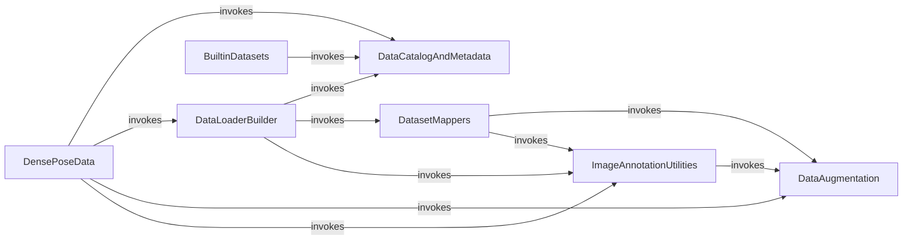

## Component Details

The Data Management subsystem in Detectron2 is responsible for orchestrating the entire data pipeline, from raw dataset registration and loading to sophisticated preprocessing and the creation of efficient data loaders for both training and inference. It ensures that data is readily available and correctly formatted for model consumption, incorporating functionalities for dataset cataloging, metadata management, image transformations, and augmentation. This subsystem integrates various components to provide a flexible and extensible framework for handling diverse computer vision datasets.

### DataCatalogAndMetadata

Manages the registration and retrieval of datasets and their associated metadata. It provides a global registry for datasets and their properties, such as class names and category mappings.

**Related Classes/Methods**:

- `detectron2.data.catalog.DatasetCatalog` (full file reference)

- `detectron2.data.catalog.MetadataCatalog` (full file reference)

- <a href="https://github.com/facebookresearch/detectron2/blob/master/detectron2/data/catalog.py#L194-L207" target="_blank" rel="noopener noreferrer">`detectron2.data.catalog._MetadataCatalog.get` (194:207)</a>

- <a href="https://github.com/facebookresearch/detectron2/blob/master/detectron2/data/catalog.py#L40-L58" target="_blank" rel="noopener noreferrer">`detectron2.data.catalog._DatasetCatalog.get` (40:58)</a>

- <a href="https://github.com/facebookresearch/detectron2/blob/master/detectron2/data/catalog.py#L29-L38" target="_blank" rel="noopener noreferrer">`detectron2.data.catalog._DatasetCatalog.register` (29:38)</a>

- <a href="https://github.com/facebookresearch/detectron2/blob/master/detectron2/data/catalog.py#L91-L178" target="_blank" rel="noopener noreferrer">`detectron2.data.catalog.Metadata` (91:178)</a>

- <a href="https://github.com/facebookresearch/detectron2/blob/master/detectron2/data/catalog.py#L162-L168" target="_blank" rel="noopener noreferrer">`detectron2.data.catalog.Metadata.set` (162:168)</a>

- <a href="https://github.com/facebookresearch/detectron2/blob/master/detectron2/data/catalog.py#L115-L134" target="_blank" rel="noopener noreferrer">`detectron2.data.catalog.Metadata:__getattr__` (115:134)</a>

- <a href="https://github.com/facebookresearch/detectron2/blob/master/detectron2/data/catalog.py#L136-L153" target="_blank" rel="noopener noreferrer">`detectron2.data.catalog.Metadata:__setattr__` (136:153)</a>

- <a href="https://github.com/facebookresearch/detectron2/blob/master/detectron2/data/catalog.py#L194-L207" target="_blank" rel="noopener noreferrer">`detectron2.data.catalog._MetadataCatalog:get` (194:207)</a>

### DataLoaderBuilder

Responsible for constructing data loaders for training and testing. It orchestrates the process of fetching dataset dictionaries, applying transformations, and creating iterable datasets for model consumption.

**Related Classes/Methods**:

- <a href="https://github.com/facebookresearch/detectron2/blob/master/detectron2/data/build.py#L521-L583" target="_blank" rel="noopener noreferrer">`detectron2.data.build.build_detection_train_loader` (521:583)</a>

- <a href="https://github.com/facebookresearch/detectron2/blob/master/detectron2/data/build.py#L621-L682" target="_blank" rel="noopener noreferrer">`detectron2.data.build.build_detection_test_loader` (621:682)</a>

- <a href="https://github.com/facebookresearch/detectron2/blob/master/detectron2/data/common.py#L205-L248" target="_blank" rel="noopener noreferrer">`detectron2.data.common.DatasetFromList` (205:248)</a>

- <a href="https://github.com/facebookresearch/detectron2/blob/master/detectron2/data/samplers/distributed_sampler.py#L15-L70" target="_blank" rel="noopener noreferrer">`detectron2.data.samplers.distributed_sampler.TrainingSampler` (15:70)</a>

- <a href="https://github.com/facebookresearch/detectron2/blob/master/detectron2/data/samplers/distributed_sampler.py#L254-L287" target="_blank" rel="noopener noreferrer">`detectron2.data.samplers.distributed_sampler.InferenceSampler` (254:287)</a>

- <a href="https://github.com/facebookresearch/detectron2/blob/master/detectron2/data/samplers/distributed_sampler.py#L130-L251" target="_blank" rel="noopener noreferrer">`detectron2.data.samplers.distributed_sampler.RepeatFactorTrainingSampler` (130:251)</a>

- <a href="https://github.com/facebookresearch/detectron2/blob/master/detectron2/data/samplers/distributed_sampler.py#L73-L127" target="_blank" rel="noopener noreferrer">`detectron2.data.samplers.distributed_sampler.RandomSubsetTrainingSampler` (73:127)</a>

- <a href="https://github.com/facebookresearch/detectron2/blob/master/detectron2/data/common.py#L84-L141" target="_blank" rel="noopener noreferrer">`detectron2.data.common.MapDataset` (84:141)</a>

- <a href="https://github.com/facebookresearch/detectron2/blob/master/detectron2/data/common.py#L251-L299" target="_blank" rel="noopener noreferrer">`detectron2.data.common.ToIterableDataset` (251:299)</a>

- <a href="https://github.com/facebookresearch/detectron2/blob/master/detectron2/data/common.py#L302-L339" target="_blank" rel="noopener noreferrer">`detectron2.data.common.AspectRatioGroupedDataset` (302:339)</a>

- <a href="https://github.com/facebookresearch/detectron2/blob/master/detectron2/data/build.py#L77-L108" target="_blank" rel="noopener noreferrer">`detectron2.data.build.filter_images_with_few_keypoints` (77:108)</a>

- <a href="https://github.com/facebookresearch/detectron2/blob/master/detectron2/data/build.py#L165-L214" target="_blank" rel="noopener noreferrer">`detectron2.data.build.print_instances_class_histogram` (165:214)</a>

- <a href="https://github.com/facebookresearch/detectron2/blob/master/detectron2/data/build.py#L217-L291" target="_blank" rel="noopener noreferrer">`detectron2.data.build.get_detection_dataset_dicts` (217:291)</a>

- <a href="https://github.com/facebookresearch/detectron2/blob/master/detectron2/data/build.py#L294-L389" target="_blank" rel="noopener noreferrer">`detectron2.data.build.build_batch_data_loader` (294:389)</a>

- <a href="https://github.com/facebookresearch/detectron2/blob/master/detectron2/data/build.py#L406-L466" target="_blank" rel="noopener noreferrer">`detectron2.data.build._build_weighted_sampler` (406:466)</a>

- <a href="https://github.com/facebookresearch/detectron2/blob/master/detectron2/data/build.py#L469-L517" target="_blank" rel="noopener noreferrer">`detectron2.data.build._train_loader_from_config` (469:517)</a>

- <a href="https://github.com/facebookresearch/detectron2/blob/master/detectron2/data/build.py#L586-L617" target="_blank" rel="noopener noreferrer">`detectron2.data.build._test_loader_from_config` (586:617)</a>

- <a href="https://github.com/facebookresearch/detectron2/blob/master/detectron2/data/common.py#L107-L112" target="_blank" rel="noopener noreferrer">`detectron2.data.common.MapDataset:__new__` (107:112)</a>

- <a href="https://github.com/facebookresearch/detectron2/blob/master/detectron2/data/common.py#L120-L141" target="_blank" rel="noopener noreferrer">`detectron2.data.common.MapDataset:__getitem__` (120:141)</a>

- <a href="https://github.com/facebookresearch/detectron2/blob/master/detectron2/data/common.py#L285-L296" target="_blank" rel="noopener noreferrer">`detectron2.data.common.ToIterableDataset:__iter__` (285:296)</a>

- <a href="https://github.com/facebookresearch/detectron2/blob/master/detectron2/data/samplers/distributed_sampler.py#L36-L56" target="_blank" rel="noopener noreferrer">`detectron2.data.samplers.distributed_sampler.TrainingSampler:__init__` (36:56)</a>

- <a href="https://github.com/facebookresearch/detectron2/blob/master/detectron2/data/samplers/distributed_sampler.py#L58-L60" target="_blank" rel="noopener noreferrer">`detectron2.data.samplers.distributed_sampler.TrainingSampler:__iter__` (58:60)</a>

- <a href="https://github.com/facebookresearch/detectron2/blob/master/detectron2/data/samplers/distributed_sampler.py#L80-L116" target="_blank" rel="noopener noreferrer">`detectron2.data.samplers.distributed_sampler.RandomSubsetTrainingSampler:__init__` (80:116)</a>

- <a href="https://github.com/facebookresearch/detectron2/blob/master/detectron2/data/samplers/distributed_sampler.py#L136-L156" target="_blank" rel="noopener noreferrer">`detectron2.data.samplers.distributed_sampler.RepeatFactorTrainingSampler:__init__` (136:156)</a>

- <a href="https://github.com/facebookresearch/detectron2/blob/master/detectron2/data/samplers/distributed_sampler.py#L236-L238" target="_blank" rel="noopener noreferrer">`detectron2.data.samplers.distributed_sampler.RepeatFactorTrainingSampler:__iter__` (236:238)</a>

- <a href="https://github.com/facebookresearch/detectron2/blob/master/detectron2/data/samplers/distributed_sampler.py#L262-L271" target="_blank" rel="noopener noreferrer">`detectron2.data.samplers.distributed_sampler.InferenceSampler:__init__` (262:271)</a>

- <a href="https://github.com/facebookresearch/detectron2/blob/master/detectron2/data/benchmark.py#L71-L98" target="_blank" rel="noopener noreferrer">`detectron2.data.benchmark.DataLoaderBenchmark:__init__` (71:98)</a>

### ImageAnnotationUtilities

Provides a collection of utility functions for reading, processing, and transforming images and their associated annotations (e.g., bounding boxes, masks, keypoints).

**Related Classes/Methods**:

- <a href="https://github.com/facebookresearch/detectron2/blob/master/detectron2/data/detection_utils.py#L166-L186" target="_blank" rel="noopener noreferrer">`detectron2.data.detection_utils.read_image` (166:186)</a>

- <a href="https://github.com/facebookresearch/detectron2/blob/master/detectron2/data/detection_utils.py#L632-L656" target="_blank" rel="noopener noreferrer">`detectron2.data.detection_utils.build_augmentation` (632:656)</a>

- <a href="https://github.com/facebookresearch/detectron2/blob/master/detectron2/data/detection_utils.py#L189-L214" target="_blank" rel="noopener noreferrer">`detectron2.data.detection_utils.check_image_size` (189:214)</a>

- <a href="https://github.com/facebookresearch/detectron2/blob/master/detectron2/data/detection_utils.py#L489-L522" target="_blank" rel="noopener noreferrer">`detectron2.data.detection_utils.filter_empty_instances` (489:522)</a>

- <a href="https://github.com/facebookresearch/detectron2/blob/master/detectron2/data/detection_utils.py#L525-L547" target="_blank" rel="noopener noreferrer">`detectron2.data.detection_utils.create_keypoint_hflip_indices` (525:547)</a>

- <a href="https://github.com/facebookresearch/detectron2/blob/master/detectron2/data/detection_utils.py#L273-L334" target="_blank" rel="noopener noreferrer">`detectron2.data.detection_utils.transform_instance_annotations` (273:334)</a>

- <a href="https://github.com/facebookresearch/detectron2/blob/master/detectron2/data/detection_utils.py#L385-L457" target="_blank" rel="noopener noreferrer">`detectron2.data.detection_utils.annotations_to_instances` (385:457)</a>

- <a href="https://github.com/facebookresearch/detectron2/blob/master/detectron2/data/detection_utils.py#L166-L186" target="_blank" rel="noopener noreferrer">`detectron2.data.detection_utils:read_image` (166:186)</a>

- <a href="https://github.com/facebookresearch/detectron2/blob/master/detectron2/data/detection_utils.py#L189-L214" target="_blank" rel="noopener noreferrer">`detectron2.data.detection_utils:check_image_size` (189:214)</a>

- <a href="https://github.com/facebookresearch/detectron2/blob/master/detectron2/data/detection_utils.py#L273-L334" target="_blank" rel="noopener noreferrer">`detectron2.data.detection_utils:transform_instance_annotations` (273:334)</a>

- <a href="https://github.com/facebookresearch/detectron2/blob/master/detectron2/data/detection_utils.py#L385-L457" target="_blank" rel="noopener noreferrer">`detectron2.data.detection_utils:annotations_to_instances` (385:457)</a>

- <a href="https://github.com/facebookresearch/detectron2/blob/master/detectron2/data/detection_utils.py#L525-L547" target="_blank" rel="noopener noreferrer">`detectron2.data.detection_utils:create_keypoint_hflip_indices` (525:547)</a>

- <a href="https://github.com/facebookresearch/detectron2/blob/master/detectron2/data/detection_utils.py#L550-L570" target="_blank" rel="noopener noreferrer">`detectron2.data.detection_utils:get_fed_loss_cls_weights` (550:570)</a>

- <a href="https://github.com/facebookresearch/detectron2/blob/master/detectron2/data/detection_utils.py#L603-L629" target="_blank" rel="noopener noreferrer">`detectron2.data.detection_utils:check_metadata_consistency` (603:629)</a>

- <a href="https://github.com/facebookresearch/detectron2/blob/master/detectron2/data/detection_utils.py#L632-L656" target="_blank" rel="noopener noreferrer">`detectron2.data.detection_utils:build_augmentation` (632:656)</a>

- <a href="https://github.com/facebookresearch/detectron2/blob/master/detectron2/data/detection_utils.py#L93-L116" target="_blank" rel="noopener noreferrer">`detectron2.data.detection_utils.convert_image_to_rgb` (93:116)</a>

### DataAugmentation

Handles various image augmentation and transformation operations applied to input data during training or inference. This includes resizing, cropping, flipping, and color adjustments.

**Related Classes/Methods**:

- <a href="https://github.com/facebookresearch/detectron2/blob/master/detectron2/data/transforms/augmentation.py#L244-L275" target="_blank" rel="noopener noreferrer">`detectron2.data.transforms.augmentation.AugmentationList` (244:275)</a>

- <a href="https://github.com/facebookresearch/detectron2/blob/master/detectron2/data/transforms/augmentation.py#L278-L350" target="_blank" rel="noopener noreferrer">`detectron2.data.transforms.augmentation.AugInput` (278:350)</a>

- <a href="https://github.com/facebookresearch/detectron2/blob/master/detectron2/data/transforms/augmentation.py#L353-L364" target="_blank" rel="noopener noreferrer">`detectron2.data.transforms.augmentation.apply_augmentations` (353:364)</a>

- <a href="https://github.com/facebookresearch/detectron2/blob/master/detectron2/data/transforms/augmentation_impl.py#L134-L200" target="_blank" rel="noopener noreferrer">`detectron2.data.transforms.augmentation_impl.ResizeShortestEdge` (134:200)</a>

- <a href="https://github.com/facebookresearch/detectron2/blob/master/detectron2/data/transforms/augmentation_impl.py#L82-L111" target="_blank" rel="noopener noreferrer">`detectron2.data.transforms.augmentation_impl.RandomFlip` (82:111)</a>

- <a href="https://github.com/facebookresearch/detectron2/blob/master/detectron2/data/transforms/augmentation_impl.py#L373-L432" target="_blank" rel="noopener noreferrer">`detectron2.data.transforms.augmentation_impl.RandomCrop` (373:432)</a>

- <a href="https://github.com/facebookresearch/detectron2/blob/master/detectron2/data/transforms/augmentation_impl.py#L53-L65" target="_blank" rel="noopener noreferrer">`detectron2.data.transforms.augmentation_impl.RandomApply:__init__` (53:65)</a>

- <a href="https://github.com/facebookresearch/detectron2/blob/master/detectron2/data/transforms/augmentation_impl.py#L67-L72" target="_blank" rel="noopener noreferrer">`detectron2.data.transforms.augmentation_impl.RandomApply:get_transform` (67:72)</a>

- <a href="https://github.com/facebookresearch/detectron2/blob/master/detectron2/data/transforms/augmentation_impl.py#L74-L79" target="_blank" rel="noopener noreferrer">`detectron2.data.transforms.augmentation_impl.RandomApply:__call__` (74:79)</a>

- <a href="https://github.com/facebookresearch/detectron2/blob/master/detectron2/data/transforms/augmentation_impl.py#L87-L100" target="_blank" rel="noopener noreferrer">`detectron2.data.transforms.augmentation_impl.RandomFlip:__init__` (87:100)</a>

- <a href="https://github.com/facebookresearch/detectron2/blob/master/detectron2/data/transforms/augmentation_impl.py#L102-L111" target="_blank" rel="noopener noreferrer">`detectron2.data.transforms.augmentation_impl.RandomFlip:get_transform` (102:111)</a>

- <a href="https://github.com/facebookresearch/detectron2/blob/master/detectron2/data/transforms/augmentation_impl.py#L117-L126" target="_blank" rel="noopener noreferrer">`detectron2.data.transforms.augmentation_impl.Resize:__init__` (117:126)</a>

- <a href="https://github.com/facebookresearch/detectron2/blob/master/detectron2/data/transforms/augmentation_impl.py#L128-L131" target="_blank" rel="noopener noreferrer">`detectron2.data.transforms.augmentation_impl.Resize:get_transform` (128:131)</a>

- <a href="https://github.com/facebookresearch/detectron2/blob/master/detectron2/data/transforms/augmentation_impl.py#L143-L165" target="_blank" rel="noopener noreferrer">`detectron2.data.transforms.augmentation_impl.ResizeShortestEdge:__init__` (143:165)</a>

- <a href="https://github.com/facebookresearch/detectron2/blob/master/detectron2/data/transforms/augmentation_impl.py#L168-L178" target="_blank" rel="noopener noreferrer">`detectron2.data.transforms.augmentation_impl.ResizeShortestEdge:get_transform` (168:178)</a>

- <a href="https://github.com/facebookresearch/detectron2/blob/master/detectron2/data/transforms/augmentation_impl.py#L212-L229" target="_blank" rel="noopener noreferrer">`detectron2.data.transforms.augmentation_impl.ResizeScale:__init__` (212:229)</a>

- <a href="https://github.com/facebookresearch/detectron2/blob/master/detectron2/data/transforms/augmentation_impl.py#L231-L246" target="_blank" rel="noopener noreferrer">`detectron2.data.transforms.augmentation_impl.ResizeScale:_get_resize` (231:246)</a>

- <a href="https://github.com/facebookresearch/detectron2/blob/master/detectron2/data/transforms/augmentation_impl.py#L248-L250" target="_blank" rel="noopener noreferrer">`detectron2.data.transforms.augmentation_impl.ResizeScale:get_transform` (248:250)</a>

- <a href="https://github.com/facebookresearch/detectron2/blob/master/detectron2/data/transforms/augmentation_impl.py#L259-L281" target="_blank" rel="noopener noreferrer">`detectron2.data.transforms.augmentation_impl.RandomRotation:__init__` (259:281)</a>

- <a href="https://github.com/facebookresearch/detectron2/blob/master/detectron2/data/transforms/augmentation_impl.py#L283-L304" target="_blank" rel="noopener noreferrer">`detectron2.data.transforms.augmentation_impl.RandomRotation:get_transform` (283:304)</a>

- <a href="https://github.com/facebookresearch/detectron2/blob/master/detectron2/data/transforms/augmentation_impl.py#L315-L330" target="_blank" rel="noopener noreferrer">`detectron2.data.transforms.augmentation_impl.FixedSizeCrop:__init__` (315:330)</a>

- <a href="https://github.com/facebookresearch/detectron2/blob/master/detectron2/data/transforms/augmentation_impl.py#L366-L370" target="_blank" rel="noopener noreferrer">`detectron2.data.transforms.augmentation_impl.FixedSizeCrop:get_transform` (366:370)</a>

- <a href="https://github.com/facebookresearch/detectron2/blob/master/detectron2/data/transforms/augmentation_impl.py#L378-L398" target="_blank" rel="noopener noreferrer">`detectron2.data.transforms.augmentation_impl.RandomCrop:__init__` (378:398)</a>

- <a href="https://github.com/facebookresearch/detectron2/blob/master/detectron2/data/transforms/augmentation_impl.py#L400-L406" target="_blank" rel="noopener noreferrer">`detectron2.data.transforms.augmentation_impl.RandomCrop:get_transform` (400:406)</a>

- <a href="https://github.com/facebookresearch/detectron2/blob/master/detectron2/data/transforms/augmentation_impl.py#L443-L460" target="_blank" rel="noopener noreferrer">`detectron2.data.transforms.augmentation_impl.RandomCrop_CategoryAreaConstraint:__init__` (443:460)</a>

- <a href="https://github.com/facebookresearch/detectron2/blob/master/detectron2/data/transforms/augmentation_impl.py#L462-L478" target="_blank" rel="noopener noreferrer">`detectron2.data.transforms.augmentation_impl.RandomCrop_CategoryAreaConstraint:get_transform` (462:478)</a>

- <a href="https://github.com/facebookresearch/detectron2/blob/master/detectron2/data/transforms/augmentation_impl.py#L490-L501" target="_blank" rel="noopener noreferrer">`detectron2.data.transforms.augmentation_impl.RandomExtent:__init__` (490:501)</a>

- <a href="https://github.com/facebookresearch/detectron2/blob/master/detectron2/data/transforms/augmentation_impl.py#L503-L523" target="_blank" rel="noopener noreferrer">`detectron2.data.transforms.augmentation_impl.RandomExtent:get_transform` (503:523)</a>

- <a href="https://github.com/facebookresearch/detectron2/blob/master/detectron2/data/transforms/augmentation_impl.py#L538-L545" target="_blank" rel="noopener noreferrer">`detectron2.data.transforms.augmentation_impl.RandomContrast:__init__` (538:545)</a>

- <a href="https://github.com/facebookresearch/detectron2/blob/master/detectron2/data/transforms/augmentation_impl.py#L564-L571" target="_blank" rel="noopener noreferrer">`detectron2.data.transforms.augmentation_impl.RandomBrightness:__init__` (564:571)</a>

- <a href="https://github.com/facebookresearch/detectron2/blob/master/detectron2/data/transforms/augmentation_impl.py#L591-L598" target="_blank" rel="noopener noreferrer">`detectron2.data.transforms.augmentation_impl.RandomSaturation:__init__` (591:598)</a>

- <a href="https://github.com/facebookresearch/detectron2/blob/master/detectron2/data/transforms/augmentation_impl.py#L616-L626" target="_blank" rel="noopener noreferrer">`detectron2.data.transforms.augmentation_impl.RandomLighting:__init__` (616:626)</a>

- <a href="https://github.com/facebookresearch/detectron2/blob/master/detectron2/data/transforms/augmentation_impl.py#L639-L646" target="_blank" rel="noopener noreferrer">`detectron2.data.transforms.augmentation_impl.RandomResize:__init__` (639:646)</a>

- <a href="https://github.com/facebookresearch/detectron2/blob/master/detectron2/data/transforms/augmentation_impl.py#L648-L651" target="_blank" rel="noopener noreferrer">`detectron2.data.transforms.augmentation_impl.RandomResize:get_transform` (648:651)</a>

- <a href="https://github.com/facebookresearch/detectron2/blob/master/detectron2/data/transforms/augmentation_impl.py#L681-L736" target="_blank" rel="noopener noreferrer">`detectron2.data.transforms.augmentation_impl.MinIoURandomCrop:get_transform` (681:736)</a>

- <a href="https://github.com/facebookresearch/detectron2/blob/master/detectron2/data/transforms/transform.py#L89-L91" target="_blank" rel="noopener noreferrer">`detectron2.data.transforms.transform.ExtentTransform:apply_segmentation` (89:91)</a>

- <a href="https://github.com/facebookresearch/detectron2/blob/master/detectron2/data/transforms/transform.py#L94-L159" target="_blank" rel="noopener noreferrer">`detectron2.data.transforms.transform.ResizeTransform` (94:159)</a>

- <a href="https://github.com/facebookresearch/detectron2/blob/master/detectron2/data/transforms/transform.py#L154-L156" target="_blank" rel="noopener noreferrer">`detectron2.data.transforms.transform.ResizeTransform:apply_segmentation` (154:156)</a>

- <a href="https://github.com/facebookresearch/detectron2/blob/master/detectron2/data/transforms/transform.py#L158-L159" target="_blank" rel="noopener noreferrer">`detectron2.data.transforms.transform.ResizeTransform:inverse` (158:159)</a>

- <a href="https://github.com/facebookresearch/detectron2/blob/master/detectron2/data/transforms/transform.py#L162-L247" target="_blank" rel="noopener noreferrer">`detectron2.data.transforms.transform.RotationTransform` (162:247)</a>

- <a href="https://github.com/facebookresearch/detectron2/blob/master/detectron2/data/transforms/transform.py#L168-L198" target="_blank" rel="noopener noreferrer">`detectron2.data.transforms.transform.RotationTransform:__init__` (168:198)</a>

- <a href="https://github.com/facebookresearch/detectron2/blob/master/detectron2/data/transforms/transform.py#L219-L221" target="_blank" rel="noopener noreferrer">`detectron2.data.transforms.transform.RotationTransform:apply_segmentation` (219:221)</a>

- <a href="https://github.com/facebookresearch/detectron2/blob/master/detectron2/data/transforms/transform.py#L235-L247" target="_blank" rel="noopener noreferrer">`detectron2.data.transforms.transform.RotationTransform:inverse` (235:247)</a>

- <a href="https://github.com/facebookresearch/detectron2/blob/master/detectron2/data/transforms/transform.py#L289-L300" target="_blank" rel="noopener noreferrer">`detectron2.data.transforms.transform.PILColorTransform:__init__` (289:300)</a>

- <a href="https://github.com/facebookresearch/detectron2/blob/master/detectron2/data/transforms/transform.py#L302-L304" target="_blank" rel="noopener noreferrer">`detectron2.data.transforms.transform.PILColorTransform:apply_image` (302:304)</a>

- <a href="https://github.com/facebookresearch/detectron2/blob/master/detectron2/data/transforms/augmentation.py#L151-L174" target="_blank" rel="noopener noreferrer">`detectron2.data.transforms.augmentation.Augmentation:__call__` (151:174)</a>

- <a href="https://github.com/facebookresearch/detectron2/blob/master/detectron2/data/transforms/augmentation.py#L232-L241" target="_blank" rel="noopener noreferrer">`detectron2.data.transforms.augmentation:_transform_to_aug` (232:241)</a>

- <a href="https://github.com/facebookresearch/detectron2/blob/master/detectron2/data/transforms/augmentation.py#L256-L262" target="_blank" rel="noopener noreferrer">`detectron2.data.transforms.augmentation.AugmentationList:__init__` (256:262)</a>

- <a href="https://github.com/facebookresearch/detectron2/blob/master/detectron2/data/transforms/augmentation.py#L310-L329" target="_blank" rel="noopener noreferrer">`detectron2.data.transforms.augmentation.AugInput:__init__` (310:329)</a>

- <a href="https://github.com/facebookresearch/detectron2/blob/master/detectron2/data/transforms/augmentation.py#L344-L350" target="_blank" rel="noopener noreferrer">`detectron2.data.transforms.augmentation.AugInput:apply_augmentations` (344:350)</a>

- <a href="https://github.com/facebookresearch/detectron2/blob/master/detectron2/data/transforms/augmentation.py#L353-L364" target="_blank" rel="noopener noreferrer">`detectron2.data.transforms.augmentation:apply_augmentations` (353:364)</a>

### DatasetMappers

Transforms raw dataset dictionaries into the format expected by the model. This often involves applying augmentations and converting annotations into structured data types.

**Related Classes/Methods**:

- <a href="https://github.com/facebookresearch/detectron2/blob/master/detectron2/data/dataset_mapper.py#L20-L191" target="_blank" rel="noopener noreferrer">`detectron2.data.dataset_mapper.DatasetMapper` (20:191)</a>

- `detectron2.projects.PointSup.dataset_mapper.PointSupDatasetMapper` (full file reference)

- <a href="https://github.com/facebookresearch/detectron2/blob/master/projects/PointSup/point_sup/dataset_mapper.py#L28-L55" target="_blank" rel="noopener noreferrer">`detectron2.projects.PointSup.point_sup.dataset_mapper.PointSupDatasetMapper:__init__` (28:55)</a>

- <a href="https://github.com/facebookresearch/detectron2/blob/master/projects/PointSup/point_sup/dataset_mapper.py#L58-L70" target="_blank" rel="noopener noreferrer">`detectron2.projects.PointSup.point_sup.dataset_mapper.PointSupDatasetMapper:from_config` (58:70)</a>

- <a href="https://github.com/facebookresearch/detectron2/blob/master/projects/PointSup/point_sup/dataset_mapper.py#L72-L125" target="_blank" rel="noopener noreferrer">`detectron2.projects.PointSup.point_sup.dataset_mapper.PointSupDatasetMapper:__call__` (72:125)</a>

- <a href="https://github.com/facebookresearch/detectron2/blob/master/projects/Panoptic-DeepLab/panoptic_deeplab/dataset_mapper.py#L29-L52" target="_blank" rel="noopener noreferrer">`detectron2.projects.Panoptic-DeepLab.panoptic_deeplab.dataset_mapper.PanopticDeeplabDatasetMapper:__init__` (29:52)</a>

- <a href="https://github.com/facebookresearch/detectron2/blob/master/projects/Panoptic-DeepLab/panoptic_deeplab/dataset_mapper.py#L55-L85" target="_blank" rel="noopener noreferrer">`detectron2.projects.Panoptic-DeepLab.panoptic_deeplab.dataset_mapper.PanopticDeeplabDatasetMapper:from_config` (55:85)</a>

- <a href="https://github.com/facebookresearch/detectron2/blob/master/projects/Panoptic-DeepLab/panoptic_deeplab/dataset_mapper.py#L87-L116" target="_blank" rel="noopener noreferrer">`detectron2.projects.Panoptic-DeepLab.panoptic_deeplab.dataset_mapper.PanopticDeeplabDatasetMapper:__call__` (87:116)</a>

- <a href="https://github.com/facebookresearch/detectron2/blob/master/detectron2/data/dataset_mapper.py#L38-L83" target="_blank" rel="noopener noreferrer">`detectron2.data.dataset_mapper.DatasetMapper:__init__` (38:83)</a>

- <a href="https://github.com/facebookresearch/detectron2/blob/master/detectron2/data/dataset_mapper.py#L86-L113" target="_blank" rel="noopener noreferrer">`detectron2.data.dataset_mapper.DatasetMapper:from_config` (86:113)</a>

- <a href="https://github.com/facebookresearch/detectron2/blob/master/detectron2/data/dataset_mapper.py#L115-L142" target="_blank" rel="noopener noreferrer">`detectron2.data.dataset_mapper.DatasetMapper:_transform_annotations` (115:142)</a>

- <a href="https://github.com/facebookresearch/detectron2/blob/master/detectron2/data/dataset_mapper.py#L144-L191" target="_blank" rel="noopener noreferrer">`detectron2.data.dataset_mapper.DatasetMapper:__call__` (144:191)</a>

- <a href="https://github.com/facebookresearch/detectron2/blob/master/detectron2/modeling/test_time_augmentation.py#L58-L98" target="_blank" rel="noopener noreferrer">`detectron2.modeling.test_time_augmentation.DatasetMapperTTA:__call__` (58:98)</a>

### BuiltinDatasets

Contains implementations and registration logic for standard benchmark datasets like COCO, LVIS, Cityscapes, and Pascal VOC, making them readily available for use within Detectron2.

**Related Classes/Methods**:

- <a href="https://github.com/facebookresearch/detectron2/blob/master/detectron2/data/datasets/coco.py#L35-L232" target="_blank" rel="noopener noreferrer">`detectron2.data.datasets.coco.load_coco_json` (35:232)</a>

- <a href="https://github.com/facebookresearch/detectron2/blob/master/detectron2/data/datasets/builtin.py#L101-L139" target="_blank" rel="noopener noreferrer">`detectron2.data.datasets.builtin.register_all_coco` (101:139)</a>

- <a href="https://github.com/facebookresearch/detectron2/blob/master/detectron2/data/datasets/coco.py#L489-L517" target="_blank" rel="noopener noreferrer">`detectron2.data.datasets.coco.register_coco_instances` (489:517)</a>

- <a href="https://github.com/facebookresearch/detectron2/blob/master/detectron2/data/datasets/coco.py#L235-L308" target="_blank" rel="noopener noreferrer">`detectron2.data.datasets.coco.load_sem_seg` (235:308)</a>

- <a href="https://github.com/facebookresearch/detectron2/blob/master/detectron2/data/datasets/cityscapes.py#L53-L92" target="_blank" rel="noopener noreferrer">`detectron2.data.datasets.cityscapes.load_cityscapes_instances` (53:92)</a>

- <a href="https://github.com/facebookresearch/detectron2/blob/master/detectron2/data/datasets/cityscapes.py#L95-L125" target="_blank" rel="noopener noreferrer">`detectron2.data.datasets.cityscapes.load_cityscapes_semantic` (95:125)</a>

- <a href="https://github.com/facebookresearch/detectron2/blob/master/detectron2/data/datasets/pascal_voc.py#L78-L82" target="_blank" rel="noopener noreferrer">`detectron2.data.datasets.pascal_voc.register_pascal_voc` (78:82)</a>

- <a href="https://github.com/facebookresearch/detectron2/blob/master/detectron2/data/datasets/lvis.py#L25-L38" target="_blank" rel="noopener noreferrer">`detectron2.data.datasets.lvis.register_lvis_instances` (25:38)</a>

- <a href="https://github.com/facebookresearch/detectron2/blob/master/detectron2/data/datasets/lvis.py#L41-L165" target="_blank" rel="noopener noreferrer">`detectron2.data.datasets.lvis.load_lvis_json` (41:165)</a>

- <a href="https://github.com/facebookresearch/detectron2/blob/master/detectron2/data/datasets/coco_panoptic.py#L14-L63" target="_blank" rel="noopener noreferrer">`detectron2.data.datasets.coco_panoptic.load_coco_panoptic_json` (14:63)</a>

- <a href="https://github.com/facebookresearch/detectron2/blob/master/detectron2/data/datasets/coco_panoptic.py#L66-L99" target="_blank" rel="noopener noreferrer">`detectron2.data.datasets.coco_panoptic.register_coco_panoptic` (66:99)</a>

- <a href="https://github.com/facebookresearch/detectron2/blob/master/detectron2/data/datasets/coco_panoptic.py#L102-L165" target="_blank" rel="noopener noreferrer">`detectron2.data.datasets.coco_panoptic.register_coco_panoptic_separated` (102:165)</a>

- <a href="https://github.com/facebookresearch/detectron2/blob/master/detectron2/data/datasets/builtin.py#L101-L139" target="_blank" rel="noopener noreferrer">`detectron2.data.datasets.builtin:register_all_coco` (101:139)</a>

- <a href="https://github.com/facebookresearch/detectron2/blob/master/detectron2/data/datasets/builtin.py#L165-L173" target="_blank" rel="noopener noreferrer">`detectron2.data.datasets.builtin:register_all_lvis` (165:173)</a>

- <a href="https://github.com/facebookresearch/detectron2/blob/master/detectron2/data/datasets/builtin.py#L184-L211" target="_blank" rel="noopener noreferrer">`detectron2.data.datasets.builtin:register_all_cityscapes` (184:211)</a>

- <a href="https://github.com/facebookresearch/detectron2/blob/master/detectron2/data/datasets/builtin.py#L215-L228" target="_blank" rel="noopener noreferrer">`detectron2.data.datasets.builtin:register_all_pascal_voc` (215:228)</a>

- <a href="https://github.com/facebookresearch/detectron2/blob/master/detectron2/data/datasets/builtin.py#L231-L246" target="_blank" rel="noopener noreferrer">`detectron2.data.datasets.builtin:register_all_ade20k` (231:246)</a>

- <a href="https://github.com/facebookresearch/detectron2/blob/master/detectron2/data/datasets/coco.py#L35-L232" target="_blank" rel="noopener noreferrer">`detectron2.data.datasets.coco:load_coco_json` (35:232)</a>

- <a href="https://github.com/facebookresearch/detectron2/blob/master/detectron2/data/datasets/coco.py#L235-L308" target="_blank" rel="noopener noreferrer">`detectron2.data.datasets.coco:load_sem_seg` (235:308)</a>

- <a href="https://github.com/facebookresearch/detectron2/blob/master/detectron2/data/datasets/coco.py#L311-L452" target="_blank" rel="noopener noreferrer">`detectron2.data.datasets.coco:convert_to_coco_dict` (311:452)</a>

- <a href="https://github.com/facebookresearch/detectron2/blob/master/detectron2/data/datasets/coco.py#L455-L486" target="_blank" rel="noopener noreferrer">`detectron2.data.datasets.coco:convert_to_coco_json` (455:486)</a>

- <a href="https://github.com/facebookresearch/detectron2/blob/master/detectron2/data/datasets/coco.py#L489-L517" target="_blank" rel="noopener noreferrer">`detectron2.data.datasets.coco:register_coco_instances` (489:517)</a>

- <a href="https://github.com/facebookresearch/detectron2/blob/master/detectron2/data/datasets/coco.py#L520-L552" target="_blank" rel="noopener noreferrer">`detectron2.data.datasets.coco:main` (520:552)</a>

- <a href="https://github.com/facebookresearch/detectron2/blob/master/detectron2/data/datasets/cityscapes.py#L53-L92" target="_blank" rel="noopener noreferrer">`detectron2.data.datasets.cityscapes:load_cityscapes_instances` (53:92)</a>

- <a href="https://github.com/facebookresearch/detectron2/blob/master/detectron2/data/datasets/cityscapes.py#L95-L125" target="_blank" rel="noopener noreferrer">`detectron2.data.datasets.cityscapes:load_cityscapes_semantic` (95:125)</a>

- <a href="https://github.com/facebookresearch/detectron2/blob/master/detectron2/data/datasets/cityscapes.py#L284-L333" target="_blank" rel="noopener noreferrer">`detectron2.data.datasets.cityscapes:main` (284:333)</a>

- <a href="https://github.com/facebookresearch/detectron2/blob/master/detectron2/data/datasets/cityscapes_panoptic.py#L51-L109" target="_blank" rel="noopener noreferrer">`detectron2.data.datasets.cityscapes_panoptic:load_cityscapes_panoptic` (51:109)</a>

- <a href="https://github.com/facebookresearch/detectron2/blob/master/detectron2/data/datasets/cityscapes_panoptic.py#L127-L187" target="_blank" rel="noopener noreferrer">`detectron2.data.datasets.cityscapes_panoptic:register_all_cityscapes_panoptic` (127:187)</a>

- <a href="https://github.com/facebookresearch/detectron2/blob/master/detectron2/data/datasets/pascal_voc.py#L78-L82" target="_blank" rel="noopener noreferrer">`detectron2.data.datasets.pascal_voc:register_pascal_voc` (78:82)</a>

- <a href="https://github.com/facebookresearch/detectron2/blob/master/detectron2/data/datasets/lvis.py#L25-L38" target="_blank" rel="noopener noreferrer">`detectron2.data.datasets.lvis:register_lvis_instances` (25:38)</a>

- <a href="https://github.com/facebookresearch/detectron2/blob/master/detectron2/data/datasets/lvis.py#L41-L165" target="_blank" rel="noopener noreferrer">`detectron2.data.datasets.lvis:load_lvis_json` (41:165)</a>

- <a href="https://github.com/facebookresearch/detectron2/blob/master/detectron2/data/datasets/lvis.py#L216-L246" target="_blank" rel="noopener noreferrer">`detectron2.data.datasets.lvis:main` (216:246)</a>

- <a href="https://github.com/facebookresearch/detectron2/blob/master/detectron2/data/datasets/coco_panoptic.py#L14-L63" target="_blank" rel="noopener noreferrer">`detectron2.data.datasets.coco_panoptic:load_coco_panoptic_json` (14:63)</a>

- <a href="https://github.com/facebookresearch/detectron2/blob/master/detectron2/data/datasets/coco_panoptic.py#L66-L99" target="_blank" rel="noopener noreferrer">`detectron2.data.datasets.coco_panoptic:register_coco_panoptic` (66:99)</a>

- <a href="https://github.com/facebookresearch/detectron2/blob/master/detectron2/data/datasets/coco_panoptic.py#L102-L165" target="_blank" rel="noopener noreferrer">`detectron2.data.datasets.coco_panoptic:register_coco_panoptic_separated` (102:165)</a>

- <a href="https://github.com/facebookresearch/detectron2/blob/master/detectron2/data/datasets/builtin_meta.py#L283-L350" target="_blank" rel="noopener noreferrer">`detectron2.data.datasets.builtin_meta:_get_builtin_metadata` (283:350)</a>

### DensePoseData

Provides specialized data loading, mapping, and dataset registration functionalities tailored for the DensePose project, extending the core Detectron2 data pipeline.

**Related Classes/Methods**:

- <a href="https://github.com/facebookresearch/detectron2/blob/master/projects/DensePose/densepose/evaluation/d2_evaluator_adapter.py#L21-L33" target="_blank" rel="noopener noreferrer">`detectron2.projects.DensePose.densepose.evaluation.d2_evaluator_adapter.Detectron2COCOEvaluatorAdapter:__init__` (21:33)</a>

- <a href="https://github.com/facebookresearch/detectron2/blob/master/projects/DensePose/densepose/evaluation/d2_evaluator_adapter.py#L35-L52" target="_blank" rel="noopener noreferrer">`detectron2.projects.DensePose.densepose.evaluation.d2_evaluator_adapter.Detectron2COCOEvaluatorAdapter:_maybe_substitute_metadata` (35:52)</a>

- <a href="https://github.com/facebookresearch/detectron2/blob/master/projects/DensePose/densepose/evaluation/evaluator.py#L48-L84" target="_blank" rel="noopener noreferrer">`detectron2.projects.DensePose.densepose.evaluation.evaluator.DensePoseCOCOEvaluator:__init__` (48:84)</a>

- <a href="https://github.com/facebookresearch/detectron2/blob/master/projects/DensePose/densepose/engine/trainer.py#L150-L189" target="_blank" rel="noopener noreferrer">`detectron2.projects.DensePose.densepose.engine.trainer.Trainer:build_evaluator` (150:189)</a>

- <a href="https://github.com/facebookresearch/detectron2/blob/master/projects/DensePose/densepose/engine/trainer.py#L219-L220" target="_blank" rel="noopener noreferrer">`detectron2.projects.DensePose.densepose.engine.trainer.Trainer:build_test_loader` (219:220)</a>

- <a href="https://github.com/facebookresearch/detectron2/blob/master/projects/DensePose/densepose/engine/trainer.py#L223-L235" target="_blank" rel="noopener noreferrer">`detectron2.projects.DensePose.densepose.engine.trainer.Trainer:build_train_loader` (223:235)</a>

- <a href="https://github.com/facebookresearch/detectron2/blob/master/projects/DensePose/densepose/data/image_list_dataset.py#L46-L71" target="_blank" rel="noopener noreferrer">`detectron2.projects.DensePose.densepose.data.image_list_dataset.ImageListDataset:__getitem__` (46:71)</a>

- <a href="https://github.com/facebookresearch/detectron2/blob/master/projects/DensePose/densepose/data/build.py#L78-L82" target="_blank" rel="noopener noreferrer">`detectron2.projects.DensePose.densepose.data.build:_map_category_id_to_contiguous_id` (78:82)</a>

- <a href="https://github.com/facebookresearch/detectron2/blob/master/projects/DensePose/densepose/data/build.py#L114-L149" target="_blank" rel="noopener noreferrer">`detectron2.projects.DensePose.densepose.data.build:_add_category_id_to_contiguous_id_maps_to_metadata` (114:149)</a>

- <a href="https://github.com/facebookresearch/detectron2/blob/master/projects/DensePose/densepose/data/build.py#L254-L270" target="_blank" rel="noopener noreferrer">`detectron2.projects.DensePose.densepose.data.build:_maybe_filter_and_map_categories` (254:270)</a>

- <a href="https://github.com/facebookresearch/detectron2/blob/master/projects/DensePose/densepose/data/build.py#L273-L282" target="_blank" rel="noopener noreferrer">`detectron2.projects.DensePose.densepose.data.build:_add_category_whitelists_to_metadata` (273:282)</a>

- <a href="https://github.com/facebookresearch/detectron2/blob/master/projects/DensePose/densepose/data/build.py#L285-L293" target="_blank" rel="noopener noreferrer">`detectron2.projects.DensePose.densepose.data.build:_add_category_maps_to_metadata` (285:293)</a>

- <a href="https://github.com/facebookresearch/detectron2/blob/master/projects/DensePose/densepose/data/build.py#L296-L306" target="_blank" rel="noopener noreferrer">`detectron2.projects.DensePose.densepose.data.build:_add_category_info_to_bootstrapping_metadata` (296:306)</a>

- <a href="https://github.com/facebookresearch/detectron2/blob/master/projects/DensePose/densepose/data/build.py#L309-L313" target="_blank" rel="noopener noreferrer">`detectron2.projects.DensePose.densepose.data.build:_maybe_add_class_to_mesh_name_map_to_metadata` (309:313)</a>

- <a href="https://github.com/facebookresearch/detectron2/blob/master/projects/DensePose/densepose/data/build.py#L316-L352" target="_blank" rel="noopener noreferrer">`detectron2.projects.DensePose.densepose.data.build:_merge_categories` (316:352)</a>

- <a href="https://github.com/facebookresearch/detectron2/blob/master/projects/DensePose/densepose/data/build.py#L372-L425" target="_blank" rel="noopener noreferrer">`detectron2.projects.DensePose.densepose.data.build:combine_detection_dataset_dicts` (372:425)</a>

- <a href="https://github.com/facebookresearch/detectron2/blob/master/projects/DensePose/densepose/data/build.py#L428-L461" target="_blank" rel="noopener noreferrer">`detectron2.projects.DensePose.densepose.data.build:build_detection_train_loader` (428:461)</a>

- <a href="https://github.com/facebookresearch/detectron2/blob/master/projects/DensePose/densepose/data/build.py#L464-L500" target="_blank" rel="noopener noreferrer">`detectron2.projects.DensePose.densepose.data.build:build_detection_test_loader` (464:500)</a>

- <a href="https://github.com/facebookresearch/detectron2/blob/master/projects/DensePose/densepose/data/build.py#L529-L550" target="_blank" rel="noopener noreferrer">`detectron2.projects.DensePose.densepose.data.build:build_bootstrap_dataset` (529:550)</a>

- <a href="https://github.com/facebookresearch/detectron2/blob/master/projects/DensePose/densepose/data/build.py#L651-L680" target="_blank" rel="noopener noreferrer">`detectron2.projects.DensePose.densepose.data.build:build_inference_based_loader` (651:680)</a>

- <a href="https://github.com/facebookresearch/detectron2/blob/master/projects/DensePose/densepose/data/dataset_mapper.py#L21-L30" target="_blank" rel="noopener noreferrer">`detectron2.projects.DensePose.densepose.data.dataset_mapper:build_augmentation` (21:30)</a>

- <a href="https://github.com/facebookresearch/detectron2/blob/master/projects/DensePose/densepose/data/dataset_mapper.py#L38-L74" target="_blank" rel="noopener noreferrer">`detectron2.projects.DensePose.densepose.data.dataset_mapper.DatasetMapper:__init__` (38:74)</a>

- <a href="https://github.com/facebookresearch/detectron2/blob/master/projects/DensePose/densepose/data/dataset_mapper.py#L76-L126" target="_blank" rel="noopener noreferrer">`detectron2.projects.DensePose.densepose.data.dataset_mapper.DatasetMapper:__call__` (76:126)</a>

- <a href="https://github.com/facebookresearch/detectron2/blob/master/projects/DensePose/densepose/data/samplers/prediction_to_gt.py#L35-L41" target="_blank" rel="noopener noreferrer">`detectron2.projects.DensePose.densepose.data.samplers.prediction_to_gt.PredictionToGroundTruthSampler:__init__` (35:41)</a>

- <a href="https://github.com/facebookresearch/detectron2/blob/master/projects/DensePose/densepose/data/samplers/prediction_to_gt.py#L69-L85" target="_blank" rel="noopener noreferrer">`detectron2.projects.DensePose.densepose.data.samplers.prediction_to_gt.PredictionToGroundTruthSampler:register_sampler` (69:85)</a>

- <a href="https://github.com/facebookresearch/detectron2/blob/master/projects/DensePose/densepose/data/samplers/prediction_to_gt.py#L15-L26" target="_blank" rel="noopener noreferrer">`detectron2.projects.DensePose.densepose.data.samplers.prediction_to_gt._Sampler` (15:26)</a>

- <a href="https://github.com/facebookresearch/detectron2/blob/master/projects/DensePose/densepose/data/datasets/chimpnsee.py#L15-L31" target="_blank" rel="noopener noreferrer">`detectron2.projects.DensePose.densepose.data.datasets.chimpnsee:register_dataset` (15:31)</a>

- <a href="https://github.com/facebookresearch/detectron2/blob/master/projects/DensePose/densepose/data/datasets/coco.py#L178-L182" target="_blank" rel="noopener noreferrer">`detectron2.projects.DensePose.densepose.data.datasets.coco:_add_categories_metadata` (178:182)</a>

- <a href="https://github.com/facebookresearch/detectron2/blob/master/projects/DensePose/densepose/data/datasets/coco.py#L339-L346" target="_blank" rel="noopener noreferrer">`detectron2.projects.DensePose.densepose.data.datasets.coco:create_video_frame_mapping` (339:346)</a>

- <a href="https://github.com/facebookresearch/detectron2/blob/master/projects/DensePose/densepose/data/datasets/coco.py#L349-L390" target="_blank" rel="noopener noreferrer">`detectron2.projects.DensePose.densepose.data.datasets.coco:load_coco_json` (349:390)</a>

- <a href="https://github.com/facebookresearch/detectron2/blob/master/projects/DensePose/densepose/data/datasets/coco.py#L393-L418" target="_blank" rel="noopener noreferrer">`detectron2.projects.DensePose.densepose.data.datasets.coco:register_dataset` (393:418)</a>

- <a href="https://github.com/facebookresearch/detectron2/blob/master/projects/DensePose/densepose/data/datasets/lvis.py#L73-L79" target="_blank" rel="noopener noreferrer">`detectron2.projects.DensePose.densepose.data.datasets.lvis:_add_categories_metadata` (73:79)</a>

- <a href="https://github.com/facebookresearch/detectron2/blob/master/projects/DensePose/densepose/data/datasets/lvis.py#L217-L243" target="_blank" rel="noopener noreferrer">`detectron2.projects.DensePose.densepose.data.datasets.lvis:register_dataset` (217:243)</a>

### [FAQ](https://github.com/CodeBoarding/GeneratedOnBoardings/tree/main?tab=readme-ov-file#faq)