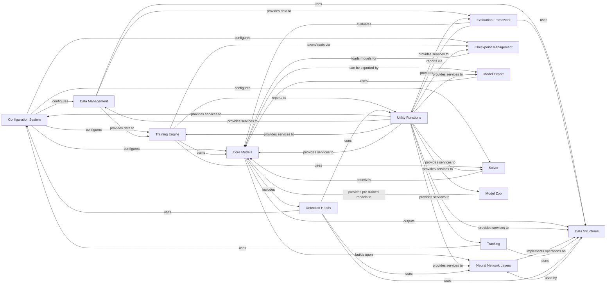

## Component Details

This graph illustrates the architecture of the Detectron2 framework, focusing on its key components and their interactions. The system is designed for object detection and segmentation tasks, encompassing data handling, model building, training, evaluation, and deployment. The core flow involves the Configuration System setting up parameters for Data Management, which prepares data for the Training Engine. The Training Engine, leveraging the Solver and Checkpoint Management, trains Core Models that are built upon Neural Network Layers and include specialized Detection Heads. Evaluation Framework assesses the performance of these models. Data Structures are fundamental, used across various components to represent annotations and model outputs. Utility Functions provide essential support services throughout the framework. Trained models can be managed via Checkpoint Management and prepared for deployment using Model Export. The Model Zoo offers pre-trained models, and a Tracking component is available for multi-object tracking tasks.

### Configuration System

Manages the configuration settings for Detectron2 models and training pipelines. It provides functionalities to define, load, merge, and access configuration parameters, ensuring consistent settings across different parts of the framework.

**Related Classes/Methods**:

- `detectron2.config.config` (full file reference)

- `detectron2.config.compat` (full file reference)

- `detectron2.config.defaults` (full file reference)

- <a href="https://github.com/facebookresearch/detectron2/blob/master/detectron2/config/instantiate.py#L37-L88" target="_blank" rel="noopener noreferrer">`detectron2.config.instantiate` (37:88)</a>

- `detectron2.config.lazy` (full file reference)

### Data Management

Handles all aspects of data loading, preprocessing, augmentation, and dataset registration. It provides tools to build data loaders, manage dataset catalogs, and apply various transformations to input images and annotations.

**Related Classes/Methods**:

- `detectron2.data.build` (full file reference)

- `detectron2.data.catalog` (full file reference)

- `detectron2.data.common` (full file reference)

- `detectron2.data.dataset_mapper` (full file reference)

- `detectron2.data.datasets` (full file reference)

- `detectron2.data.detection_utils` (full file reference)

- `detectron2.data.samplers` (full file reference)

- `detectron2.data.transforms` (full file reference)

### Training Engine

Orchestrates the training process, including the main training loop, managing hooks for various events (e.g., logging, checkpointing, evaluation), and distributed training launch utilities. It provides a flexible framework for customizing training workflows.

**Related Classes/Methods**:

- `detectron2.engine.defaults` (full file reference)

- `detectron2.engine.hooks` (full file reference)

- <a href="https://github.com/facebookresearch/detectron2/blob/master/detectron2/engine/launch.py#L27-L84" target="_blank" rel="noopener noreferrer">`detectron2.engine.launch` (27:84)</a>

- `detectron2.engine.train_loop` (full file reference)

### Evaluation Framework

Provides a standardized interface for evaluating model performance on various datasets and tasks. It includes specific evaluators for different benchmarks (e.g., COCO, Cityscapes, LVIS) and utilities for aggregating and reporting results.

**Related Classes/Methods**:

- `detectron2.evaluation.cityscapes_evaluation` (full file reference)

- `detectron2.evaluation.coco_evaluation` (full file reference)

- `detectron2.evaluation.evaluator` (full file reference)

- `detectron2.evaluation.lvis_evaluation` (full file reference)

- `detectron2.evaluation.panoptic_evaluation` (full file reference)

- `detectron2.evaluation.pascal_voc_evaluation` (full file reference)

- `detectron2.evaluation.rotated_coco_evaluation` (full file reference)

- `detectron2.evaluation.sem_seg_evaluation` (full file reference)

- `detectron2.evaluation.testing` (full file reference)

### Core Models

Encompasses the fundamental building blocks of detection and segmentation models, including backbones, proposal generators, ROI heads, and meta-architectures. It defines how different model components are constructed and interact to form a complete deep learning model.

**Related Classes/Methods**:

- `detectron2.modeling.anchor_generator` (full file reference)

- `detectron2.modeling.backbone` (full file reference)

- `detectron2.modeling.box_regression` (full file reference)

- `detectron2.modeling.matcher` (full file reference)

- `detectron2.modeling.meta_arch` (full file reference)

- `detectron2.modeling.mmdet_wrapper` (full file reference)

- `detectron2.modeling.poolers` (full file reference)

- `detectron2.modeling.postprocessing` (full file reference)

- `detectron2.modeling.proposal_generator` (full file reference)

- `detectron2.modeling.roi_heads` (full file reference)

- `detectron2.modeling.sampling` (full file reference)

- `detectron2.modeling.test_time_augmentation` (full file reference)

### Data Structures

Defines the core data structures used throughout Detectron2 to represent various types of annotations and model outputs, such as bounding boxes, instance masks, keypoints, and image lists. These structures provide a consistent way to handle geometric and semantic information.

**Related Classes/Methods**:

- `detectron2.structures.boxes` (full file reference)

- `detectron2.structures.image_list` (full file reference)

- `detectron2.structures.instances` (full file reference)

- `detectron2.structures.keypoints` (full file reference)

- `detectron2.structures.masks` (full file reference)

- `detectron2.structures.rotated_boxes` (full file reference)

### Utility Functions

Provides a collection of general-purpose utility functions that support various aspects of the Detectron2 framework, including distributed communication, environment setup, event logging, file I/O, memory management, and visualization tools.

**Related Classes/Methods**:

- `detectron2.utils.analysis` (full file reference)

- `detectron2.utils.collect_env` (full file reference)

- `detectron2.utils.comm` (full file reference)

- `detectron2.utils.env` (full file reference)

- `detectron2.utils.events` (full file reference)

- `detectron2.utils.file_io` (full file reference)

- `detectron2.utils.logger` (full file reference)

- `detectron2.utils.memory` (full file reference)

- `detectron2.utils.registry` (full file reference)

- `detectron2.utils.serialize` (full file reference)

- `detectron2.utils.testing` (full file reference)

- `detectron2.utils.torch_version_utils` (full file reference)

- `detectron2.utils.tracing` (full file reference)

- `detectron2.utils.video_visualizer` (full file reference)

- `detectron2.utils.visualizer` (full file reference)

### Neural Network Layers

Contains custom neural network layers and operations specifically designed for object detection and segmentation tasks. This includes specialized layers for ROI operations, deformable convolutions, and various normalization and activation functions.

**Related Classes/Methods**:

- `detectron2.layers.aspp` (full file reference)

- `detectron2.layers.batch_norm` (full file reference)

- `detectron2.layers.blocks` (full file reference)

- `detectron2.layers.deform_conv` (full file reference)

- `detectron2.layers.losses` (full file reference)

- `detectron2.layers.mask_ops` (full file reference)

- `detectron2.layers.nms` (full file reference)

- `detectron2.layers.roi_align` (full file reference)

- `detectron2.layers.roi_align_rotated` (full file reference)

- `detectron2.layers.shape_spec` (full file reference)

- `detectron2.layers.wrappers` (full file reference)

### Checkpoint Management

Manages the saving and loading of model checkpoints during training and inference. It handles serialization and deserialization of model weights, optimizer states, and other training-related information, facilitating training resumption and model deployment.

**Related Classes/Methods**:

- `detectron2.checkpoint.catalog` (full file reference)

- `detectron2.checkpoint.c2_model_loading` (full file reference)

- `detectron2.checkpoint.detection_checkpoint` (full file reference)

### Model Export

Provides functionalities for exporting trained Detectron2 models to various deployment formats, such as Caffe2 and TorchScript. It includes tools for model flattening, graph optimization, and compatibility with different inference backends.

**Related Classes/Methods**:

- `detectron2.export.api` (full file reference)

- `detectron2.export.c10` (full file reference)

- `detectron2.export.caffe2_export` (full file reference)

- `detectron2.export.caffe2_inference` (full file reference)

- `detectron2.export.caffe2_modeling` (full file reference)

- `detectron2.export.caffe2_patch` (full file reference)

- `detectron2.export.flatten` (full file reference)

- `detectron2.export.shared` (full file reference)

- `detectron2.export.torchscript` (full file reference)

- `detectron2.export.torchscript_patch` (full file reference)

### Solver

Responsible for configuring and managing the optimization process during model training. It includes functionalities for building optimizers and learning rate schedulers based on the provided configuration.

**Related Classes/Methods**:

- `detectron2.solver.build` (full file reference)

- `detectron2.solver.lr_scheduler` (full file reference)

### Model Zoo

Provides a collection of pre-trained models and their corresponding configurations, allowing users to easily load and utilize state-of-the-art models for various tasks without needing to train them from scratch.

**Related Classes/Methods**:

- `detectron2.model_zoo.model_zoo` (full file reference)

### Tracking

Offers functionalities for object tracking, including base trackers and specific implementations like IOU-based and Hungarian algorithm-based trackers. It provides tools to associate detected objects across consecutive frames.

**Related Classes/Methods**:

- `detectron2.tracking.base_tracker` (full file reference)

- `detectron2.tracking.bbox_iou_tracker` (full file reference)

- `detectron2.tracking.hungarian_tracker` (full file reference)

- `detectron2.tracking.iou_weighted_hungarian_bbox_iou_tracker` (full file reference)

- `detectron2.tracking.utils` (full file reference)

- `detectron2.tracking.vanilla_hungarian_bbox_iou_tracker` (full file reference)

### Detection Heads

Implements the task-specific heads for object detection, including the Region Proposal Network (RPN) for generating candidate object proposals and ROI-based heads (e.g., Fast R-CNN, Mask R-CNN, Keypoint R-CNN) for classification, bounding box regression, and mask/keypoint prediction on these proposals. These heads process features from the backbone and generate final predictions.

**Related Classes/Methods**:

- <a href="https://github.com/facebookresearch/detectron2/blob/master/detectron2/modeling/proposal_generator/rpn.py#L181-L533" target="_blank" rel="noopener noreferrer">`detectron2.modeling.proposal_generator.rpn.RPN` (181:533)</a>

- <a href="https://github.com/facebookresearch/detectron2/blob/master/detectron2/modeling/proposal_generator/rrpn.py#L131-L209" target="_blank" rel="noopener noreferrer">`detectron2.modeling.proposal_generator.rrpn.RRPN` (131:209)</a>

- <a href="https://github.com/facebookresearch/detectron2/blob/master/detectron2/modeling/roi_heads/roi_heads.py#L123-L338" target="_blank" rel="noopener noreferrer">`detectron2.modeling.roi_heads.roi_heads.ROIHeads` (123:338)</a>

- <a href="https://github.com/facebookresearch/detectron2/blob/master/detectron2/modeling/roi_heads/roi_heads.py#L530-L877" target="_blank" rel="noopener noreferrer">`detectron2.modeling.roi_heads.roi_heads.StandardROIHeads` (530:877)</a>

- <a href="https://github.com/facebookresearch/detectron2/blob/master/detectron2/modeling/roi_heads/box_head.py#L26-L110" target="_blank" rel="noopener noreferrer">`detectron2.modeling.roi_heads.box_head.FastRCNNConvFCHead` (26:110)</a>

- <a href="https://github.com/facebookresearch/detectron2/blob/master/detectron2/modeling/roi_heads/mask_head.py#L215-L290" target="_blank" rel="noopener noreferrer">`detectron2.modeling.roi_heads.mask_head.MaskRCNNConvUpsampleHead` (215:290)</a>

- <a href="https://github.com/facebookresearch/detectron2/blob/master/detectron2/modeling/roi_heads/keypoint_head.py#L218-L272" target="_blank" rel="noopener noreferrer">`detectron2.modeling.roi_heads.keypoint_head.KRCNNConvDeconvUpsampleHead` (218:272)</a>

- <a href="https://github.com/facebookresearch/detectron2/blob/master/detectron2/modeling/box_regression.py#L21-L116" target="_blank" rel="noopener noreferrer">`detectron2.modeling.box_regression.Box2BoxTransform` (21:116)</a>

- <a href="https://github.com/facebookresearch/detectron2/blob/master/detectron2/modeling/matcher.py#L9-L127" target="_blank" rel="noopener noreferrer">`detectron2.modeling.matcher.Matcher` (9:127)</a>

- <a href="https://github.com/facebookresearch/detectron2/blob/master/detectron2/modeling/poolers.py#L114-L263" target="_blank" rel="noopener noreferrer">`detectron2.modeling.poolers.ROIPooler` (114:263)</a>

### [FAQ](https://github.com/CodeBoarding/GeneratedOnBoardings/tree/main?tab=readme-ov-file#faq)