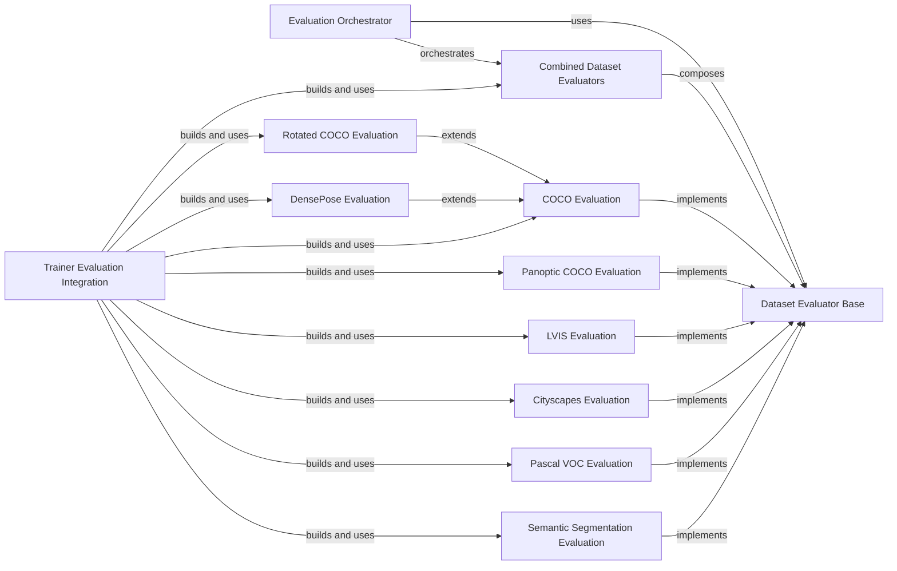

## Component Details

This graph illustrates the architecture of the `detectron2` evaluation subsystem. It highlights the central role of the `Evaluation Orchestrator` in coordinating various dataset-specific evaluators, which all adhere to the `Dataset Evaluator Base` interface. The system supports a wide range of benchmarks, including COCO, LVIS, Cityscapes, Pascal VOC, and semantic segmentation, with specialized components for each. The `Trainer Evaluation Integration` component demonstrates how these evaluators are incorporated into different training pipelines to assess model performance.

### Evaluation Orchestrator

This component is responsible for orchestrating the evaluation process across different datasets and models. It utilizes various dataset-specific evaluators and aggregates their results. The core functionality involves iterating through a data loader, performing inference with the model, and then processing the outputs using the appropriate evaluators. It also handles performance benchmarking during inference.

**Related Classes/Methods**:

- <a href="https://github.com/facebookresearch/detectron2/blob/master/detectron2/evaluation/evaluator.py#L103-L220" target="_blank" rel="noopener noreferrer">`detectron2.evaluation.evaluator.inference_on_dataset` (103:220)</a>

- <a href="https://github.com/facebookresearch/detectron2/blob/master/detectron2/engine/hooks.py#L528-L549" target="_blank" rel="noopener noreferrer">`detectron2.engine.hooks.EvalHook:_do_eval` (528:549)</a>

- <a href="https://github.com/facebookresearch/detectron2/blob/master/detectron2/engine/defaults.py#L452-L500" target="_blank" rel="noopener noreferrer">`detectron2.engine.defaults.DefaultTrainer:build_hooks` (452:500)</a>

- <a href="https://github.com/facebookresearch/detectron2/blob/master/detectron2/engine/defaults.py#L613-L666" target="_blank" rel="noopener noreferrer">`detectron2.engine.defaults.DefaultTrainer:test` (613:666)</a>

- <a href="https://github.com/facebookresearch/detectron2/blob/master/tools/lazyconfig_train_net.py#L35-L43" target="_blank" rel="noopener noreferrer">`detectron2.tools.lazyconfig_train_net:do_test` (35:43)</a>

- <a href="https://github.com/facebookresearch/detectron2/blob/master/tools/deploy/export_model.py#L179-L241" target="_blank" rel="noopener noreferrer">`detectron2.tools.deploy.export_model:main` (179:241)</a>

- <a href="https://github.com/facebookresearch/detectron2/blob/master/projects/DensePose/densepose/engine/trainer.py#L88-L147" target="_blank" rel="noopener noreferrer">`detectron2.projects.DensePose.densepose.engine.trainer.Trainer:test` (88:147)</a>

### Dataset Evaluator Base

This component defines the fundamental interface for all dataset-specific evaluators. It provides methods for resetting the evaluator's state, processing input/output pairs from the model, and finally evaluating and summarizing the performance. This abstract base class ensures a consistent evaluation workflow across different tasks and datasets.

**Related Classes/Methods**:

- <a href="https://github.com/facebookresearch/detectron2/blob/master/detectron2/evaluation/evaluator.py#L15-L63" target="_blank" rel="noopener noreferrer">`detectron2.evaluation.evaluator.DatasetEvaluator` (15:63)</a>

### Combined Dataset Evaluators

This component acts as a composite evaluator, allowing multiple individual `DatasetEvaluator` instances to be combined and run simultaneously. It dispatches evaluation calls to all its contained evaluators, aggregates their results, and handles potential key conflicts in the aggregated results.

**Related Classes/Methods**:

- <a href="https://github.com/facebookresearch/detectron2/blob/master/detectron2/evaluation/evaluator.py#L66-L100" target="_blank" rel="noopener noreferrer">`detectron2.evaluation.evaluator.DatasetEvaluators` (66:100)</a>

### COCO Evaluation

This component provides specialized evaluation capabilities for datasets formatted according to the COCO (Common Objects in Context) dataset specification. It handles tasks such as object detection and instance segmentation, calculating metrics like Average Precision (AP) for bounding box proposals and predictions.

**Related Classes/Methods**:

- <a href="https://github.com/facebookresearch/detectron2/blob/master/detectron2/evaluation/coco_evaluation.py#L34-L389" target="_blank" rel="noopener noreferrer">`detectron2.evaluation.coco_evaluation.COCOEvaluator` (34:389)</a>

- <a href="https://github.com/facebookresearch/detectron2/blob/master/detectron2/evaluation/coco_evaluation.py#L47-L152" target="_blank" rel="noopener noreferrer">`detectron2.evaluation.coco_evaluation.COCOEvaluator:__init__` (47:152)</a>

- <a href="https://github.com/facebookresearch/detectron2/blob/master/detectron2/evaluation/coco_evaluation.py#L177-L208" target="_blank" rel="noopener noreferrer">`detectron2.evaluation.coco_evaluation.COCOEvaluator:evaluate` (177:208)</a>

- <a href="https://github.com/facebookresearch/detectron2/blob/master/detectron2/evaluation/coco_evaluation.py#L284-L321" target="_blank" rel="noopener noreferrer">`detectron2.evaluation.coco_evaluation.COCOEvaluator:_eval_box_proposals` (284:321)</a>

- <a href="https://github.com/facebookresearch/detectron2/blob/master/detectron2/evaluation/coco_evaluation.py#L222-L282" target="_blank" rel="noopener noreferrer">`detectron2.evaluation.coco_evaluation.COCOEvaluator:_eval_predictions` (222:282)</a>

### Panoptic COCO Evaluation

This component extends COCO evaluation to include panoptic segmentation, which unifies semantic and instance segmentation. It evaluates the model's performance on both 'stuff' (semantic) and 'things' (instance) categories within the COCO panoptic format.

**Related Classes/Methods**:

- <a href="https://github.com/facebookresearch/detectron2/blob/master/detectron2/evaluation/panoptic_evaluation.py#L24-L165" target="_blank" rel="noopener noreferrer">`detectron2.evaluation.panoptic_evaluation.COCOPanopticEvaluator` (24:165)</a>

- <a href="https://github.com/facebookresearch/detectron2/blob/master/detectron2/evaluation/panoptic_evaluation.py#L32-L48" target="_blank" rel="noopener noreferrer">`detectron2.evaluation.panoptic_evaluation.COCOPanopticEvaluator:__init__` (32:48)</a>

- <a href="https://github.com/facebookresearch/detectron2/blob/master/detectron2/evaluation/panoptic_evaluation.py#L114-L165" target="_blank" rel="noopener noreferrer">`detectron2.evaluation.panoptic_evaluation.COCOPanopticEvaluator:evaluate` (114:165)</a>

### LVIS Evaluation

This component is dedicated to evaluating models on the LVIS (Long-tail Visual Recognition) dataset, which focuses on object detection with a long-tail distribution of categories. It calculates relevant metrics for this specific dataset, similar to COCO evaluation but adapted for LVIS characteristics.

**Related Classes/Methods**:

- <a href="https://github.com/facebookresearch/detectron2/blob/master/detectron2/evaluation/lvis_evaluation.py#L22-L217" target="_blank" rel="noopener noreferrer">`detectron2.evaluation.lvis_evaluation.LVISEvaluator` (22:217)</a>

- <a href="https://github.com/facebookresearch/detectron2/blob/master/detectron2/evaluation/lvis_evaluation.py#L28-L75" target="_blank" rel="noopener noreferrer">`detectron2.evaluation.lvis_evaluation.LVISEvaluator:__init__` (28:75)</a>

- <a href="https://github.com/facebookresearch/detectron2/blob/master/detectron2/evaluation/lvis_evaluation.py#L99-L126" target="_blank" rel="noopener noreferrer">`detectron2.evaluation.lvis_evaluation.LVISEvaluator:evaluate` (99:126)</a>

- <a href="https://github.com/facebookresearch/detectron2/blob/master/detectron2/evaluation/lvis_evaluation.py#L180-L217" target="_blank" rel="noopener noreferrer">`detectron2.evaluation.lvis_evaluation.LVISEvaluator:_eval_box_proposals` (180:217)</a>

- <a href="https://github.com/facebookresearch/detectron2/blob/master/detectron2/evaluation/lvis_evaluation.py#L134-L178" target="_blank" rel="noopener noreferrer">`detectron2.evaluation.lvis_evaluation.LVISEvaluator:_eval_predictions` (134:178)</a>

### Cityscapes Evaluation

This component provides evaluation functionalities specifically for the Cityscapes dataset, which is commonly used for urban scene understanding tasks like semantic segmentation and instance segmentation. It includes evaluators for both instance-level and semantic segmentation metrics.

**Related Classes/Methods**:

- <a href="https://github.com/facebookresearch/detectron2/blob/master/detectron2/evaluation/cityscapes_evaluation.py#L18-L47" target="_blank" rel="noopener noreferrer">`detectron2.evaluation.cityscapes_evaluation.CityscapesEvaluator` (18:47)</a>

- <a href="https://github.com/facebookresearch/detectron2/blob/master/detectron2/evaluation/cityscapes_evaluation.py#L50-L129" target="_blank" rel="noopener noreferrer">`detectron2.evaluation.cityscapes_evaluation.CityscapesInstanceEvaluator` (50:129)</a>

- <a href="https://github.com/facebookresearch/detectron2/blob/master/detectron2/evaluation/cityscapes_evaluation.py#L132-L199" target="_blank" rel="noopener noreferrer">`detectron2.evaluation.cityscapes_evaluation.CityscapesSemSegEvaluator` (132:199)</a>

- <a href="https://github.com/facebookresearch/detectron2/blob/master/detectron2/evaluation/cityscapes_evaluation.py#L23-L32" target="_blank" rel="noopener noreferrer">`detectron2.evaluation.cityscapes_evaluation.CityscapesEvaluator:__init__` (23:32)</a>

- <a href="https://github.com/facebookresearch/detectron2/blob/master/detectron2/evaluation/cityscapes_evaluation.py#L91-L129" target="_blank" rel="noopener noreferrer">`detectron2.evaluation.cityscapes_evaluation.CityscapesInstanceEvaluator:evaluate` (91:129)</a>

- <a href="https://github.com/facebookresearch/detectron2/blob/master/detectron2/evaluation/cityscapes_evaluation.py#L160-L199" target="_blank" rel="noopener noreferrer">`detectron2.evaluation.cityscapes_evaluation.CityscapesSemSegEvaluator:evaluate` (160:199)</a>

### Pascal VOC Evaluation

This component handles evaluation for the Pascal VOC (Visual Object Classes) dataset, a benchmark for object detection and image segmentation. It calculates metrics relevant to the Pascal VOC challenges.

**Related Classes/Methods**:

- <a href="https://github.com/facebookresearch/detectron2/blob/master/detectron2/evaluation/pascal_voc_evaluation.py#L20-L115" target="_blank" rel="noopener noreferrer">`detectron2.evaluation.pascal_voc_evaluation.PascalVOCDetectionEvaluator` (20:115)</a>

- <a href="https://github.com/facebookresearch/detectron2/blob/master/detectron2/evaluation/pascal_voc_evaluation.py#L31-L49" target="_blank" rel="noopener noreferrer">`detectron2.evaluation.pascal_voc_evaluation.PascalVOCDetectionEvaluator:__init__` (31:49)</a>

- <a href="https://github.com/facebookresearch/detectron2/blob/master/detectron2/evaluation/pascal_voc_evaluation.py#L70-L115" target="_blank" rel="noopener noreferrer">`detectron2.evaluation.pascal_voc_evaluation.PascalVOCDetectionEvaluator:evaluate` (70:115)</a>

### Semantic Segmentation Evaluation

This component focuses on evaluating semantic segmentation models, which assign a class label to each pixel in an image. It calculates metrics such as Mean Intersection over Union (mIoU) and pixel accuracy.

**Related Classes/Methods**:

- <a href="https://github.com/facebookresearch/detectron2/blob/master/detectron2/evaluation/sem_seg_evaluation.py#L36-L265" target="_blank" rel="noopener noreferrer">`detectron2.evaluation.sem_seg_evaluation.SemSegEvaluator` (36:265)</a>

- <a href="https://github.com/facebookresearch/detectron2/blob/master/detectron2/evaluation/sem_seg_evaluation.py#L41-L111" target="_blank" rel="noopener noreferrer">`detectron2.evaluation.sem_seg_evaluation.SemSegEvaluator:__init__` (41:111)</a>

- <a href="https://github.com/facebookresearch/detectron2/blob/master/detectron2/evaluation/sem_seg_evaluation.py#L154-L230" target="_blank" rel="noopener noreferrer">`detectron2.evaluation.sem_seg_evaluation.SemSegEvaluator:evaluate` (154:230)</a>

### Rotated COCO Evaluation

This component extends COCO evaluation to handle rotated bounding boxes, which are common in aerial imagery and other specialized object detection tasks. It calculates COCO-style metrics adapted for rotated objects.

**Related Classes/Methods**:

- <a href="https://github.com/facebookresearch/detectron2/blob/master/detectron2/evaluation/rotated_coco_evaluation.py#L99-L209" target="_blank" rel="noopener noreferrer">`detectron2.evaluation.rotated_coco_evaluation.RotatedCOCOEvaluator` (99:209)</a>

### DensePose Evaluation

This component is specifically designed for evaluating DensePose models, which aim to map all human pixels in an RGB image to a 3D surface model of the human body. It includes specialized evaluators for mesh alignment and integrates with COCO evaluation for DensePose-specific metrics.

**Related Classes/Methods**:

- <a href="https://github.com/facebookresearch/detectron2/blob/master/projects/DensePose/densepose/evaluation/mesh_alignment_evaluator.py#L16-L68" target="_blank" rel="noopener noreferrer">`detectron2.projects.DensePose.densepose.evaluation.mesh_alignment_evaluator.MeshAlignmentEvaluator` (16:68)</a>

- <a href="https://github.com/facebookresearch/detectron2/blob/master/projects/DensePose/densepose/evaluation/mesh_alignment_evaluator.py#L31-L68" target="_blank" rel="noopener noreferrer">`detectron2.projects.DensePose.densepose.evaluation.mesh_alignment_evaluator.MeshAlignmentEvaluator:evaluate` (31:68)</a>

- <a href="https://github.com/facebookresearch/detectron2/blob/master/projects/DensePose/densepose/evaluation/d2_evaluator_adapter.py#L21-L33" target="_blank" rel="noopener noreferrer">`detectron2.projects.DensePose.densepose.evaluation.d2_evaluator_adapter.Detectron2COCOEvaluatorAdapter:__init__` (21:33)</a>

- <a href="https://github.com/facebookresearch/detectron2/blob/master/projects/DensePose/densepose/evaluation/evaluator.py#L48-L84" target="_blank" rel="noopener noreferrer">`detectron2.projects.DensePose.densepose.evaluation.evaluator.DensePoseCOCOEvaluator:__init__` (48:84)</a>

- <a href="https://github.com/facebookresearch/detectron2/blob/master/projects/DensePose/densepose/evaluation/evaluator.py#L122-L134" target="_blank" rel="noopener noreferrer">`detectron2.projects.DensePose.densepose.evaluation.evaluator.DensePoseCOCOEvaluator:evaluate` (122:134)</a>

- <a href="https://github.com/facebookresearch/detectron2/blob/master/projects/DensePose/densepose/evaluation/evaluator.py#L136-L165" target="_blank" rel="noopener noreferrer">`detectron2.projects.DensePose.densepose.evaluation.evaluator.DensePoseCOCOEvaluator._eval_predictions` (136:165)</a>

- <a href="https://github.com/facebookresearch/detectron2/blob/master/projects/DensePose/densepose/evaluation/evaluator.py#L167-L180" target="_blank" rel="noopener noreferrer">`detectron2.projects.DensePose.densepose.evaluation.evaluator.DensePoseCOCOEvaluator._evaluate_mesh_alignment` (167:180)</a>

- <a href="https://github.com/facebookresearch/detectron2/blob/master/projects/DensePose/densepose/engine/trainer.py#L150-L189" target="_blank" rel="noopener noreferrer">`detectron2.projects.DensePose.densepose.engine.trainer.Trainer:build_evaluator` (150:189)</a>

### Trainer Evaluation Integration

This component represents the integration points where various training pipelines (e.g., from different projects like PointSup, DeepLab, PointRend, TridentNet, Panoptic-DeepLab) build and utilize evaluators. It demonstrates how different training setups leverage the evaluation framework to assess model performance during or after training.

**Related Classes/Methods**:

- <a href="https://github.com/facebookresearch/detectron2/blob/master/tools/train_net.py#L42-L79" target="_blank" rel="noopener noreferrer">`detectron2.tools.train_net:build_evaluator` (42:79)</a>

- <a href="https://github.com/facebookresearch/detectron2/blob/master/projects/PointSup/train_net.py#L32-L53" target="_blank" rel="noopener noreferrer">`detectron2.projects.PointSup.train_net.Trainer:build_evaluator` (32:53)</a>

- <a href="https://github.com/facebookresearch/detectron2/blob/master/projects/DeepLab/train_net.py#L51-L78" target="_blank" rel="noopener noreferrer">`detectron2.projects.DeepLab.train_net.Trainer:build_evaluator` (51:78)</a>

- <a href="https://github.com/facebookresearch/detectron2/blob/master/projects/PointRend/train_net.py#L62-L95" target="_blank" rel="noopener noreferrer">`detectron2.projects.PointRend.train_net.Trainer:build_evaluator` (62:95)</a>

- <a href="https://github.com/facebookresearch/detectron2/blob/master/projects/TridentNet/train_net.py#L22-L25" target="_blank" rel="noopener noreferrer">`detectron2.projects.TridentNet.train_net.Trainer:build_evaluator` (22:25)</a>

- <a href="https://github.com/facebookresearch/detectron2/blob/master/projects/Panoptic-DeepLab/train_net.py#L56-L94" target="_blank" rel="noopener noreferrer">`detectron2.projects.Panoptic-DeepLab.train_net.Trainer:build_evaluator` (56:94)</a>

### [FAQ](https://github.com/CodeBoarding/GeneratedOnBoardings/tree/main?tab=readme-ov-file#faq)