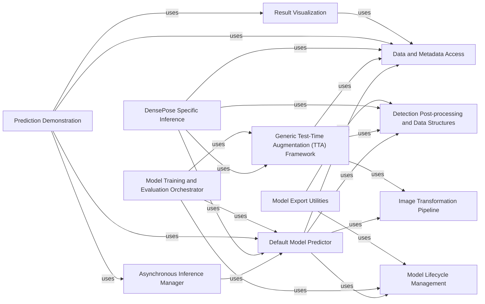

## Component Details

The Inference and Prediction subsystem in Detectron2 is responsible for taking trained models and generating predictions on new input data. This involves several key steps: loading the model, preprocessing input data (including transformations and augmentations), executing the model to obtain raw predictions, post-processing these predictions into structured formats, and optionally visualizing the results. The subsystem supports both synchronous and asynchronous inference, as well as advanced techniques like Test-Time Augmentation (TTA) for improved robustness and accuracy. It also includes specialized components for specific model types like DensePose and utilities for exporting models for deployment.

### Default Model Predictor

A standard, synchronous predictor for Detectron2 models, responsible for loading the model, applying transformations, and performing inference.

**Related Classes/Methods**:

- <a href="https://github.com/facebookresearch/detectron2/blob/master/detectron2/engine/defaults.py#L284-L352" target="_blank" rel="noopener noreferrer">`detectron2.engine.defaults.DefaultPredictor` (284:352)</a>

### Asynchronous Inference Manager

Enables asynchronous execution of model predictions, potentially leveraging multiple GPUs, to enhance throughput, especially for video processing. It manages a queue-based system for tasks and results.

**Related Classes/Methods**:

- <a href="https://github.com/facebookresearch/detectron2/blob/master/demo/predictor.py#L132-L220" target="_blank" rel="noopener noreferrer">`detectron2.demo.predictor.AsyncPredictor` (132:220)</a>

- <a href="https://github.com/facebookresearch/detectron2/blob/master/demo/predictor.py#L142-L158" target="_blank" rel="noopener noreferrer">`detectron2.demo.predictor.AsyncPredictor._PredictWorker` (142:158)</a>

- <a href="https://github.com/facebookresearch/detectron2/blob/master/demo/predictor.py#L139-L140" target="_blank" rel="noopener noreferrer">`detectron2.demo.predictor.AsyncPredictor._StopToken` (139:140)</a>

- <a href="https://github.com/facebookresearch/detectron2/blob/master/demo/predictor.py#L187-L189" target="_blank" rel="noopener noreferrer">`detectron2.demo.predictor.AsyncPredictor.put` (187:189)</a>

- <a href="https://github.com/facebookresearch/detectron2/blob/master/demo/predictor.py#L191-L205" target="_blank" rel="noopener noreferrer">`detectron2.demo.predictor.AsyncPredictor.get` (191:205)</a>

### Generic Test-Time Augmentation (TTA) Framework

Implements a general framework for applying test-time augmentation strategies to object detection and segmentation models, including input augmentation, inference, and result merging.

**Related Classes/Methods**:

- <a href="https://github.com/facebookresearch/detectron2/blob/master/detectron2/modeling/test_time_augmentation.py#L101-L307" target="_blank" rel="noopener noreferrer">`detectron2.modeling.test_time_augmentation.GeneralizedRCNNWithTTA` (101:307)</a>

- <a href="https://github.com/facebookresearch/detectron2/blob/master/detectron2/modeling/test_time_augmentation.py#L239-L242" target="_blank" rel="noopener noreferrer">`detectron2.modeling.test_time_augmentation.GeneralizedRCNNWithTTA._get_augmented_inputs` (239:242)</a>

- <a href="https://github.com/facebookresearch/detectron2/blob/master/detectron2/modeling/test_time_augmentation.py#L137-L160" target="_blank" rel="noopener noreferrer">`detectron2.modeling.test_time_augmentation.GeneralizedRCNNWithTTA._turn_off_roi_heads` (137:160)</a>

- <a href="https://github.com/facebookresearch/detectron2/blob/master/detectron2/modeling/test_time_augmentation.py#L262-L280" target="_blank" rel="noopener noreferrer">`detectron2.modeling.test_time_augmentation.GeneralizedRCNNWithTTA._merge_detections` (262:280)</a>

- <a href="https://github.com/facebookresearch/detectron2/blob/master/detectron2/modeling/test_time_augmentation.py#L282-L296" target="_blank" rel="noopener noreferrer">`detectron2.modeling.test_time_augmentation.GeneralizedRCNNWithTTA._rescale_detected_boxes` (282:296)</a>

- <a href="https://github.com/facebookresearch/detectron2/blob/master/detectron2/modeling/test_time_augmentation.py#L162-L186" target="_blank" rel="noopener noreferrer">`detectron2.modeling.test_time_augmentation.GeneralizedRCNNWithTTA._batch_inference` (162:186)</a>

- <a href="https://github.com/facebookresearch/detectron2/blob/master/detectron2/modeling/test_time_augmentation.py#L298-L307" target="_blank" rel="noopener noreferrer">`detectron2.modeling.test_time_augmentation.GeneralizedRCNNWithTTA._reduce_pred_masks` (298:307)</a>

- <a href="https://github.com/facebookresearch/detectron2/blob/master/detectron2/modeling/test_time_augmentation.py#L29-L98" target="_blank" rel="noopener noreferrer">`detectron2.modeling.test_time_augmentation.DatasetMapperTTA` (29:98)</a>

- <a href="https://github.com/facebookresearch/detectron2/blob/master/detectron2/modeling/test_time_augmentation.py#L206-L237" target="_blank" rel="noopener noreferrer">`detectron2.modeling.test_time_augmentation.GeneralizedRCNNWithTTA._inference_one_image` (206:237)</a>

### DensePose Specific Inference

Contains specialized logic for performing inference and test-time augmentation tailored for DensePose models, including handling DensePose-specific outputs.

**Related Classes/Methods**:

- <a href="https://github.com/facebookresearch/detectron2/blob/master/projects/DensePose/apply_net.py#L74-L134" target="_blank" rel="noopener noreferrer">`detectron2.projects.DensePose.apply_net.InferenceAction` (74:134)</a>

- <a href="https://github.com/facebookresearch/detectron2/blob/master/projects/DensePose/apply_net.py#L109-L120" target="_blank" rel="noopener noreferrer">`detectron2.projects.DensePose.apply_net.InferenceAction.setup_config` (109:120)</a>

- <a href="https://github.com/facebookresearch/detectron2/blob/master/projects/DensePose/apply_net.py#L123-L134" target="_blank" rel="noopener noreferrer">`detectron2.projects.DensePose.apply_net.InferenceAction._get_input_file_list` (123:134)</a>

- <a href="https://github.com/facebookresearch/detectron2/blob/master/projects/DensePose/densepose/modeling/test_time_augmentation.py#L40-L144" target="_blank" rel="noopener noreferrer">`detectron2.projects.DensePose.densepose.modeling.test_time_augmentation.DensePoseGeneralizedRCNNWithTTA` (40:144)</a>

- <a href="https://github.com/facebookresearch/detectron2/blob/master/projects/DensePose/densepose/modeling/test_time_augmentation.py#L95-L114" target="_blank" rel="noopener noreferrer">`detectron2.projects.DensePose.densepose.modeling.test_time_augmentation.DensePoseGeneralizedRCNNWithTTA._get_augmented_boxes` (95:114)</a>

- <a href="https://github.com/facebookresearch/detectron2/blob/master/projects/DensePose/densepose/modeling/test_time_augmentation.py#L116-L135" target="_blank" rel="noopener noreferrer">`detectron2.projects.DensePose.densepose.modeling.test_time_augmentation.DensePoseGeneralizedRCNNWithTTA._reduce_pred_densepose` (116:135)</a>

### Detection Post-processing and Data Structures

Provides utilities for post-processing raw model outputs into structured detection results and defines core data structures for instances, bounding boxes, and masks.

**Related Classes/Methods**:

- <a href="https://github.com/facebookresearch/detectron2/blob/master/detectron2/modeling/postprocessing.py#L9-L74" target="_blank" rel="noopener noreferrer">`detectron2.modeling.postprocessing.detector_postprocess` (9:74)</a>

- <a href="https://github.com/facebookresearch/detectron2/blob/master/detectron2/structures/instances.py#L8-L194" target="_blank" rel="noopener noreferrer">`detectron2.structures.instances.Instances` (8:194)</a>

- <a href="https://github.com/facebookresearch/detectron2/blob/master/detectron2/structures/instances.py#L83-L88" target="_blank" rel="noopener noreferrer">`detectron2.structures.instances.Instances.has` (83:88)</a>

- <a href="https://github.com/facebookresearch/detectron2/blob/master/detectron2/structures/boxes.py#L271-L276" target="_blank" rel="noopener noreferrer">`detectron2.structures.boxes.Boxes.scale` (271:276)</a>

- <a href="https://github.com/facebookresearch/detectron2/blob/master/detectron2/structures/boxes.py#L183-L197" target="_blank" rel="noopener noreferrer">`detectron2.structures.boxes.Boxes.clip` (183:197)</a>

- <a href="https://github.com/facebookresearch/detectron2/blob/master/detectron2/structures/boxes.py#L199-L213" target="_blank" rel="noopener noreferrer">`detectron2.structures.boxes.Boxes.nonempty` (199:213)</a>

- <a href="https://github.com/facebookresearch/detectron2/blob/master/detectron2/structures/masks.py#L466-L534" target="_blank" rel="noopener noreferrer">`detectron2.structures.masks.ROIMasks` (466:534)</a>

### Image Transformation Pipeline

Provides functionalities for applying various image transformations and augmentations, such as resizing, to prepare input for models.

**Related Classes/Methods**:

- <a href="https://github.com/facebookresearch/detectron2/blob/master/detectron2/data/transforms/augmentation_impl.py#L134-L200" target="_blank" rel="noopener noreferrer">`detectron2.data.transforms.augmentation_impl.ResizeShortestEdge` (134:200)</a>

- <a href="https://github.com/facebookresearch/detectron2/blob/master/detectron2/data/transforms/augmentation_impl.py#L168-L178" target="_blank" rel="noopener noreferrer">`detectron2.data.transforms.augmentation_impl.ResizeShortestEdge.get_transform` (168:178)</a>

### Prediction Demonstration

Provides a high-level interface for running object detection and segmentation models on images and videos, including visualization of results. It can operate in synchronous or asynchronous modes.

**Related Classes/Methods**:

- <a href="https://github.com/facebookresearch/detectron2/blob/master/demo/predictor.py#L15-L129" target="_blank" rel="noopener noreferrer">`detectron2.demo.predictor.VisualizationDemo` (15:129)</a>

- <a href="https://github.com/facebookresearch/detectron2/blob/master/demo/predictor.py#L68-L74" target="_blank" rel="noopener noreferrer">`detectron2.demo.predictor.VisualizationDemo._frame_from_video` (68:74)</a>

- <a href="https://github.com/facebookresearch/detectron2/blob/master/demo/predictor.py#L76-L129" target="_blank" rel="noopener noreferrer">`detectron2.demo.predictor.VisualizationDemo.run_on_video` (76:129)</a>

### Result Visualization

Provides utilities for rendering and drawing various types of model predictions (e.g., panoptic, semantic, instance segmentations) onto images and video frames.

**Related Classes/Methods**:

- <a href="https://github.com/facebookresearch/detectron2/blob/master/detectron2/utils/visualizer.py#L331-L1281" target="_blank" rel="noopener noreferrer">`detectron2.utils.visualizer.Visualizer` (331:1281)</a>

- <a href="https://github.com/facebookresearch/detectron2/blob/master/detectron2/utils/visualizer.py#L484-L546" target="_blank" rel="noopener noreferrer">`detectron2.utils.visualizer.Visualizer.draw_panoptic_seg` (484:546)</a>

- <a href="https://github.com/facebookresearch/detectron2/blob/master/detectron2/utils/visualizer.py#L448-L482" target="_blank" rel="noopener noreferrer">`detectron2.utils.visualizer.Visualizer.draw_sem_seg` (448:482)</a>

- <a href="https://github.com/facebookresearch/detectron2/blob/master/detectron2/utils/visualizer.py#L387-L446" target="_blank" rel="noopener noreferrer">`detectron2.utils.visualizer.Visualizer.draw_instance_predictions` (387:446)</a>

- <a href="https://github.com/facebookresearch/detectron2/blob/master/detectron2/utils/video_visualizer.py#L41-L287" target="_blank" rel="noopener noreferrer">`detectron2.utils.video_visualizer.VideoVisualizer` (41:287)</a>

- <a href="https://github.com/facebookresearch/detectron2/blob/master/detectron2/utils/video_visualizer.py#L155-L209" target="_blank" rel="noopener noreferrer">`detectron2.utils.video_visualizer.VideoVisualizer.draw_panoptic_seg_predictions` (155:209)</a>

- <a href="https://github.com/facebookresearch/detectron2/blob/master/detectron2/utils/video_visualizer.py#L59-L141" target="_blank" rel="noopener noreferrer">`detectron2.utils.video_visualizer.VideoVisualizer.draw_instance_predictions` (59:141)</a>

- <a href="https://github.com/facebookresearch/detectron2/blob/master/detectron2/utils/video_visualizer.py#L143-L153" target="_blank" rel="noopener noreferrer">`detectron2.utils.video_visualizer.VideoVisualizer.draw_sem_seg` (143:153)</a>

- <a href="https://github.com/facebookresearch/detectron2/blob/master/detectron2/utils/visualizer.py#L310-L328" target="_blank" rel="noopener noreferrer">`detectron2.utils.visualizer.VisImage.get_image` (310:328)</a>

### Data and Metadata Access

Handles the retrieval of dataset-specific metadata and basic image loading operations.

**Related Classes/Methods**:

- <a href="https://github.com/facebookresearch/detectron2/blob/master/detectron2/data/catalog.py#L194-L207" target="_blank" rel="noopener noreferrer">`detectron2.data.catalog._MetadataCatalog.get` (194:207)</a>

- <a href="https://github.com/facebookresearch/detectron2/blob/master/detectron2/data/detection_utils.py#L166-L186" target="_blank" rel="noopener noreferrer">`detectron2.data.detection_utils.read_image` (166:186)</a>

### Model Lifecycle Management

Responsible for building the neural network model architecture and handling the loading and saving of model weights (checkpoints).

**Related Classes/Methods**:

- <a href="https://github.com/facebookresearch/detectron2/blob/master/detectron2/modeling/meta_arch/build.py#L16-L25" target="_blank" rel="noopener noreferrer">`detectron2.modeling.meta_arch.build.build_model` (16:25)</a>

- <a href="https://github.com/facebookresearch/detectron2/blob/master/detectron2/checkpoint/detection_checkpoint.py#L16-L143" target="_blank" rel="noopener noreferrer">`detectron2.checkpoint.detection_checkpoint.DetectionCheckpointer` (16:143)</a>

- <a href="https://github.com/facebookresearch/detectron2/blob/master/detectron2/checkpoint/detection_checkpoint.py#L34-L68" target="_blank" rel="noopener noreferrer">`detectron2.checkpoint.detection_checkpoint.DetectionCheckpointer.load` (34:68)</a>

### Model Training and Evaluation Orchestrator

Manages the overall training and evaluation pipeline for Detectron2 models, including setting up evaluators and running test-time augmentation.

**Related Classes/Methods**:

- <a href="https://github.com/facebookresearch/detectron2/blob/master/tools/train_net.py#L82-L109" target="_blank" rel="noopener noreferrer">`detectron2.tools.train_net.Trainer` (82:109)</a>

- <a href="https://github.com/facebookresearch/detectron2/blob/master/tools/train_net.py#L91-L92" target="_blank" rel="noopener noreferrer">`detectron2.tools.train_net.Trainer.build_evaluator` (91:92)</a>

- <a href="https://github.com/facebookresearch/detectron2/blob/master/detectron2/engine/defaults.py#L613-L666" target="_blank" rel="noopener noreferrer">`detectron2.engine.defaults.DefaultTrainer.test` (613:666)</a>

### Model Export Utilities

Facilitates the export of trained models into different formats, including TorchScript, for deployment purposes.

**Related Classes/Methods**:

- <a href="https://github.com/facebookresearch/detectron2/blob/master/tools/deploy/export_model.py#L65-L140" target="_blank" rel="noopener noreferrer">`tools.deploy.export_model` (65:140)</a>

- <a href="https://github.com/facebookresearch/detectron2/blob/master/detectron2/export/flatten.py#L186-L330" target="_blank" rel="noopener noreferrer">`detectron2.export.flatten.TracingAdapter` (186:330)</a>

- <a href="https://github.com/facebookresearch/detectron2/blob/master/detectron2/export/torchscript.py#L63-L132" target="_blank" rel="noopener noreferrer">`detectron2.export.torchscript.dump_torchscript_IR` (63:132)</a>

### [FAQ](https://github.com/CodeBoarding/GeneratedOnBoardings/tree/main?tab=readme-ov-file#faq)