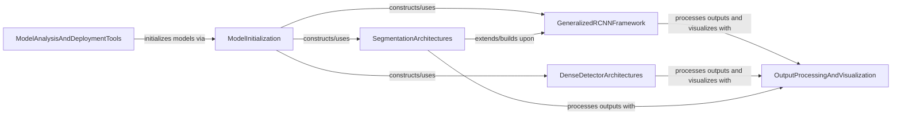

## Component Details

This graph illustrates the high-level architecture of the 'Meta Architectures' subsystem within Detectron2, focusing on how different neural network models for computer vision tasks are built, initialized, and interact. It covers the core components responsible for constructing various detection and segmentation models, their interdependencies, and the flow of data from model initialization to output processing and visualization.

### ModelInitialization

This component serves as the primary entry point for constructing and configuring various Detectron2 models. It centralizes the model building process, allowing different tools and applications to instantiate models based on specified configurations. It also includes core utilities for logging API usage during model creation.

**Related Classes/Methods**:

- <a href="https://github.com/facebookresearch/detectron2/blob/master/detectron2/modeling/meta_arch/build.py#L16-L25" target="_blank" rel="noopener noreferrer">`detectron2.modeling.meta_arch.build.build_model` (16:25)</a>

- <a href="https://github.com/facebookresearch/detectron2/blob/master/detectron2/model_zoo/model_zoo.py#L180-L213" target="_blank" rel="noopener noreferrer">`detectron2.model_zoo.model_zoo.get` (180:213)</a>

- <a href="https://github.com/facebookresearch/detectron2/blob/master/detectron2/engine/defaults.py#L312-L327" target="_blank" rel="noopener noreferrer">`detectron2.engine.defaults.DefaultPredictor.__init__` (312:327)</a>

- <a href="https://github.com/facebookresearch/detectron2/blob/master/detectron2/engine/defaults.py#L542-L553" target="_blank" rel="noopener noreferrer">`detectron2.engine.defaults.DefaultTrainer.build_model` (542:553)</a>

- <a href="https://github.com/facebookresearch/detectron2/blob/master/detectron2/utils/logger.py#L256-L261" target="_blank" rel="noopener noreferrer">`detectron2.utils.logger._log_api_usage` (256:261)</a>

### GeneralizedRCNNFramework

This component defines the fundamental architecture and operational flow for Generalized R-CNN based object detection models. It encompasses the construction of backbones, proposal generators, and ROI heads, along with image preprocessing, inference logic, and visualization capabilities for training.

**Related Classes/Methods**:

- <a href="https://github.com/facebookresearch/detectron2/blob/master/detectron2/modeling/meta_arch/rcnn.py#L25-L250" target="_blank" rel="noopener noreferrer">`detectron2.modeling.meta_arch.rcnn.GeneralizedRCNN` (25:250)</a>

- <a href="https://github.com/facebookresearch/detectron2/blob/master/detectron2/modeling/backbone/build.py#L20-L33" target="_blank" rel="noopener noreferrer">`detectron2.modeling.backbone.build.build_backbone` (20:33)</a>

- <a href="https://github.com/facebookresearch/detectron2/blob/master/detectron2/modeling/proposal_generator/build.py#L15-L24" target="_blank" rel="noopener noreferrer">`detectron2.modeling.proposal_generator.build.build_proposal_generator` (15:24)</a>

- <a href="https://github.com/facebookresearch/detectron2/blob/master/detectron2/modeling/roi_heads/roi_heads.py#L38-L43" target="_blank" rel="noopener noreferrer">`detectron2.modeling.roi_heads.roi_heads.build_roi_heads` (38:43)</a>

- <a href="https://github.com/facebookresearch/detectron2/blob/master/detectron2/modeling/meta_arch/rcnn.py#L254-L341" target="_blank" rel="noopener noreferrer">`detectron2.modeling.meta_arch.rcnn.ProposalNetwork` (254:341)</a>

- <a href="https://github.com/facebookresearch/detectron2/blob/master/detectron2/modeling/meta_arch/rcnn.py#L88-L89" target="_blank" rel="noopener noreferrer">`detectron2.modeling.meta_arch.rcnn.GeneralizedRCNN._move_to_current_device` (88:89)</a>

### DenseDetectorArchitectures

This component provides the base and specific implementations for dense object detection models, including FCOS and RetinaNet. It handles common functionalities such as transposing predictions, managing exponential moving averages (EMA), and decoding multi-level predictions for inference.

**Related Classes/Methods**:

- <a href="https://github.com/facebookresearch/detectron2/blob/master/detectron2/modeling/meta_arch/dense_detector.py#L27-L294" target="_blank" rel="noopener noreferrer">`detectron2.modeling.meta_arch.dense_detector.DenseDetector` (27:294)</a>

- <a href="https://github.com/facebookresearch/detectron2/blob/master/detectron2/modeling/meta_arch/fcos.py#L25-L300" target="_blank" rel="noopener noreferrer">`detectron2.modeling.meta_arch.fcos.FCOS` (25:300)</a>

- <a href="https://github.com/facebookresearch/detectron2/blob/master/detectron2/modeling/meta_arch/fcos.py#L303-L328" target="_blank" rel="noopener noreferrer">`detectron2.modeling.meta_arch.fcos.FCOSHead` (303:328)</a>

- <a href="https://github.com/facebookresearch/detectron2/blob/master/detectron2/modeling/meta_arch/retinanet.py#L29-L308" target="_blank" rel="noopener noreferrer">`detectron2.modeling.meta_arch.retinanet.RetinaNet` (29:308)</a>

- <a href="https://github.com/facebookresearch/detectron2/blob/master/detectron2/modeling/meta_arch/retinanet.py#L311-L439" target="_blank" rel="noopener noreferrer">`detectron2.modeling.meta_arch.retinanet.RetinaNetHead` (311:439)</a>

- <a href="https://github.com/facebookresearch/detectron2/blob/master/detectron2/modeling/meta_arch/dense_detector.py#L15-L24" target="_blank" rel="noopener noreferrer">`detectron2.modeling.meta_arch.dense_detector.permute_to_N_HWA_K` (15:24)</a>

- <a href="https://github.com/facebookresearch/detectron2/blob/master/detectron2/modeling/meta_arch/dense_detector.py#L186-L233" target="_blank" rel="noopener noreferrer">`detectron2.modeling.meta_arch.dense_detector.DenseDetector._decode_per_level_predictions` (186:233)</a>

- <a href="https://github.com/facebookresearch/detectron2/blob/master/detectron2/modeling/meta_arch/dense_detector.py#L72-L73" target="_blank" rel="noopener noreferrer">`detectron2.modeling.meta_arch.dense_detector.DenseDetector._move_to_current_device` (72:73)</a>

### SegmentationArchitectures

This component focuses on architectures and functionalities tailored for semantic and panoptic segmentation tasks. It includes models like PanopticFPN and PanopticDeepLab, responsible for building segmentation heads and executing their specific forward passes.

**Related Classes/Methods**:

- `detectron2.projects.panoptic_deeplab.panoptic_seg.PanopticDeepLab` (full file reference)

- <a href="https://github.com/facebookresearch/detectron2/blob/master/detectron2/modeling/meta_arch/panoptic_fpn.py#L21-L181" target="_blank" rel="noopener noreferrer">`detectron2.modeling.meta_arch.panoptic_fpn.PanopticFPN` (21:181)</a>

- <a href="https://github.com/facebookresearch/detectron2/blob/master/detectron2/modeling/meta_arch/semantic_seg.py#L134-L139" target="_blank" rel="noopener noreferrer">`detectron2.modeling.meta_arch.semantic_seg.build_sem_seg_head` (134:139)</a>

- <a href="https://github.com/facebookresearch/detectron2/blob/master/detectron2/modeling/meta_arch/semantic_seg.py#L34-L131" target="_blank" rel="noopener noreferrer">`detectron2.modeling.meta_arch.semantic_seg.SemanticSegmentor` (34:131)</a>

### OutputProcessingAndVisualization

This component is dedicated to the final stages of model output handling, including post-processing raw predictions into structured detection or segmentation results. It also provides robust visualization tools for overlaying predictions on images, crucial for debugging and qualitative analysis.

**Related Classes/Methods**:

- <a href="https://github.com/facebookresearch/detectron2/blob/master/detectron2/modeling/postprocessing.py#L77-L100" target="_blank" rel="noopener noreferrer">`detectron2.modeling.postprocessing.sem_seg_postprocess` (77:100)</a>

- <a href="https://github.com/facebookresearch/detectron2/blob/master/detectron2/modeling/postprocessing.py#L9-L74" target="_blank" rel="noopener noreferrer">`detectron2.modeling.postprocessing.detector_postprocess` (9:74)</a>

- <a href="https://github.com/facebookresearch/detectron2/blob/master/detectron2/utils/visualizer.py#L331-L1281" target="_blank" rel="noopener noreferrer">`detectron2.utils.visualizer.Visualizer` (331:1281)</a>

- <a href="https://github.com/facebookresearch/detectron2/blob/master/detectron2/utils/visualizer.py#L621-L761" target="_blank" rel="noopener noreferrer">`detectron2.utils.visualizer.Visualizer.overlay_instances` (621:761)</a>

### ModelAnalysisAndDeploymentTools

This component comprises a suite of command-line tools and utilities designed for analyzing various aspects of Detectron2 models, such as computational complexity (FLOPs), activation patterns, and parameter counts. It also includes tools for benchmarking model performance and preparing models for deployment.

**Related Classes/Methods**:

- `detectron2.tools.analyze_model` (full file reference)

- `detectron2.tools.benchmark` (full file reference)

- <a href="https://github.com/facebookresearch/detectron2/blob/master/tools/lightning_train_net.py#L42-L169" target="_blank" rel="noopener noreferrer">`detectron2.tools.lightning_train_net.TrainingModule` (42:169)</a>

- `detectron2.tools.plain_train_net` (full file reference)

- `detectron2.tools.deploy.export_model` (full file reference)

### [FAQ](https://github.com/CodeBoarding/GeneratedOnBoardings/tree/main?tab=readme-ov-file#faq)