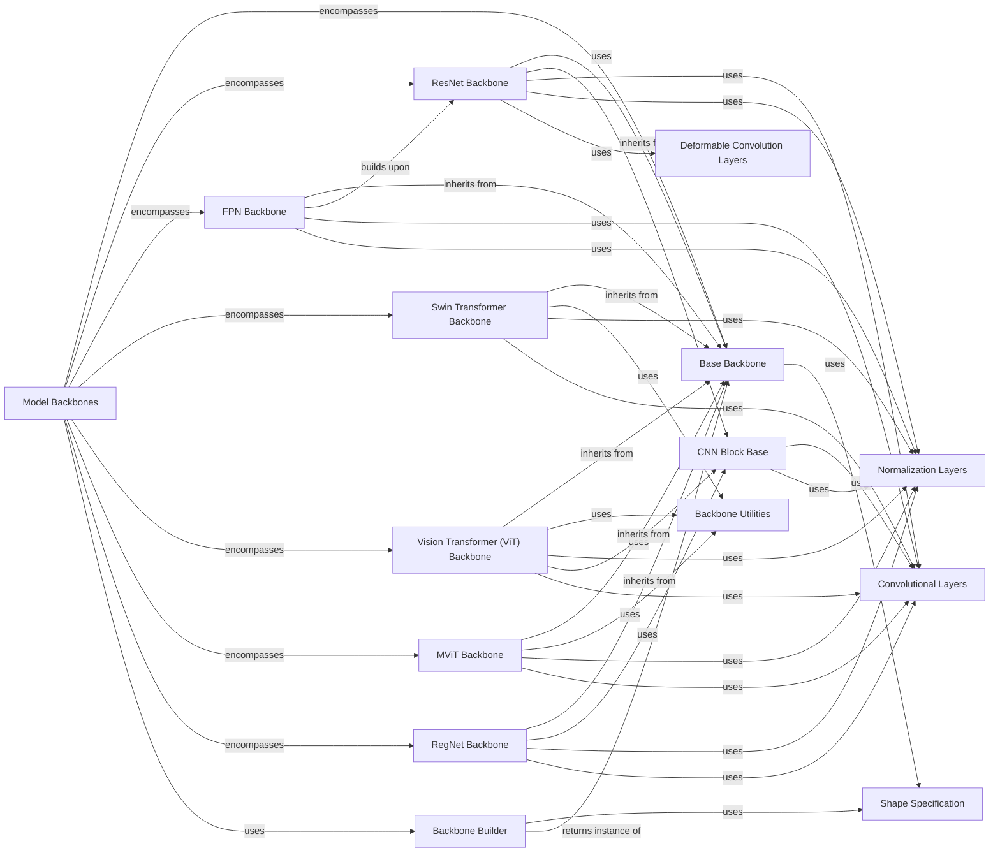

## Component Details

This graph illustrates the structure and interactions within the 'Model Backbones' subsystem of Detectron2. It highlights how various backbone architectures (ResNet, FPN, Swin Transformer, ViT, MViT, RegNet) are built upon a common 'Base Backbone' and leverage fundamental 'Convolutional Layers' and 'Normalization Layers'. The 'Backbone Builder' acts as a central factory for instantiating these backbones, which are crucial for extracting hierarchical features from input images for downstream tasks.

### Model Backbones

Contains the fundamental building blocks for neural network models, such as various backbone architectures (e.g., ResNet, Swin Transformer, ViT, RegNet, MViT) and basic convolutional and normalization layers (e.g., FPN, BatchNorm). These backbones extract hierarchical features from input images.

**Related Classes/Methods**:

- <a href="https://github.com/facebookresearch/detectron2/blob/master/detectron2/modeling/backbone/build.py#L20-L33" target="_blank" rel="noopener noreferrer">`detectron2.modeling.backbone.build.build_backbone` (20:33)</a>

- <a href="https://github.com/facebookresearch/detectron2/blob/master/detectron2/modeling/backbone/fpn.py#L17-L175" target="_blank" rel="noopener noreferrer">`detectron2.modeling.backbone.fpn.FPN` (17:175)</a>

- <a href="https://github.com/facebookresearch/detectron2/blob/master/detectron2/modeling/backbone/resnet.py#L362-L597" target="_blank" rel="noopener noreferrer">`detectron2.modeling.backbone.resnet.ResNet` (362:597)</a>

- <a href="https://github.com/facebookresearch/detectron2/blob/master/detectron2/modeling/backbone/swin.py#L510-L695" target="_blank" rel="noopener noreferrer">`detectron2.modeling.backbone.swin.SwinTransformer` (510:695)</a>

- <a href="https://github.com/facebookresearch/detectron2/blob/master/detectron2/modeling/backbone/vit.py#L232-L360" target="_blank" rel="noopener noreferrer">`detectron2.modeling.backbone.vit.ViT` (232:360)</a>

- <a href="https://github.com/facebookresearch/detectron2/blob/master/detectron2/modeling/backbone/regnet.py#L387-L452" target="_blank" rel="noopener noreferrer">`detectron2.modeling.backbone.regnet.RegNet` (387:452)</a>

- <a href="https://github.com/facebookresearch/detectron2/blob/master/detectron2/modeling/backbone/mvit.py#L271-L448" target="_blank" rel="noopener noreferrer">`detectron2.modeling.backbone.mvit.MViT` (271:448)</a>

- <a href="https://github.com/facebookresearch/detectron2/blob/master/detectron2/layers/batch_norm.py#L13-L166" target="_blank" rel="noopener noreferrer">`detectron2.layers.batch_norm.FrozenBatchNorm2d` (13:166)</a>

- <a href="https://github.com/facebookresearch/detectron2/blob/master/detectron2/layers/wrappers.py#L102-L149" target="_blank" rel="noopener noreferrer">`detectron2.layers.wrappers.Conv2d` (102:149)</a>

### Base Backbone

This component defines the abstract base class for all backbone networks in Detectron2, providing a common interface and fundamental properties for feature extraction.

**Related Classes/Methods**:

- <a href="https://github.com/facebookresearch/detectron2/blob/master/detectron2/modeling/backbone/backbone.py#L16-L20" target="_blank" rel="noopener noreferrer">`detectron2.modeling.backbone.backbone.Backbone.__init__` (16:20)</a>

### Backbone Builder

This component is responsible for constructing various backbone networks based on configuration. It acts as a central registry and factory for instantiating different backbone architectures.

**Related Classes/Methods**:

- <a href="https://github.com/facebookresearch/detectron2/blob/master/detectron2/modeling/backbone/build.py#L20-L33" target="_blank" rel="noopener noreferrer">`detectron2.modeling.backbone.build.build_backbone` (20:33)</a>

### ResNet Backbone

This component implements the ResNet family of backbone architectures, including basic and bottleneck blocks, and provides utilities for building ResNet models with different configurations and stages.

**Related Classes/Methods**:

- <a href="https://github.com/facebookresearch/detectron2/blob/master/detectron2/modeling/backbone/resnet.py#L330-L359" target="_blank" rel="noopener noreferrer">`detectron2.modeling.backbone.resnet.BasicStem` (330:359)</a>

- <a href="https://github.com/facebookresearch/detectron2/blob/master/detectron2/modeling/backbone/resnet.py#L362-L597" target="_blank" rel="noopener noreferrer">`detectron2.modeling.backbone.resnet.ResNet` (362:597)</a>

- <a href="https://github.com/facebookresearch/detectron2/blob/master/detectron2/modeling/backbone/resnet.py#L32-L97" target="_blank" rel="noopener noreferrer">`detectron2.modeling.backbone.resnet.BasicBlock` (32:97)</a>

- <a href="https://github.com/facebookresearch/detectron2/blob/master/detectron2/modeling/backbone/resnet.py#L100-L210" target="_blank" rel="noopener noreferrer">`detectron2.modeling.backbone.resnet.BottleneckBlock` (100:210)</a>

- <a href="https://github.com/facebookresearch/detectron2/blob/master/detectron2/modeling/backbone/resnet.py#L213-L327" target="_blank" rel="noopener noreferrer">`detectron2.modeling.backbone.resnet.DeformBottleneckBlock` (213:327)</a>

- <a href="https://github.com/facebookresearch/detectron2/blob/master/detectron2/modeling/backbone/resnet.py#L614-L694" target="_blank" rel="noopener noreferrer">`detectron2.modeling.backbone.resnet:build_resnet_backbone` (614:694)</a>

- <a href="https://github.com/facebookresearch/detectron2/blob/master/detectron2/modeling/backbone/resnet.py#L606-L610" target="_blank" rel="noopener noreferrer">`detectron2.modeling.backbone.resnet:make_stage` (606:610)</a>

- <a href="https://github.com/facebookresearch/detectron2/blob/master/detectron2/modeling/backbone/resnet.py#L468-L490" target="_blank" rel="noopener noreferrer">`detectron2.modeling.backbone.resnet.ResNet.freeze` (468:490)</a>

- <a href="https://github.com/facebookresearch/detectron2/blob/master/detectron2/modeling/backbone/resnet.py#L548-L597" target="_blank" rel="noopener noreferrer">`detectron2.modeling.backbone.resnet.ResNet.make_default_stages` (548:597)</a>

- <a href="https://github.com/facebookresearch/detectron2/blob/master/detectron2/modeling/backbone/resnet.py#L460-L466" target="_blank" rel="noopener noreferrer">`detectron2.modeling.backbone.resnet.ResNet.output_shape` (460:466)</a>

### FPN Backbone

This component implements the Feature Pyramid Network (FPN) architecture, which enhances backbone features by creating a multi-scale feature pyramid. It includes functions for building FPNs on top of ResNet backbones.

**Related Classes/Methods**:

- <a href="https://github.com/facebookresearch/detectron2/blob/master/detectron2/modeling/backbone/fpn.py#L17-L175" target="_blank" rel="noopener noreferrer">`detectron2.modeling.backbone.fpn.FPN` (17:175)</a>

- <a href="https://github.com/facebookresearch/detectron2/blob/master/detectron2/modeling/backbone/fpn.py#L225-L244" target="_blank" rel="noopener noreferrer">`detectron2.modeling.backbone.fpn:build_resnet_fpn_backbone` (225:244)</a>

- <a href="https://github.com/facebookresearch/detectron2/blob/master/detectron2/modeling/backbone/fpn.py#L248-L268" target="_blank" rel="noopener noreferrer">`detectron2.modeling.backbone.fpn:build_retinanet_resnet_fpn_backbone` (248:268)</a>

- <a href="https://github.com/facebookresearch/detectron2/blob/master/detectron2/modeling/backbone/fpn.py#L178-L185" target="_blank" rel="noopener noreferrer">`detectron2.modeling.backbone.fpn._assert_strides_are_log2_contiguous` (178:185)</a>

### Swin Transformer Backbone

This component provides the Swin Transformer backbone, a hierarchical vision transformer that uses shifted windows for efficient self-attention computation. It includes the core Swin Transformer blocks and layers.

**Related Classes/Methods**:

- <a href="https://github.com/facebookresearch/detectron2/blob/master/detectron2/modeling/backbone/swin.py#L180-L306" target="_blank" rel="noopener noreferrer">`detectron2.modeling.backbone.swin.SwinTransformerBlock` (180:306)</a>

- <a href="https://github.com/facebookresearch/detectron2/blob/master/detectron2/modeling/backbone/swin.py#L351-L465" target="_blank" rel="noopener noreferrer">`detectron2.modeling.backbone.swin.BasicLayer` (351:465)</a>

- <a href="https://github.com/facebookresearch/detectron2/blob/master/detectron2/modeling/backbone/swin.py#L510-L695" target="_blank" rel="noopener noreferrer">`detectron2.modeling.backbone.swin.SwinTransformer` (510:695)</a>

- <a href="https://github.com/facebookresearch/detectron2/blob/master/detectron2/modeling/backbone/swin.py#L79-L177" target="_blank" rel="noopener noreferrer">`detectron2.modeling.backbone.swin.WindowAttention` (79:177)</a>

- <a href="https://github.com/facebookresearch/detectron2/blob/master/detectron2/modeling/backbone/swin.py#L468-L507" target="_blank" rel="noopener noreferrer">`detectron2.modeling.backbone.swin.PatchEmbed` (468:507)</a>

- <a href="https://github.com/facebookresearch/detectron2/blob/master/detectron2/modeling/backbone/swin.py#L49-L60" target="_blank" rel="noopener noreferrer">`detectron2.modeling.backbone.swin.window_partition` (49:60)</a>

- <a href="https://github.com/facebookresearch/detectron2/blob/master/detectron2/modeling/backbone/swin.py#L63-L76" target="_blank" rel="noopener noreferrer">`detectron2.modeling.backbone.swin.window_reverse` (63:76)</a>

- <a href="https://github.com/facebookresearch/detectron2/blob/master/detectron2/modeling/backbone/swin.py#L638-L653" target="_blank" rel="noopener noreferrer">`detectron2.modeling.backbone.swin.SwinTransformer._freeze_stages` (638:653)</a>

### Vision Transformer (ViT) Backbone

This component implements the Vision Transformer (ViT) architecture, which applies transformer principles directly to image patches. It includes attention mechanisms, residual blocks, and patch embedding.

**Related Classes/Methods**:

- <a href="https://github.com/facebookresearch/detectron2/blob/master/detectron2/modeling/backbone/vit.py#L84-L142" target="_blank" rel="noopener noreferrer">`detectron2.modeling.backbone.vit.ResBottleneckBlock` (84:142)</a>

- <a href="https://github.com/facebookresearch/detectron2/blob/master/detectron2/modeling/backbone/vit.py#L145-L229" target="_blank" rel="noopener noreferrer">`detectron2.modeling.backbone.vit.Block` (145:229)</a>

- <a href="https://github.com/facebookresearch/detectron2/blob/master/detectron2/modeling/backbone/vit.py#L232-L360" target="_blank" rel="noopener noreferrer">`detectron2.modeling.backbone.vit.ViT` (232:360)</a>

- <a href="https://github.com/facebookresearch/detectron2/blob/master/detectron2/modeling/backbone/vit.py#L363-L503" target="_blank" rel="noopener noreferrer">`detectron2.modeling.backbone.vit.SimpleFeaturePyramid` (363:503)</a>

- <a href="https://github.com/facebookresearch/detectron2/blob/master/detectron2/modeling/backbone/vit.py#L25-L81" target="_blank" rel="noopener noreferrer">`detectron2.modeling.backbone.vit.Attention` (25:81)</a>

### MViT Backbone

This component provides the Multi-scale Vision Transformer (MViT) backbone, which incorporates multi-scale attention mechanisms for efficient processing of visual information.

**Related Classes/Methods**:

- <a href="https://github.com/facebookresearch/detectron2/blob/master/detectron2/modeling/backbone/mvit.py#L33-L174" target="_blank" rel="noopener noreferrer">`detectron2.modeling.backbone.mvit.MultiScaleAttention` (33:174)</a>

- <a href="https://github.com/facebookresearch/detectron2/blob/master/detectron2/modeling/backbone/mvit.py#L177-L268" target="_blank" rel="noopener noreferrer">`detectron2.modeling.backbone.mvit.MultiScaleBlock` (177:268)</a>

- <a href="https://github.com/facebookresearch/detectron2/blob/master/detectron2/modeling/backbone/mvit.py#L271-L448" target="_blank" rel="noopener noreferrer">`detectron2.modeling.backbone.mvit.MViT` (271:448)</a>

- <a href="https://github.com/facebookresearch/detectron2/blob/master/detectron2/modeling/backbone/mvit.py#L21-L30" target="_blank" rel="noopener noreferrer">`detectron2.modeling.backbone.mvit.attention_pool` (21:30)</a>

- <a href="https://github.com/facebookresearch/detectron2/blob/master/detectron2/modeling/backbone/utils.py#L96-L125" target="_blank" rel="noopener noreferrer">`detectron2.modeling.backbone.utils.add_decomposed_rel_pos` (96:125)</a>

### RegNet Backbone

This component implements the RegNet family of backbones, which are designed using neural architecture search to achieve efficient and scalable network designs. It includes various stem and block types.

**Related Classes/Methods**:

- <a href="https://github.com/facebookresearch/detectron2/blob/master/detectron2/modeling/backbone/regnet.py#L60-L73" target="_blank" rel="noopener noreferrer">`detectron2.modeling.backbone.regnet.ResStem` (60:73)</a>

- <a href="https://github.com/facebookresearch/detectron2/blob/master/detectron2/modeling/backbone/regnet.py#L76-L88" target="_blank" rel="noopener noreferrer">`detectron2.modeling.backbone.regnet.SimpleStem` (76:88)</a>

- <a href="https://github.com/facebookresearch/detectron2/blob/master/detectron2/modeling/backbone/regnet.py#L108-L123" target="_blank" rel="noopener noreferrer">`detectron2.modeling.backbone.regnet.VanillaBlock` (108:123)</a>

- <a href="https://github.com/facebookresearch/detectron2/blob/master/detectron2/modeling/backbone/regnet.py#L126-L141" target="_blank" rel="noopener noreferrer">`detectron2.modeling.backbone.regnet.BasicTransform` (126:141)</a>

- <a href="https://github.com/facebookresearch/detectron2/blob/master/detectron2/modeling/backbone/regnet.py#L144-L158" target="_blank" rel="noopener noreferrer">`detectron2.modeling.backbone.regnet.ResBasicBlock` (144:158)</a>

- <a href="https://github.com/facebookresearch/detectron2/blob/master/detectron2/modeling/backbone/regnet.py#L161-L183" target="_blank" rel="noopener noreferrer">`detectron2.modeling.backbone.regnet.BottleneckTransform` (161:183)</a>

- <a href="https://github.com/facebookresearch/detectron2/blob/master/detectron2/modeling/backbone/regnet.py#L186-L200" target="_blank" rel="noopener noreferrer">`detectron2.modeling.backbone.regnet.ResBottleneckBlock` (186:200)</a>

- <a href="https://github.com/facebookresearch/detectron2/blob/master/detectron2/modeling/backbone/regnet.py#L219-L353" target="_blank" rel="noopener noreferrer">`detectron2.modeling.backbone.regnet.AnyNet` (219:353)</a>

- <a href="https://github.com/facebookresearch/detectron2/blob/master/detectron2/modeling/backbone/regnet.py#L387-L452" target="_blank" rel="noopener noreferrer">`detectron2.modeling.backbone.regnet.RegNet` (387:452)</a>

- <a href="https://github.com/facebookresearch/detectron2/blob/master/detectron2/modeling/backbone/regnet.py#L28-L32" target="_blank" rel="noopener noreferrer">`detectron2.modeling.backbone.regnet.conv2d` (28:32)</a>

- <a href="https://github.com/facebookresearch/detectron2/blob/master/detectron2/modeling/backbone/regnet.py#L40-L43" target="_blank" rel="noopener noreferrer">`detectron2.modeling.backbone.regnet.pool2d` (40:43)</a>

- <a href="https://github.com/facebookresearch/detectron2/blob/master/detectron2/modeling/backbone/regnet.py#L369-L384" target="_blank" rel="noopener noreferrer">`detectron2.modeling.backbone.regnet.generate_regnet_parameters` (369:384)</a>

- <a href="https://github.com/facebookresearch/detectron2/blob/master/detectron2/modeling/backbone/regnet.py#L356-L366" target="_blank" rel="noopener noreferrer">`detectron2.modeling.backbone.regnet.adjust_block_compatibility` (356:366)</a>

- <a href="https://github.com/facebookresearch/detectron2/blob/master/detectron2/modeling/backbone/regnet.py#L203-L216" target="_blank" rel="noopener noreferrer">`detectron2.modeling.backbone.regnet.AnyStage` (203:216)</a>

### Convolutional Layers

This component provides a wrapper around standard PyTorch 2D convolutional layers, adding support for empty inputs and optional normalization and activation functions. It is a fundamental building block for many neural network architectures within Detectron2.

**Related Classes/Methods**:

- <a href="https://github.com/facebookresearch/detectron2/blob/master/detectron2/layers/wrappers.py#L102-L149" target="_blank" rel="noopener noreferrer">`detectron2.layers.wrappers.Conv2d` (102:149)</a>

- <a href="https://github.com/facebookresearch/detectron2/blob/master/detectron2/layers/wrappers.py#L42-L48" target="_blank" rel="noopener noreferrer">`detectron2.layers.wrappers.check_if_dynamo_compiling` (42:48)</a>

### Normalization Layers

This component offers various normalization techniques, including standard BatchNorm, frozen BatchNorm (for inference or specific training scenarios), naive synchronized BatchNorm, and LayerNorm. It provides a utility function to retrieve the appropriate normalization layer based on configuration.

**Related Classes/Methods**:

- <a href="https://github.com/facebookresearch/detectron2/blob/master/detectron2/layers/batch_norm.py#L169-L197" target="_blank" rel="noopener noreferrer">`detectron2.layers.batch_norm.get_norm` (169:197)</a>

- <a href="https://github.com/facebookresearch/detectron2/blob/master/detectron2/layers/batch_norm.py#L13-L166" target="_blank" rel="noopener noreferrer">`detectron2.layers.batch_norm.FrozenBatchNorm2d` (13:166)</a>

- <a href="https://github.com/facebookresearch/detectron2/blob/master/detectron2/layers/batch_norm.py#L200-L283" target="_blank" rel="noopener noreferrer">`detectron2.layers.batch_norm.NaiveSyncBatchNorm` (200:283)</a>

- <a href="https://github.com/facebookresearch/detectron2/blob/master/detectron2/layers/batch_norm.py#L333-L353" target="_blank" rel="noopener noreferrer">`detectron2.layers.batch_norm.LayerNorm` (333:353)</a>

- <a href="https://github.com/facebookresearch/detectron2/blob/master/detectron2/layers/batch_norm.py#L102-L133" target="_blank" rel="noopener noreferrer">`detectron2.layers.batch_norm.FrozenBatchNorm2d:convert_frozen_batchnorm` (102:133)</a>

- <a href="https://github.com/facebookresearch/detectron2/blob/master/detectron2/layers/batch_norm.py#L136-L166" target="_blank" rel="noopener noreferrer">`detectron2.layers.batch_norm.FrozenBatchNorm2d:convert_frozenbatchnorm2d_to_batchnorm2d` (136:166)</a>

### Shape Specification

This utility component defines a data structure for specifying the shape of tensors, including channels, height, and width. It is used throughout Detectron2 to describe input and output feature map dimensions.

**Related Classes/Methods**:

- <a href="https://github.com/facebookresearch/detectron2/blob/master/detectron2/layers/shape_spec.py#L8-L18" target="_blank" rel="noopener noreferrer">`detectron2.layers.shape_spec.ShapeSpec` (8:18)</a>

### Backbone Utilities

This component provides common utility functions and classes used across various backbone architectures, such as patch embedding, window partitioning/unpartitioning for attention mechanisms, and relative position encoding.

**Related Classes/Methods**:

- <a href="https://github.com/facebookresearch/detectron2/blob/master/detectron2/modeling/backbone/utils.py#L160-L186" target="_blank" rel="noopener noreferrer">`detectron2.modeling.backbone.utils.PatchEmbed` (160:186)</a>

- <a href="https://github.com/facebookresearch/detectron2/blob/master/detectron2/modeling/backbone/utils.py#L16-L37" target="_blank" rel="noopener noreferrer">`detectron2.modeling.backbone.utils.window_partition` (16:37)</a>

- <a href="https://github.com/facebookresearch/detectron2/blob/master/detectron2/modeling/backbone/utils.py#L40-L60" target="_blank" rel="noopener noreferrer">`detectron2.modeling.backbone.utils.window_unpartition` (40:60)</a>

- <a href="https://github.com/facebookresearch/detectron2/blob/master/detectron2/modeling/backbone/utils.py#L96-L125" target="_blank" rel="noopener noreferrer">`detectron2.modeling.backbone.utils.add_decomposed_rel_pos` (96:125)</a>

### CNN Block Base

This component provides foundational classes for convolutional neural network blocks, including a base class for common CNN block functionalities and a specialized depthwise separable convolution block.

**Related Classes/Methods**:

- <a href="https://github.com/facebookresearch/detectron2/blob/master/detectron2/layers/blocks.py#L16-L55" target="_blank" rel="noopener noreferrer">`detectron2.layers.blocks.CNNBlockBase` (16:55)</a>

- <a href="https://github.com/facebookresearch/detectron2/blob/master/detectron2/layers/blocks.py#L58-L111" target="_blank" rel="noopener noreferrer">`detectron2.layers.blocks.DepthwiseSeparableConv2d` (58:111)</a>

### Deformable Convolution Layers

This component provides implementations of deformable convolution and modulated deformable convolution, which allow the sampling locations in the convolution kernel to be adaptively adjusted based on the input features.

**Related Classes/Methods**:

- <a href="https://github.com/facebookresearch/detectron2/blob/master/detectron2/layers/deform_conv.py#L316-L410" target="_blank" rel="noopener noreferrer">`detectron2.layers.deform_conv.DeformConv` (316:410)</a>

- <a href="https://github.com/facebookresearch/detectron2/blob/master/detectron2/layers/deform_conv.py#L413-L502" target="_blank" rel="noopener noreferrer">`detectron2.layers.deform_conv.ModulatedDeformConv` (413:502)</a>

### [FAQ](https://github.com/CodeBoarding/GeneratedOnBoardings/tree/main?tab=readme-ov-file#faq)