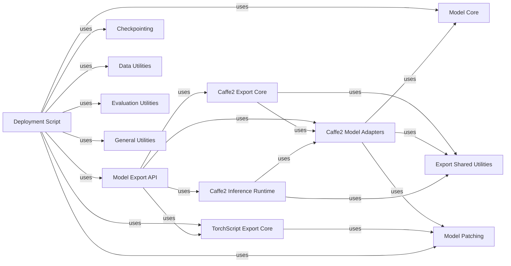

## Component Details

Facilitates the export of trained Detectron2 models to various deployment formats such as Caffe2, ONNX, and TorchScript, enabling their use in production environments or other frameworks.

### Model Export API

This component provides the primary interface for users to export Detectron2 models into various deployment formats like Caffe2, ONNX, and TorchScript. It encapsulates the complexities of model tracing and format-specific conversions.

**Related Classes/Methods**:

- <a href="https://github.com/facebookresearch/detectron2/blob/master/detectron2/export/api.py#L22-L107" target="_blank" rel="noopener noreferrer">`detectron2.export.api.Caffe2Tracer` (22:107)</a>

- <a href="https://github.com/facebookresearch/detectron2/blob/master/detectron2/export/api.py#L110-L230" target="_blank" rel="noopener noreferrer">`detectron2.export.api.Caffe2Model` (110:230)</a>

### Caffe2 Export Core

This component is responsible for the detailed process of converting a PyTorch model to Caffe2's protobuf format. It leverages ONNX as an intermediate representation and applies various graph optimizations specific to Caffe2.

**Related Classes/Methods**:

- <a href="https://github.com/facebookresearch/detectron2/blob/master/detectron2/export/caffe2_export.py#L125-L168" target="_blank" rel="noopener noreferrer">`detectron2.export.caffe2_export.export_caffe2_detection_model` (125:168)</a>

- <a href="https://github.com/facebookresearch/detectron2/blob/master/detectron2/export/caffe2_export.py#L34-L67" target="_blank" rel="noopener noreferrer">`detectron2.export.caffe2_export.export_onnx_model` (34:67)</a>

- <a href="https://github.com/facebookresearch/detectron2/blob/master/detectron2/export/caffe2_export.py#L79-L122" target="_blank" rel="noopener noreferrer">`detectron2.export.caffe2_export._assign_device_option` (79:122)</a>

- <a href="https://github.com/facebookresearch/detectron2/blob/master/detectron2/export/caffe2_export.py#L70-L76" target="_blank" rel="noopener noreferrer">`detectron2.export.caffe2_export._op_stats` (70:76)</a>

- <a href="https://github.com/facebookresearch/detectron2/blob/master/detectron2/export/caffe2_export.py#L171-L203" target="_blank" rel="noopener noreferrer">`detectron2.export.caffe2_export.run_and_save_graph` (171:203)</a>

### TorchScript Export Core

This component handles the tracing and scripting of PyTorch models into TorchScript format. It includes specialized logic to manage Detectron2's Instances data structure during the scripting process and provides utilities for debugging the TorchScript IR.

**Related Classes/Methods**:

- <a href="https://github.com/facebookresearch/detectron2/blob/master/detectron2/export/torchscript.py#L13-L56" target="_blank" rel="noopener noreferrer">`detectron2.export.torchscript.scripting_with_instances` (13:56)</a>

- <a href="https://github.com/facebookresearch/detectron2/blob/master/detectron2/export/torchscript.py#L63-L132" target="_blank" rel="noopener noreferrer">`detectron2.export.torchscript.dump_torchscript_IR` (63:132)</a>

### Caffe2 Model Adapters

This component provides specialized model implementations and utility functions that adapt Detectron2's meta-architectures (like GeneralizedRCNN) to be compatible with Caffe2's operational requirements. It includes methods for input/output format conversion and image preprocessing for Caffe2.

**Related Classes/Methods**:

- <a href="https://github.com/facebookresearch/detectron2/blob/master/detectron2/export/caffe2_modeling.py#L135-L242" target="_blank" rel="noopener noreferrer">`detectron2.export.caffe2_modeling.Caffe2MetaArch` (135:242)</a>

- <a href="https://github.com/facebookresearch/detectron2/blob/master/detectron2/export/caffe2_modeling.py#L245-L287" target="_blank" rel="noopener noreferrer">`detectron2.export.caffe2_modeling.Caffe2GeneralizedRCNN` (245:287)</a>

- <a href="https://github.com/facebookresearch/detectron2/blob/master/detectron2/export/caffe2_modeling.py#L27-L92" target="_blank" rel="noopener noreferrer">`detectron2.export.caffe2_modeling.assemble_rcnn_outputs_by_name` (27:92)</a>

- <a href="https://github.com/facebookresearch/detectron2/blob/master/detectron2/export/caffe2_modeling.py#L107-L132" target="_blank" rel="noopener noreferrer">`detectron2.export.caffe2_modeling.convert_batched_inputs_to_c2_format` (107:132)</a>

- `detectron2.export.caffe2_modeling._caffe2_preprocess_image` (full file reference)

### Export Shared Utilities

This component comprises a collection of common helper functions and graph transformation passes that are utilized across different model export pipelines (e.g., Caffe2, ONNX). These utilities perform tasks like fusing operations, removing dead-end ops, and managing protobuf arguments.

**Related Classes/Methods**:

- <a href="https://github.com/facebookresearch/detectron2/blob/master/detectron2/export/shared.py#L605-L627" target="_blank" rel="noopener noreferrer">`detectron2.export.shared.fuse_alias_placeholder` (605:627)</a>

- <a href="https://github.com/facebookresearch/detectron2/blob/master/detectron2/export/shared.py#L958-L1013" target="_blank" rel="noopener noreferrer">`detectron2.export.shared.fuse_copy_between_cpu_and_gpu` (958:1013)</a>

- <a href="https://github.com/facebookresearch/detectron2/blob/master/detectron2/export/shared.py#L1016-L1040" target="_blank" rel="noopener noreferrer">`detectron2.export.shared.remove_dead_end_ops` (1016:1040)</a>

- <a href="https://github.com/facebookresearch/detectron2/blob/master/detectron2/export/shared.py#L345-L372" target="_blank" rel="noopener noreferrer">`detectron2.export.shared.get_params_from_init_net` (345:372)</a>

- <a href="https://github.com/facebookresearch/detectron2/blob/master/detectron2/export/shared.py#L888-L955" target="_blank" rel="noopener noreferrer">`detectron2.export.shared.remove_reshape_for_fc` (888:955)</a>

- <a href="https://github.com/facebookresearch/detectron2/blob/master/detectron2/export/shared.py#L295-L316" target="_blank" rel="noopener noreferrer">`detectron2.export.shared.construct_init_net_from_params` (295:316)</a>

- <a href="https://github.com/facebookresearch/detectron2/blob/master/detectron2/export/shared.py#L569-L592" target="_blank" rel="noopener noreferrer">`detectron2.export.shared.group_norm_replace_aten_with_caffe2` (569:592)</a>

- <a href="https://github.com/facebookresearch/detectron2/blob/master/detectron2/export/shared.py#L209-L224" target="_blank" rel="noopener noreferrer">`detectron2.export.shared.check_set_pb_arg` (209:224)</a>

- <a href="https://github.com/facebookresearch/detectron2/blob/master/detectron2/export/shared.py#L114-L128" target="_blank" rel="noopener noreferrer">`detectron2.export.shared.mock_torch_nn_functional_interpolate` (114:128)</a>

- <a href="https://github.com/facebookresearch/detectron2/blob/master/detectron2/export/shared.py#L529-L531" target="_blank" rel="noopener noreferrer">`detectron2.export.shared.save_graph` (529:531)</a>

### Model Patching

This component provides specific patching and adaptation mechanisms to modify internal behaviors or structures of Detectron2 models, making them suitable for export to target runtimes like Caffe2 or TorchScript, especially concerning data structures like Instances or specific module behaviors, and also includes adapters for tracing.

**Related Classes/Methods**:

- <a href="https://github.com/facebookresearch/detectron2/blob/master/detectron2/export/caffe2_patch.py#L73-L78" target="_blank" rel="noopener noreferrer">`detectron2.export.caffe2_patch.patch_generalized_rcnn` (73:78)</a>

- <a href="https://github.com/facebookresearch/detectron2/blob/master/detectron2/export/caffe2_patch.py#L117-L189" target="_blank" rel="noopener noreferrer">`detectron2.export.caffe2_patch.ROIHeadsPatcher` (117:189)</a>

- <a href="https://github.com/facebookresearch/detectron2/blob/master/detectron2/export/torchscript_patch.py#L392-L406" target="_blank" rel="noopener noreferrer">`detectron2.export.torchscript_patch.freeze_training_mode` (392:406)</a>

- <a href="https://github.com/facebookresearch/detectron2/blob/master/detectron2/export/torchscript_patch.py#L51-L87" target="_blank" rel="noopener noreferrer">`detectron2.export.torchscript_patch.patch_instances` (51:87)</a>

- <a href="https://github.com/facebookresearch/detectron2/blob/master/detectron2/export/flatten.py#L186-L330" target="_blank" rel="noopener noreferrer">`detectron2.export.flatten.TracingAdapter` (186:330)</a>

### Deployment Script

This is the main executable script for the Detectron2 model deployment subsystem. It parses command-line arguments, sets up the configuration, loads the PyTorch model, orchestrates the chosen export method (Caffe2 tracing, TorchScript scripting, or TorchScript tracing), and optionally performs evaluation on the exported model.

**Related Classes/Methods**:

- <a href="https://github.com/facebookresearch/detectron2/blob/master/tools/deploy/export_model.py#L179-L241" target="_blank" rel="noopener noreferrer">`tools.deploy.export_model.main` (179:241)</a>

- <a href="https://github.com/facebookresearch/detectron2/blob/master/tools/deploy/export_model.py#L29-L37" target="_blank" rel="noopener noreferrer">`tools.deploy.export_model.setup_cfg` (29:37)</a>

- <a href="https://github.com/facebookresearch/detectron2/blob/master/tools/deploy/export_model.py#L40-L59" target="_blank" rel="noopener noreferrer">`tools.deploy.export_model.export_caffe2_tracing` (40:59)</a>

- <a href="https://github.com/facebookresearch/detectron2/blob/master/tools/deploy/export_model.py#L63-L104" target="_blank" rel="noopener noreferrer">`tools.deploy.export_model.export_scripting` (63:104)</a>

- <a href="https://github.com/facebookresearch/detectron2/blob/master/tools/deploy/export_model.py#L108-L151" target="_blank" rel="noopener noreferrer">`tools.deploy.export_model.export_tracing` (108:151)</a>

- <a href="https://github.com/facebookresearch/detectron2/blob/master/tools/deploy/export_model.py#L154-L176" target="_blank" rel="noopener noreferrer">`tools.deploy.export_model.get_sample_inputs` (154:176)</a>

- `tools.deploy.export_model.ScriptableAdapter` (full file reference)

- <a href="https://github.com/facebookresearch/detectron2/blob/master/detectron2/export/flatten.py#L186-L330" target="_blank" rel="noopener noreferrer">`detectron2.export.flatten.TracingAdapter` (186:330)</a>

### Caffe2 Inference Runtime

Provides functionalities to load and run inference with Detectron2 models exported to Caffe2 protobuf format.

**Related Classes/Methods**:

- <a href="https://github.com/facebookresearch/detectron2/blob/master/detectron2/export/caffe2_inference.py#L125-L161" target="_blank" rel="noopener noreferrer">`detectron2.export.caffe2_inference.ProtobufDetectionModel` (125:161)</a>

- <a href="https://github.com/facebookresearch/detectron2/blob/master/detectron2/export/caffe2_inference.py#L17-L122" target="_blank" rel="noopener noreferrer">`detectron2.export.caffe2_inference.ProtobufModel` (17:122)</a>

### Model Core

This component encompasses the fundamental building blocks and meta-architectures of Detectron2 models, such as GeneralizedRCNN, and provides utilities for post-processing detection results.

**Related Classes/Methods**:

- <a href="https://github.com/facebookresearch/detectron2/blob/master/detectron2/modeling/meta_arch/build.py#L16-L25" target="_blank" rel="noopener noreferrer">`detectron2.modeling.meta_arch.build.build_model` (16:25)</a>

- `detectron2.modeling.GeneralizedRCNN` (full file reference)

- <a href="https://github.com/facebookresearch/detectron2/blob/master/detectron2/modeling/postprocessing.py#L9-L74" target="_blank" rel="noopener noreferrer">`detectron2.modeling.postprocessing.detector_postprocess` (9:74)</a>

### Checkpointing

This component is responsible for loading pre-trained model weights from checkpoints, ensuring that the model is initialized correctly before export or evaluation.

**Related Classes/Methods**:

- <a href="https://github.com/facebookresearch/detectron2/blob/master/detectron2/checkpoint/detection_checkpoint.py#L16-L143" target="_blank" rel="noopener noreferrer">`detectron2.checkpoint.detection_checkpoint.DetectionCheckpointer` (16:143)</a>

### Data Utilities

This component provides functionalities for loading datasets, reading images, and applying necessary transformations to prepare input data for model inference or export.

**Related Classes/Methods**:

- <a href="https://github.com/facebookresearch/detectron2/blob/master/detectron2/data/build.py#L621-L682" target="_blank" rel="noopener noreferrer">`detectron2.data.build.build_detection_test_loader` (621:682)</a>

- <a href="https://github.com/facebookresearch/detectron2/blob/master/detectron2/data/detection_utils.py#L166-L186" target="_blank" rel="noopener noreferrer">`detectron2.data.detection_utils.read_image` (166:186)</a>

- `detectron2.data.transforms` (full file reference)

### Evaluation Utilities

This component provides tools and frameworks for evaluating the performance of detection models, including standard evaluators like COCOEvaluator and functions for running inference on datasets and reporting metrics.

**Related Classes/Methods**:

- <a href="https://github.com/facebookresearch/detectron2/blob/master/detectron2/evaluation/coco_evaluation.py#L34-L389" target="_blank" rel="noopener noreferrer">`detectron2.evaluation.coco_evaluation.COCOEvaluator` (34:389)</a>

- <a href="https://github.com/facebookresearch/detectron2/blob/master/detectron2/evaluation/evaluator.py#L103-L220" target="_blank" rel="noopener noreferrer">`detectron2.evaluation.evaluator.inference_on_dataset` (103:220)</a>

- <a href="https://github.com/facebookresearch/detectron2/blob/master/detectron2/evaluation/testing.py#L9-L28" target="_blank" rel="noopener noreferrer">`detectron2.evaluation.testing.print_csv_format` (9:28)</a>

### General Utilities

This component includes common utility functions that support various parts of the Detectron2 framework, such as setting up logging.

**Related Classes/Methods**:

- <a href="https://github.com/facebookresearch/detectron2/blob/master/detectron2/utils/logger.py#L43-L113" target="_blank" rel="noopener noreferrer">`detectron2.utils.logger.setup_logger` (43:113)</a>

### [FAQ](https://github.com/CodeBoarding/GeneratedOnBoardings/tree/main?tab=readme-ov-file#faq)