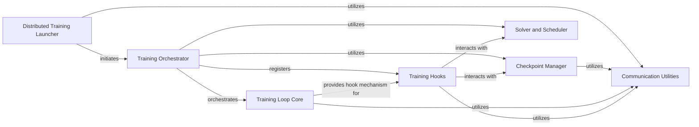

## Component Details

This graph illustrates the architecture of the Training Orchestration subsystem in Detectron2. The core functionality revolves around the `Training Orchestrator`, which manages the entire training lifecycle. It leverages the `Training Loop Core` to execute the main training iterations and integrates with `Checkpoint Manager` for saving and loading model states, and `Solver and Scheduler` for optimizing model parameters and adjusting learning rates. The training process is highly customizable through `Training Hooks`, which allow for various callbacks at different stages. For distributed training, the `Distributed Training Launcher` initiates and manages the processes, relying on `Communication Utilities` for inter-process communication and synchronization. The overall purpose is to provide a robust, flexible, and scalable framework for training deep learning models.

### Training Orchestrator

Orchestrates the entire training process, including initialization, managing the training loop, handling checkpoints, and integrating optimizers, learning rate schedulers, and various training event hooks.

**Related Classes/Methods**:

- <a href="https://github.com/facebookresearch/detectron2/blob/master/detectron2/engine/defaults.py#L355-L737" target="_blank" rel="noopener noreferrer">`detectron2.engine.defaults.DefaultTrainer` (355:737)</a>

- <a href="https://github.com/facebookresearch/detectron2/blob/master/detectron2/engine/defaults.py#L398-L430" target="_blank" rel="noopener noreferrer">`detectron2.engine.defaults.DefaultTrainer.__init__` (398:430)</a>

- <a href="https://github.com/facebookresearch/detectron2/blob/master/detectron2/engine/defaults.py#L432-L450" target="_blank" rel="noopener noreferrer">`detectron2.engine.defaults.DefaultTrainer.resume_or_load` (432:450)</a>

- <a href="https://github.com/facebookresearch/detectron2/blob/master/detectron2/engine/defaults.py#L513-L526" target="_blank" rel="noopener noreferrer">`detectron2.engine.defaults.DefaultTrainer.train` (513:526)</a>

- <a href="https://github.com/facebookresearch/detectron2/blob/master/detectron2/engine/defaults.py#L528-L530" target="_blank" rel="noopener noreferrer">`detectron2.engine.defaults.DefaultTrainer.run_step` (528:530)</a>

- <a href="https://github.com/facebookresearch/detectron2/blob/master/detectron2/engine/defaults.py#L532-L535" target="_blank" rel="noopener noreferrer">`detectron2.engine.defaults.DefaultTrainer.state_dict` (532:535)</a>

- <a href="https://github.com/facebookresearch/detectron2/blob/master/detectron2/engine/defaults.py#L537-L539" target="_blank" rel="noopener noreferrer">`detectron2.engine.defaults.DefaultTrainer.load_state_dict` (537:539)</a>

- <a href="https://github.com/facebookresearch/detectron2/blob/master/detectron2/engine/defaults.py#L542-L553" target="_blank" rel="noopener noreferrer">`detectron2.engine.defaults.DefaultTrainer.build_model` (542:553)</a>

- <a href="https://github.com/facebookresearch/detectron2/blob/master/detectron2/engine/defaults.py#L556-L564" target="_blank" rel="noopener noreferrer">`detectron2.engine.defaults.DefaultTrainer.build_optimizer` (556:564)</a>

- <a href="https://github.com/facebookresearch/detectron2/blob/master/detectron2/engine/defaults.py#L567-L572" target="_blank" rel="noopener noreferrer">`detectron2.engine.defaults.DefaultTrainer.build_lr_scheduler` (567:572)</a>

- <a href="https://github.com/facebookresearch/detectron2/blob/master/detectron2/engine/defaults.py#L575-L583" target="_blank" rel="noopener noreferrer">`detectron2.engine.defaults.DefaultTrainer.build_train_loader` (575:583)</a>

- <a href="https://github.com/facebookresearch/detectron2/blob/master/detectron2/engine/defaults.py#L586-L594" target="_blank" rel="noopener noreferrer">`detectron2.engine.defaults.DefaultTrainer.build_test_loader` (586:594)</a>

- <a href="https://github.com/facebookresearch/detectron2/blob/master/detectron2/engine/defaults.py#L597-L610" target="_blank" rel="noopener noreferrer">`detectron2.engine.defaults.DefaultTrainer.build_evaluator` (597:610)</a>

- <a href="https://github.com/facebookresearch/detectron2/blob/master/detectron2/engine/defaults.py#L613-L666" target="_blank" rel="noopener noreferrer">`detectron2.engine.defaults.DefaultTrainer.test` (613:666)</a>

- <a href="https://github.com/facebookresearch/detectron2/blob/master/detectron2/engine/defaults.py#L669-L737" target="_blank" rel="noopener noreferrer">`detectron2.engine.defaults.DefaultTrainer.auto_scale_workers` (669:737)</a>

### Distributed Training Launcher

Manages the setup and execution of distributed training processes across multiple devices or machines, ensuring proper environment configuration and inter-process communication.

**Related Classes/Methods**:

- <a href="https://github.com/facebookresearch/detectron2/blob/master/detectron2/engine/launch.py#L27-L84" target="_blank" rel="noopener noreferrer">`detectron2.engine.launch.launch` (27:84)</a>

- <a href="https://github.com/facebookresearch/detectron2/blob/master/detectron2/engine/launch.py#L15-L24" target="_blank" rel="noopener noreferrer">`detectron2.engine.launch._find_free_port` (15:24)</a>

- <a href="https://github.com/facebookresearch/detectron2/blob/master/detectron2/engine/launch.py#L87-L123" target="_blank" rel="noopener noreferrer">`detectron2.engine.launch._distributed_worker` (87:123)</a>

### Checkpoint Manager

Handles the saving, loading, and management of model checkpoints during training, including resuming training from a saved state and ensuring data integrity in distributed environments.

**Related Classes/Methods**:

- <a href="https://github.com/facebookresearch/detectron2/blob/master/detectron2/checkpoint/detection_checkpoint.py#L16-L143" target="_blank" rel="noopener noreferrer">`detectron2.checkpoint.detection_checkpoint.DetectionCheckpointer` (16:143)</a>

- <a href="https://github.com/facebookresearch/detectron2/blob/master/detectron2/checkpoint/detection_checkpoint.py#L34-L68" target="_blank" rel="noopener noreferrer">`detectron2.checkpoint.detection_checkpoint.DetectionCheckpointer.load` (34:68)</a>

- <a href="https://github.com/facebookresearch/detectron2/blob/master/detectron2/checkpoint/detection_checkpoint.py#L70-L111" target="_blank" rel="noopener noreferrer">`detectron2.checkpoint.detection_checkpoint.DetectionCheckpointer._load_file` (70:111)</a>

- <a href="https://github.com/facebookresearch/detectron2/blob/master/detectron2/checkpoint/detection_checkpoint.py#L113-L114" target="_blank" rel="noopener noreferrer">`detectron2.checkpoint.detection_checkpoint.DetectionCheckpointer._torch_load` (113:114)</a>

- <a href="https://github.com/facebookresearch/detectron2/blob/master/detectron2/checkpoint/detection_checkpoint.py#L116-L143" target="_blank" rel="noopener noreferrer">`detectron2.checkpoint.detection_checkpoint.DetectionCheckpointer._load_model` (116:143)</a>

- <a href="https://github.com/facebookresearch/detectron2/blob/master/detectron2/engine/hooks.py#L191-L207" target="_blank" rel="noopener noreferrer">`detectron2.engine.hooks.PeriodicCheckpointer` (191:207)</a>

- <a href="https://github.com/facebookresearch/detectron2/blob/master/detectron2/engine/hooks.py#L210-L304" target="_blank" rel="noopener noreferrer">`detectron2.engine.hooks.BestCheckpointer` (210:304)</a>

### Solver and Scheduler

Provides functionalities for constructing and managing optimizers and learning rate schedulers, including gradient clipping and dynamic adjustment of learning rates throughout the training process.

**Related Classes/Methods**:

- <a href="https://github.com/facebookresearch/detectron2/blob/master/detectron2/solver/build.py#L119-L139" target="_blank" rel="noopener noreferrer">`detectron2.solver.build.build_optimizer` (119:139)</a>

- <a href="https://github.com/facebookresearch/detectron2/blob/master/detectron2/solver/build.py#L283-L323" target="_blank" rel="noopener noreferrer">`detectron2.solver.build.build_lr_scheduler` (283:323)</a>

- <a href="https://github.com/facebookresearch/detectron2/blob/master/detectron2/solver/build.py#L83-L116" target="_blank" rel="noopener noreferrer">`detectron2.solver.build.maybe_add_gradient_clipping` (83:116)</a>

- <a href="https://github.com/facebookresearch/detectron2/blob/master/detectron2/solver/build.py#L29-L46" target="_blank" rel="noopener noreferrer">`detectron2.solver.build._create_gradient_clipper` (29:46)</a>

- <a href="https://github.com/facebookresearch/detectron2/blob/master/detectron2/solver/build.py#L49-L80" target="_blank" rel="noopener noreferrer">`detectron2.solver.build._generate_optimizer_class_with_gradient_clipping` (49:80)</a>

- <a href="https://github.com/facebookresearch/detectron2/blob/master/detectron2/solver/build.py#L142-L235" target="_blank" rel="noopener noreferrer">`detectron2.solver.build.get_default_optimizer_params` (142:235)</a>

- <a href="https://github.com/facebookresearch/detectron2/blob/master/detectron2/solver/build.py#L254-L280" target="_blank" rel="noopener noreferrer">`detectron2.solver.build.reduce_param_groups` (254:280)</a>

- <a href="https://github.com/facebookresearch/detectron2/blob/master/detectron2/solver/build.py#L238-L251" target="_blank" rel="noopener noreferrer">`detectron2.solver.build._expand_param_groups` (238:251)</a>

- <a href="https://github.com/facebookresearch/detectron2/blob/master/detectron2/solver/lr_scheduler.py#L141-L177" target="_blank" rel="noopener noreferrer">`detectron2.solver.lr_scheduler.WarmupMultiStepLR` (141:177)</a>

- <a href="https://github.com/facebookresearch/detectron2/blob/master/detectron2/solver/lr_scheduler.py#L166-L173" target="_blank" rel="noopener noreferrer">`detectron2.solver.lr_scheduler.WarmupMultiStepLR.get_lr` (166:173)</a>

- <a href="https://github.com/facebookresearch/detectron2/blob/master/detectron2/solver/lr_scheduler.py#L175-L177" target="_blank" rel="noopener noreferrer">`detectron2.solver.lr_scheduler.WarmupMultiStepLR._compute_values` (175:177)</a>

- <a href="https://github.com/facebookresearch/detectron2/blob/master/detectron2/solver/lr_scheduler.py#L61-L125" target="_blank" rel="noopener noreferrer">`detectron2.solver.lr_scheduler.LRMultiplier` (61:125)</a>

- <a href="https://github.com/facebookresearch/detectron2/blob/master/detectron2/solver/lr_scheduler.py#L22-L58" target="_blank" rel="noopener noreferrer">`detectron2.solver.lr_scheduler.WarmupParamScheduler` (22:58)</a>

- <a href="https://github.com/facebookresearch/detectron2/blob/master/detectron2/engine/hooks.py#L307-L374" target="_blank" rel="noopener noreferrer">`detectron2.engine.hooks.LRScheduler` (307:374)</a>

### Training Loop Core

Defines the foundational training loop and serves as a base for various trainer implementations, managing the execution flow and integrating hooks at different stages of the training process.

**Related Classes/Methods**:

- <a href="https://github.com/facebookresearch/detectron2/blob/master/detectron2/engine/train_loop.py#L94-L223" target="_blank" rel="noopener noreferrer">`detectron2.engine.train_loop.TrainerBase` (94:223)</a>

- <a href="https://github.com/facebookresearch/detectron2/blob/master/detectron2/engine/train_loop.py#L113-L119" target="_blank" rel="noopener noreferrer">`detectron2.engine.train_loop.TrainerBase.__init__` (113:119)</a>

- <a href="https://github.com/facebookresearch/detectron2/blob/master/detectron2/engine/train_loop.py#L121-L137" target="_blank" rel="noopener noreferrer">`detectron2.engine.train_loop.TrainerBase.register_hooks` (121:137)</a>

- <a href="https://github.com/facebookresearch/detectron2/blob/master/detectron2/engine/train_loop.py#L139-L165" target="_blank" rel="noopener noreferrer">`detectron2.engine.train_loop.TrainerBase.train` (139:165)</a>

- <a href="https://github.com/facebookresearch/detectron2/blob/master/detectron2/engine/train_loop.py#L167-L169" target="_blank" rel="noopener noreferrer">`detectron2.engine.train_loop.TrainerBase.before_train` (167:169)</a>

- <a href="https://github.com/facebookresearch/detectron2/blob/master/detectron2/engine/train_loop.py#L171-L174" target="_blank" rel="noopener noreferrer">`detectron2.engine.train_loop.TrainerBase.after_train` (171:174)</a>

- <a href="https://github.com/facebookresearch/detectron2/blob/master/detectron2/engine/train_loop.py#L176-L182" target="_blank" rel="noopener noreferrer">`detectron2.engine.train_loop.TrainerBase.before_step` (176:182)</a>

- <a href="https://github.com/facebookresearch/detectron2/blob/master/detectron2/engine/train_loop.py#L184-L186" target="_blank" rel="noopener noreferrer">`detectron2.engine.train_loop.TrainerBase.after_backward` (184:186)</a>

- <a href="https://github.com/facebookresearch/detectron2/blob/master/detectron2/engine/train_loop.py#L188-L190" target="_blank" rel="noopener noreferrer">`detectron2.engine.train_loop.TrainerBase.after_step` (188:190)</a>

- <a href="https://github.com/facebookresearch/detectron2/blob/master/detectron2/engine/train_loop.py#L192-L193" target="_blank" rel="noopener noreferrer">`detectron2.engine.train_loop.TrainerBase.run_step` (192:193)</a>

- <a href="https://github.com/facebookresearch/detectron2/blob/master/detectron2/engine/train_loop.py#L195-L208" target="_blank" rel="noopener noreferrer">`detectron2.engine.train_loop.TrainerBase.state_dict` (195:208)</a>

- <a href="https://github.com/facebookresearch/detectron2/blob/master/detectron2/engine/train_loop.py#L210-L223" target="_blank" rel="noopener noreferrer">`detectron2.engine.train_loop.TrainerBase.load_state_dict` (210:223)</a>

- <a href="https://github.com/facebookresearch/detectron2/blob/master/detectron2/engine/train_loop.py#L226-L434" target="_blank" rel="noopener noreferrer">`detectron2.engine.train_loop.SimpleTrainer` (226:434)</a>

- <a href="https://github.com/facebookresearch/detectron2/blob/master/detectron2/engine/train_loop.py#L288-L339" target="_blank" rel="noopener noreferrer">`detectron2.engine.train_loop.SimpleTrainer.run_step` (288:339)</a>

- <a href="https://github.com/facebookresearch/detectron2/blob/master/detectron2/engine/train_loop.py#L358-L373" target="_blank" rel="noopener noreferrer">`detectron2.engine.train_loop.SimpleTrainer._write_metrics` (358:373)</a>

- <a href="https://github.com/facebookresearch/detectron2/blob/master/detectron2/engine/train_loop.py#L376-L421" target="_blank" rel="noopener noreferrer">`detectron2.engine.train_loop.SimpleTrainer.write_metrics` (376:421)</a>

- <a href="https://github.com/facebookresearch/detectron2/blob/master/detectron2/engine/train_loop.py#L437-L530" target="_blank" rel="noopener noreferrer">`detectron2.engine.train_loop.AMPTrainer` (437:530)</a>

- <a href="https://github.com/facebookresearch/detectron2/blob/master/detectron2/engine/train_loop.py#L479-L521" target="_blank" rel="noopener noreferrer">`detectron2.engine.train_loop.AMPTrainer.run_step` (479:521)</a>

- `detectron2.engine.hooks.HookBase` (full file reference)

### Training Hooks

Provides a flexible mechanism for extending and customizing the training process by allowing the registration of various callbacks that execute at predefined events, such as logging, evaluation, and checkpointing.

**Related Classes/Methods**:

- `detectron2.engine.hooks.HookBase` (full file reference)

- <a href="https://github.com/facebookresearch/detectron2/blob/master/detectron2/engine/hooks.py#L50-L82" target="_blank" rel="noopener noreferrer">`detectron2.engine.hooks.CallbackHook` (50:82)</a>

- <a href="https://github.com/facebookresearch/detectron2/blob/master/detectron2/engine/hooks.py#L85-L154" target="_blank" rel="noopener noreferrer">`detectron2.engine.hooks.IterationTimer` (85:154)</a>

- <a href="https://github.com/facebookresearch/detectron2/blob/master/detectron2/engine/hooks.py#L157-L188" target="_blank" rel="noopener noreferrer">`detectron2.engine.hooks.PeriodicWriter` (157:188)</a>

- <a href="https://github.com/facebookresearch/detectron2/blob/master/detectron2/engine/hooks.py#L191-L207" target="_blank" rel="noopener noreferrer">`detectron2.engine.hooks.PeriodicCheckpointer` (191:207)</a>

- <a href="https://github.com/facebookresearch/detectron2/blob/master/detectron2/engine/hooks.py#L210-L304" target="_blank" rel="noopener noreferrer">`detectron2.engine.hooks.BestCheckpointer` (210:304)</a>

- <a href="https://github.com/facebookresearch/detectron2/blob/master/detectron2/engine/hooks.py#L307-L374" target="_blank" rel="noopener noreferrer">`detectron2.engine.hooks.LRScheduler` (307:374)</a>

- <a href="https://github.com/facebookresearch/detectron2/blob/master/detectron2/engine/hooks.py#L338-L354" target="_blank" rel="noopener noreferrer">`detectron2.engine.hooks.LRScheduler.get_best_param_group_id` (338:354)</a>

- <a href="https://github.com/facebookresearch/detectron2/blob/master/detectron2/engine/hooks.py#L457-L499" target="_blank" rel="noopener noreferrer">`detectron2.engine.hooks.AutogradProfiler` (457:499)</a>

- <a href="https://github.com/facebookresearch/detectron2/blob/master/detectron2/engine/hooks.py#L502-L564" target="_blank" rel="noopener noreferrer">`detectron2.engine.hooks.EvalHook` (502:564)</a>

- <a href="https://github.com/facebookresearch/detectron2/blob/master/detectron2/engine/hooks.py#L528-L549" target="_blank" rel="noopener noreferrer">`detectron2.engine.hooks.EvalHook._do_eval` (528:549)</a>

- <a href="https://github.com/facebookresearch/detectron2/blob/master/detectron2/engine/hooks.py#L567-L636" target="_blank" rel="noopener noreferrer">`detectron2.engine.hooks.PreciseBN` (567:636)</a>

- <a href="https://github.com/facebookresearch/detectron2/blob/master/detectron2/engine/hooks.py#L377-L454" target="_blank" rel="noopener noreferrer">`detectron2.engine.hooks.TorchProfiler` (377:454)</a>

- <a href="https://github.com/facebookresearch/detectron2/blob/master/detectron2/engine/hooks.py#L639-L690" target="_blank" rel="noopener noreferrer">`detectron2.engine.hooks.TorchMemoryStats` (639:690)</a>

### Communication Utilities

Offers essential utility functions for managing inter-process communication in distributed training setups, including operations for world size, rank, local rank, and process synchronization.

**Related Classes/Methods**:

- <a href="https://github.com/facebookresearch/detectron2/blob/master/detectron2/utils/comm.py#L21-L26" target="_blank" rel="noopener noreferrer">`detectron2.utils.comm.get_world_size` (21:26)</a>

- <a href="https://github.com/facebookresearch/detectron2/blob/master/detectron2/utils/comm.py#L29-L34" target="_blank" rel="noopener noreferrer">`detectron2.utils.comm.get_rank` (29:34)</a>

- <a href="https://github.com/facebookresearch/detectron2/blob/master/detectron2/utils/comm.py#L38-L61" target="_blank" rel="noopener noreferrer">`detectron2.utils.comm.create_local_process_group` (38:61)</a>

- <a href="https://github.com/facebookresearch/detectron2/blob/master/detectron2/utils/comm.py#L64-L72" target="_blank" rel="noopener noreferrer">`detectron2.utils.comm.get_local_process_group` (64:72)</a>

- <a href="https://github.com/facebookresearch/detectron2/blob/master/detectron2/utils/comm.py#L75-L85" target="_blank" rel="noopener noreferrer">`detectron2.utils.comm.get_local_rank` (75:85)</a>

- <a href="https://github.com/facebookresearch/detectron2/blob/master/detectron2/utils/comm.py#L88-L99" target="_blank" rel="noopener noreferrer">`detectron2.utils.comm.get_local_size` (88:99)</a>

- <a href="https://github.com/facebookresearch/detectron2/blob/master/detectron2/utils/comm.py#L102-L103" target="_blank" rel="noopener noreferrer">`detectron2.utils.comm.is_main_process` (102:103)</a>

- <a href="https://github.com/facebookresearch/detectron2/blob/master/detectron2/utils/comm.py#L106-L123" target="_blank" rel="noopener noreferrer">`detectron2.utils.comm.synchronize` (106:123)</a>

- <a href="https://github.com/facebookresearch/detectron2/blob/master/detectron2/utils/comm.py#L127-L135" target="_blank" rel="noopener noreferrer">`detectron2.utils.comm._get_global_gloo_group` (127:135)</a>

- <a href="https://github.com/facebookresearch/detectron2/blob/master/detectron2/utils/comm.py#L138-L160" target="_blank" rel="noopener noreferrer">`detectron2.utils.comm.all_gather` (138:160)</a>

- <a href="https://github.com/facebookresearch/detectron2/blob/master/detectron2/utils/comm.py#L163-L192" target="_blank" rel="noopener noreferrer">`detectron2.utils.comm.gather` (163:192)</a>

- <a href="https://github.com/facebookresearch/detectron2/blob/master/detectron2/utils/comm.py#L195-L206" target="_blank" rel="noopener noreferrer">`detectron2.utils.comm.shared_random_seed` (195:206)</a>

- <a href="https://github.com/facebookresearch/detectron2/blob/master/detectron2/utils/comm.py#L209-L238" target="_blank" rel="noopener noreferrer">`detectron2.utils.comm.reduce_dict` (209:238)</a>

### [FAQ](https://github.com/CodeBoarding/GeneratedOnBoardings/tree/main?tab=readme-ov-file#faq)