```mermaid

graph LR

    Core_Utilities["Core Utilities"]

    Data_Management["Data Management"]

    Model_Backbones["Model Backbones"]

    Detection_Heads["Detection Heads"]

    Meta_Architectures["Meta Architectures"]

    Training_Orchestration["Training Orchestration"]

    Inference_and_Prediction["Inference and Prediction"]

    Evaluation["Evaluation"]

    Model_Deployment["Model Deployment"]

    CLI_Tools_and_Project_Extensions["CLI Tools and Project Extensions"]

    CLI_Tools_and_Project_Extensions -- "configures and initiates" --> Core_Utilities

    CLI_Tools_and_Project_Extensions -- "manages data flow through" --> Data_Management

    CLI_Tools_and_Project_Extensions -- "orchestrates training via" --> Training_Orchestration

    CLI_Tools_and_Project_Extensions -- "performs inference with" --> Inference_and_Prediction

    CLI_Tools_and_Project_Extensions -- "evaluates models using" --> Evaluation

    CLI_Tools_and_Project_Extensions -- "facilitates model export through" --> Model_Deployment

    Training_Orchestration -- "utilizes" --> Core_Utilities

    Training_Orchestration -- "consumes data from" --> Data_Management

    Training_Orchestration -- "builds and trains" --> Meta_Architectures

    Training_Orchestration -- "interacts with" --> Evaluation

    Inference_and_Prediction -- "utilizes" --> Core_Utilities

    Inference_and_Prediction -- "receives input from" --> Data_Management

    Inference_and_Prediction -- "employs" --> Meta_Architectures

    Inference_and_Prediction -- "provides predictions to" --> Evaluation

    Evaluation -- "receives data from" --> Data_Management

    Evaluation -- "processes predictions from" --> Inference_and_Prediction

    Evaluation -- "reports results via" --> Core_Utilities

    Model_Deployment -- "uses" --> Core_Utilities

    Model_Deployment -- "exports models from" --> Meta_Architectures

    Meta_Architectures -- "integrates" --> Model_Backbones

    Meta_Architectures -- "incorporates" --> Detection_Heads

    Meta_Architectures -- "produces" --> Core_Utilities

    Model_Backbones -- "provides features to" --> Meta_Architectures

    Detection_Heads -- "generates" --> Core_Utilities

    Data_Management -- "produces" --> Core_Utilities

    click Core_Utilities href "https://github.com/facebookresearch/detectron2/blob/main/.codeboarding//Core Utilities.md" "Details"

    click Data_Management href "https://github.com/facebookresearch/detectron2/blob/main/.codeboarding//Data Management.md" "Details"

    click Model_Backbones href "https://github.com/facebookresearch/detectron2/blob/main/.codeboarding//Model Backbones.md" "Details"

    click Detection_Heads href "https://github.com/facebookresearch/detectron2/blob/main/.codeboarding//Detection Heads.md" "Details"

    click Meta_Architectures href "https://github.com/facebookresearch/detectron2/blob/main/.codeboarding//Meta Architectures.md" "Details"

    click Training_Orchestration href "https://github.com/facebookresearch/detectron2/blob/main/.codeboarding//Training Orchestration.md" "Details"

    click Inference_and_Prediction href "https://github.com/facebookresearch/detectron2/blob/main/.codeboarding//Inference and Prediction.md" "Details"

    click Evaluation href "https://github.com/facebookresearch/detectron2/blob/main/.codeboarding//Evaluation.md" "Details"

    click Model_Deployment href "https://github.com/facebookresearch/detectron2/blob/main/.codeboarding//Model Deployment.md" "Details"

    click CLI_Tools_and_Project_Extensions href "https://github.com/facebookresearch/detectron2/blob/main/.codeboarding//CLI Tools and Project Extensions.md" "Details"

```

## Component Details

The Detectron2 framework is a modular and extensible platform for object detection, segmentation, and other computer vision tasks. Its main flow involves configuring the system, managing data, building and training models, performing inference, evaluating results, and deploying models, all supported by a robust set of core utilities and extensible project-specific implementations.

### Core Utilities

Provides foundational utilities for configuration management, environment setup, logging, core data structures (e.g., Boxes, Instances, Masks, Keypoints, ImageList), and visualization tools for data and model outputs.

**Related Classes/Methods**:

- <a href="https://github.com/facebookresearch/detectron2/blob/master/detectron2/config/config.py#L99-L108" target="_blank" rel="noopener noreferrer">`detectron2.config.config.get_cfg` (99:108)</a>

- <a href="https://github.com/facebookresearch/detectron2/blob/master/detectron2/config/config.py#L12-L93" target="_blank" rel="noopener noreferrer">`detectron2.config.config.CfgNode` (12:93)</a>

- <a href="https://github.com/facebookresearch/detectron2/blob/master/detectron2/config/lazy.py#L174-L436" target="_blank" rel="noopener noreferrer">`detectron2.config.lazy.LazyConfig` (174:436)</a>

- <a href="https://github.com/facebookresearch/detectron2/blob/master/detectron2/utils/env.py#L98-L117" target="_blank" rel="noopener noreferrer">`detectron2.utils.env.setup_environment` (98:117)</a>

- <a href="https://github.com/facebookresearch/detectron2/blob/master/detectron2/utils/events.py#L321-L557" target="_blank" rel="noopener noreferrer">`detectron2.utils.events.EventStorage` (321:557)</a>

- <a href="https://github.com/facebookresearch/detectron2/blob/master/detectron2/utils/comm.py#L102-L103" target="_blank" rel="noopener noreferrer">`detectron2.utils.comm.is_main_process` (102:103)</a>

- <a href="https://github.com/facebookresearch/detectron2/blob/master/detectron2/utils/logger.py#L43-L113" target="_blank" rel="noopener noreferrer">`detectron2.utils.logger.setup_logger` (43:113)</a>

- <a href="https://github.com/facebookresearch/detectron2/blob/master/detectron2/structures/boxes.py#L130-L309" target="_blank" rel="noopener noreferrer">`detectron2.structures.boxes.Boxes` (130:309)</a>

- <a href="https://github.com/facebookresearch/detectron2/blob/master/detectron2/structures/instances.py#L8-L194" target="_blank" rel="noopener noreferrer">`detectron2.structures.instances.Instances` (8:194)</a>

- <a href="https://github.com/facebookresearch/detectron2/blob/master/detectron2/structures/masks.py#L88-L258" target="_blank" rel="noopener noreferrer">`detectron2.structures.masks.BitMasks` (88:258)</a>

- <a href="https://github.com/facebookresearch/detectron2/blob/master/detectron2/structures/keypoints.py#L8-L101" target="_blank" rel="noopener noreferrer">`detectron2.structures.keypoints.Keypoints` (8:101)</a>

- <a href="https://github.com/facebookresearch/detectron2/blob/master/detectron2/utils/visualizer.py#L331-L1281" target="_blank" rel="noopener noreferrer">`detectron2.utils.visualizer.Visualizer` (331:1281)</a>

- <a href="https://github.com/facebookresearch/detectron2/blob/master/detectron2/utils/video_visualizer.py#L41-L287" target="_blank" rel="noopener noreferrer">`detectron2.utils.video_visualizer.VideoVisualizer` (41:287)</a>

### Data Management

Responsible for handling all aspects of data, including dataset registration, loading, preprocessing (image transformations and augmentations), and creating data loaders for both training and inference.

**Related Classes/Methods**:

- `detectron2.data.catalog.DatasetCatalog` (full file reference)

- `detectron2.data.catalog.MetadataCatalog` (full file reference)

- <a href="https://github.com/facebookresearch/detectron2/blob/master/detectron2/data/build.py#L521-L583" target="_blank" rel="noopener noreferrer">`detectron2.data.build.build_detection_train_loader` (521:583)</a>

- <a href="https://github.com/facebookresearch/detectron2/blob/master/detectron2/data/build.py#L621-L682" target="_blank" rel="noopener noreferrer">`detectron2.data.build.build_detection_test_loader` (621:682)</a>

- <a href="https://github.com/facebookresearch/detectron2/blob/master/detectron2/data/common.py#L205-L248" target="_blank" rel="noopener noreferrer">`detectron2.data.common.DatasetFromList` (205:248)</a>

- <a href="https://github.com/facebookresearch/detectron2/blob/master/detectron2/data/dataset_mapper.py#L20-L191" target="_blank" rel="noopener noreferrer">`detectron2.data.dataset_mapper.DatasetMapper` (20:191)</a>

- <a href="https://github.com/facebookresearch/detectron2/blob/master/detectron2/data/detection_utils.py#L166-L186" target="_blank" rel="noopener noreferrer">`detectron2.data.detection_utils.read_image` (166:186)</a>

- <a href="https://github.com/facebookresearch/detectron2/blob/master/detectron2/data/detection_utils.py#L632-L656" target="_blank" rel="noopener noreferrer">`detectron2.data.detection_utils.build_augmentation` (632:656)</a>

- <a href="https://github.com/facebookresearch/detectron2/blob/master/detectron2/data/samplers/distributed_sampler.py#L15-L70" target="_blank" rel="noopener noreferrer">`detectron2.data.samplers.distributed_sampler.TrainingSampler` (15:70)</a>

- <a href="https://github.com/facebookresearch/detectron2/blob/master/detectron2/data/transforms/augmentation.py#L244-L275" target="_blank" rel="noopener noreferrer">`detectron2.data.transforms.augmentation.AugmentationList` (244:275)</a>

- <a href="https://github.com/facebookresearch/detectron2/blob/master/detectron2/data/datasets/builtin.py#L101-L139" target="_blank" rel="noopener noreferrer">`detectron2.data.datasets.builtin.register_all_coco` (101:139)</a>

- <a href="https://github.com/facebookresearch/detectron2/blob/master/detectron2/data/datasets/coco.py#L35-L232" target="_blank" rel="noopener noreferrer">`detectron2.data.datasets.coco.load_coco_json` (35:232)</a>

### Model Backbones

Contains the fundamental building blocks for neural network models, such as various backbone architectures (e.g., ResNet, Swin Transformer, ViT, RegNet, MViT) and basic convolutional and normalization layers (e.g., FPN, BatchNorm). These backbones extract hierarchical features from input images.

**Related Classes/Methods**:

- <a href="https://github.com/facebookresearch/detectron2/blob/master/detectron2/modeling/backbone/build.py#L20-L33" target="_blank" rel="noopener noreferrer">`detectron2.modeling.backbone.build.build_backbone` (20:33)</a>

- <a href="https://github.com/facebookresearch/detectron2/blob/master/detectron2/modeling/backbone/fpn.py#L17-L175" target="_blank" rel="noopener noreferrer">`detectron2.modeling.backbone.fpn.FPN` (17:175)</a>

- <a href="https://github.com/facebookresearch/detectron2/blob/master/detectron2/modeling/backbone/resnet.py#L362-L597" target="_blank" rel="noopener noreferrer">`detectron2.modeling.backbone.resnet.ResNet` (362:597)</a>

- <a href="https://github.com/facebookresearch/detectron2/blob/master/detectron2/modeling/backbone/swin.py#L510-L695" target="_blank" rel="noopener noreferrer">`detectron2.modeling.backbone.swin.SwinTransformer` (510:695)</a>

- <a href="https://github.com/facebookresearch/detectron2/blob/master/detectron2/modeling/backbone/vit.py#L232-L360" target="_blank" rel="noopener noreferrer">`detectron2.modeling.backbone.vit.ViT` (232:360)</a>

- <a href="https://github.com/facebookresearch/detectron2/blob/master/detectron2/modeling/backbone/regnet.py#L387-L452" target="_blank" rel="noopener noreferrer">`detectron2.modeling.backbone.regnet.RegNet` (387:452)</a>

- <a href="https://github.com/facebookresearch/detectron2/blob/master/detectron2/modeling/backbone/mvit.py#L271-L448" target="_blank" rel="noopener noreferrer">`detectron2.modeling.backbone.mvit.MViT` (271:448)</a>

- <a href="https://github.com/facebookresearch/detectron2/blob/master/detectron2/layers/batch_norm.py#L13-L166" target="_blank" rel="noopener noreferrer">`detectron2.layers.batch_norm.FrozenBatchNorm2d` (13:166)</a>

- <a href="https://github.com/facebookresearch/detectron2/blob/master/detectron2/layers/wrappers.py#L102-L149" target="_blank" rel="noopener noreferrer">`detectron2.layers.wrappers.Conv2d` (102:149)</a>

### Detection Heads

Implements the task-specific heads for object detection, including the Region Proposal Network (RPN) for generating candidate object proposals and ROI-based heads (e.g., Fast R-CNN, Mask R-CNN, Keypoint R-CNN) for classification, bounding box regression, and mask/keypoint prediction on these proposals.

**Related Classes/Methods**:

- <a href="https://github.com/facebookresearch/detectron2/blob/master/detectron2/modeling/proposal_generator/rpn.py#L181-L533" target="_blank" rel="noopener noreferrer">`detectron2.modeling.proposal_generator.rpn.RPN` (181:533)</a>

- <a href="https://github.com/facebookresearch/detectron2/blob/master/detectron2/modeling/proposal_generator/rrpn.py#L131-L209" target="_blank" rel="noopener noreferrer">`detectron2.modeling.proposal_generator.rrpn.RRPN` (131:209)</a>

- <a href="https://github.com/facebookresearch/detectron2/blob/master/detectron2/modeling/roi_heads/roi_heads.py#L123-L338" target="_blank" rel="noopener noreferrer">`detectron2.modeling.roi_heads.roi_heads.ROIHeads` (123:338)</a>

- <a href="https://github.com/facebookresearch/detectron2/blob/master/detectron2/modeling/roi_heads/roi_heads.py#L530-L877" target="_blank" rel="noopener noreferrer">`detectron2.modeling.roi_heads.roi_heads.StandardROIHeads` (530:877)</a>

- <a href="https://github.com/facebookresearch/detectron2/blob/master/detectron2/modeling/roi_heads/box_head.py#L26-L110" target="_blank" rel="noopener noreferrer">`detectron2.modeling.roi_heads.box_head.FastRCNNConvFCHead` (26:110)</a>

- <a href="https://github.com/facebookresearch/detectron2/blob/master/detectron2/modeling/roi_heads/mask_head.py#L215-L290" target="_blank" rel="noopener noreferrer">`detectron2.modeling.roi_heads.mask_head.MaskRCNNConvUpsampleHead` (215:290)</a>

- <a href="https://github.com/facebookresearch/detectron2/blob/master/detectron2/modeling/roi_heads/keypoint_head.py#L218-L272" target="_blank" rel="noopener noreferrer">`detectron2.modeling.roi_heads.keypoint_head.KRCNNConvDeconvUpsampleHead` (218:272)</a>

- <a href="https://github.com/facebookresearch/detectron2/blob/master/detectron2/modeling/box_regression.py#L21-L116" target="_blank" rel="noopener noreferrer">`detectron2.modeling.box_regression.Box2BoxTransform` (21:116)</a>

- <a href="https://github.com/facebookresearch/detectron2/blob/master/detectron2/modeling/matcher.py#L9-L127" target="_blank" rel="noopener noreferrer">`detectron2.modeling.matcher.Matcher` (9:127)</a>

- <a href="https://github.com/facebookresearch/detectron2/blob/master/detectron2/modeling/poolers.py#L114-L263" target="_blank" rel="noopener noreferrer">`detectron2.modeling.poolers.ROIPooler` (114:263)</a>

### Meta Architectures

Defines the high-level, end-to-end neural network architectures for various computer vision tasks (e.g., Generalized R-CNN, RetinaNet, FCOS, Panoptic FPN, Semantic Segmentor). These modules integrate backbone networks with task-specific heads to form complete detection or segmentation models.

**Related Classes/Methods**:

- <a href="https://github.com/facebookresearch/detectron2/blob/master/detectron2/modeling/meta_arch/build.py#L16-L25" target="_blank" rel="noopener noreferrer">`detectron2.modeling.meta_arch.build.build_model` (16:25)</a>

- <a href="https://github.com/facebookresearch/detectron2/blob/master/detectron2/modeling/meta_arch/rcnn.py#L25-L250" target="_blank" rel="noopener noreferrer">`detectron2.modeling.meta_arch.rcnn.GeneralizedRCNN` (25:250)</a>

- <a href="https://github.com/facebookresearch/detectron2/blob/master/detectron2/modeling/meta_arch/retinanet.py#L29-L308" target="_blank" rel="noopener noreferrer">`detectron2.modeling.meta_arch.retinanet.RetinaNet` (29:308)</a>

- <a href="https://github.com/facebookresearch/detectron2/blob/master/detectron2/modeling/meta_arch/semantic_seg.py#L34-L131" target="_blank" rel="noopener noreferrer">`detectron2.modeling.meta_arch.semantic_seg.SemanticSegmentor` (34:131)</a>

- <a href="https://github.com/facebookresearch/detectron2/blob/master/detectron2/modeling/meta_arch/panoptic_fpn.py#L21-L181" target="_blank" rel="noopener noreferrer">`detectron2.modeling.meta_arch.panoptic_fpn.PanopticFPN` (21:181)</a>

- <a href="https://github.com/facebookresearch/detectron2/blob/master/detectron2/modeling/meta_arch/fcos.py#L25-L300" target="_blank" rel="noopener noreferrer">`detectron2.modeling.meta_arch.fcos.FCOS` (25:300)</a>

### Training Orchestration

Manages the entire training process, including the main training loop, building and managing optimizers and learning rate schedulers, handling hooks for various training events (e.g., logging, evaluation, checkpointing), and facilitating distributed training.

**Related Classes/Methods**:

- <a href="https://github.com/facebookresearch/detectron2/blob/master/detectron2/engine/defaults.py#L355-L737" target="_blank" rel="noopener noreferrer">`detectron2.engine.defaults.DefaultTrainer` (355:737)</a>

- <a href="https://github.com/facebookresearch/detectron2/blob/master/detectron2/engine/train_loop.py#L94-L223" target="_blank" rel="noopener noreferrer">`detectron2.engine.train_loop.TrainerBase` (94:223)</a>

- <a href="https://github.com/facebookresearch/detectron2/blob/master/detectron2/engine/hooks.py#L191-L207" target="_blank" rel="noopener noreferrer">`detectron2.engine.hooks.PeriodicCheckpointer` (191:207)</a>

- <a href="https://github.com/facebookresearch/detectron2/blob/master/detectron2/engine/launch.py#L27-L84" target="_blank" rel="noopener noreferrer">`detectron2.engine.launch.launch` (27:84)</a>

- <a href="https://github.com/facebookresearch/detectron2/blob/master/detectron2/solver/build.py#L119-L139" target="_blank" rel="noopener noreferrer">`detectron2.solver.build.build_optimizer` (119:139)</a>

- <a href="https://github.com/facebookresearch/detectron2/blob/master/detectron2/solver/build.py#L283-L323" target="_blank" rel="noopener noreferrer">`detectron2.solver.build.build_lr_scheduler` (283:323)</a>

- <a href="https://github.com/facebookresearch/detectron2/blob/master/detectron2/solver/lr_scheduler.py#L141-L177" target="_blank" rel="noopener noreferrer">`detectron2.solver.lr_scheduler.WarmupMultiStepLR` (141:177)</a>

### Inference and Prediction

Provides functionalities for performing inference on trained models, including single-image prediction, asynchronous prediction, and test-time augmentation. It takes processed input data and generates model predictions.

**Related Classes/Methods**:

- <a href="https://github.com/facebookresearch/detectron2/blob/master/detectron2/engine/defaults.py#L284-L352" target="_blank" rel="noopener noreferrer">`detectron2.engine.defaults.DefaultPredictor` (284:352)</a>

- <a href="https://github.com/facebookresearch/detectron2/blob/master/demo/predictor.py#L15-L129" target="_blank" rel="noopener noreferrer">`detectron2.demo.predictor.VisualizationDemo` (15:129)</a>

- <a href="https://github.com/facebookresearch/detectron2/blob/master/demo/predictor.py#L132-L220" target="_blank" rel="noopener noreferrer">`detectron2.demo.predictor.AsyncPredictor` (132:220)</a>

- <a href="https://github.com/facebookresearch/detectron2/blob/master/detectron2/modeling/test_time_augmentation.py#L101-L307" target="_blank" rel="noopener noreferrer">`detectron2.modeling.test_time_augmentation.GeneralizedRCNNWithTTA` (101:307)</a>

- <a href="https://github.com/facebookresearch/detectron2/blob/master/detectron2/modeling/postprocessing.py#L9-L74" target="_blank" rel="noopener noreferrer">`detectron2.modeling.postprocessing.detector_postprocess` (9:74)</a>

### Evaluation

Offers a comprehensive set of tools and classes for evaluating the performance of models on various benchmarks, including COCO, LVIS, Cityscapes, Pascal VOC, and semantic segmentation metrics. It processes model predictions and ground truth to compute standard metrics.

**Related Classes/Methods**:

- <a href="https://github.com/facebookresearch/detectron2/blob/master/detectron2/evaluation/coco_evaluation.py#L34-L389" target="_blank" rel="noopener noreferrer">`detectron2.evaluation.coco_evaluation.COCOEvaluator` (34:389)</a>

- <a href="https://github.com/facebookresearch/detectron2/blob/master/detectron2/evaluation/evaluator.py#L66-L100" target="_blank" rel="noopener noreferrer">`detectron2.evaluation.evaluator.DatasetEvaluators` (66:100)</a>

- <a href="https://github.com/facebookresearch/detectron2/blob/master/detectron2/evaluation/evaluator.py#L103-L220" target="_blank" rel="noopener noreferrer">`detectron2.evaluation.evaluator.inference_on_dataset` (103:220)</a>

- <a href="https://github.com/facebookresearch/detectron2/blob/master/detectron2/evaluation/lvis_evaluation.py#L22-L217" target="_blank" rel="noopener noreferrer">`detectron2.evaluation.lvis_evaluation.LVISEvaluator` (22:217)</a>

- <a href="https://github.com/facebookresearch/detectron2/blob/master/detectron2/evaluation/cityscapes_evaluation.py#L18-L47" target="_blank" rel="noopener noreferrer">`detectron2.evaluation.cityscapes_evaluation.CityscapesEvaluator` (18:47)</a>

- <a href="https://github.com/facebookresearch/detectron2/blob/master/detectron2/evaluation/pascal_voc_evaluation.py#L20-L115" target="_blank" rel="noopener noreferrer">`detectron2.evaluation.pascal_voc_evaluation.PascalVOCDetectionEvaluator` (20:115)</a>

- <a href="https://github.com/facebookresearch/detectron2/blob/master/detectron2/evaluation/sem_seg_evaluation.py#L36-L265" target="_blank" rel="noopener noreferrer">`detectron2.evaluation.sem_seg_evaluation.SemSegEvaluator` (36:265)</a>

### Model Deployment

Facilitates the export of trained Detectron2 models to various deployment formats such as Caffe2, ONNX, and TorchScript, enabling their use in production environments or other frameworks.

**Related Classes/Methods**:

- <a href="https://github.com/facebookresearch/detectron2/blob/master/detectron2/export/api.py#L22-L107" target="_blank" rel="noopener noreferrer">`detectron2.export.api.Caffe2Tracer` (22:107)</a>

- <a href="https://github.com/facebookresearch/detectron2/blob/master/detectron2/export/caffe2_export.py#L125-L168" target="_blank" rel="noopener noreferrer">`detectron2.export.caffe2_export.export_caffe2_detection_model` (125:168)</a>

- <a href="https://github.com/facebookresearch/detectron2/blob/master/detectron2/export/caffe2_export.py#L34-L67" target="_blank" rel="noopener noreferrer">`detectron2.export.caffe2_export.export_onnx_model` (34:67)</a>

- <a href="https://github.com/facebookresearch/detectron2/blob/master/detectron2/export/torchscript.py#L13-L56" target="_blank" rel="noopener noreferrer">`detectron2.export.torchscript.scripting_with_instances` (13:56)</a>

- <a href="https://github.com/facebookresearch/detectron2/blob/master/detectron2/export/caffe2_modeling.py#L245-L287" target="_blank" rel="noopener noreferrer">`detectron2.export.caffe2_modeling.Caffe2GeneralizedRCNN` (245:287)</a>

### CLI Tools and Project Extensions

Provides the main command-line entry points for interacting with Detectron2, enabling users to train models, perform inference, analyze models, and visualize data. It also serves as a container for specialized project-specific implementations that extend the core framework's capabilities.

**Related Classes/Methods**:

- <a href="https://github.com/facebookresearch/detectron2/blob/master/tools/train_net.py#L124-L150" target="_blank" rel="noopener noreferrer">`detectron2.tools.train_net.main` (124:150)</a>

- <a href="https://github.com/facebookresearch/detectron2/blob/master/demo/demo.py#L93-L190" target="_blank" rel="noopener noreferrer">`detectron2.demo.demo.main` (93:190)</a>

- <a href="https://github.com/facebookresearch/detectron2/blob/master/tools/analyze_model.py#L116-L160" target="_blank" rel="noopener noreferrer">`detectron2.tools.analyze_model.main` (116:160)</a>

- <a href="https://github.com/facebookresearch/detectron2/blob/master/tools/visualize_data.py#L47-L95" target="_blank" rel="noopener noreferrer">`detectron2.tools.visualize_data.main` (47:95)</a>

- <a href="https://github.com/facebookresearch/detectron2/blob/master/tools/benchmark.py#L175-L206" target="_blank" rel="noopener noreferrer">`detectron2.tools.benchmark.main` (175:206)</a>

- <a href="https://github.com/facebookresearch/detectron2/blob/master/projects/PointSup/train_net.py#L80-L102" target="_blank" rel="noopener noreferrer">`detectron2.projects.PointSup.train_net.main` (80:102)</a>

- <a href="https://github.com/facebookresearch/detectron2/blob/master/projects/DeepLab/train_net.py#L110-L123" target="_blank" rel="noopener noreferrer">`detectron2.projects.DeepLab.train_net.main` (110:123)</a>

- <a href="https://github.com/facebookresearch/detectron2/blob/master/projects/DensePose/train_net.py#L38-L62" target="_blank" rel="noopener noreferrer">`detectron2.projects.DensePose.train_net.main` (38:62)</a>

- <a href="https://github.com/facebookresearch/detectron2/blob/master/projects/TridentNet/train_net.py#L41-L54" target="_blank" rel="noopener noreferrer">`detectron2.projects.TridentNet.train_net.main` (41:54)</a>

- <a href="https://github.com/facebookresearch/detectron2/blob/master/projects/TensorMask/train_net.py#L42-L57" target="_blank" rel="noopener noreferrer">`detectron2.projects.TensorMask.train_net.main` (42:57)</a>

- <a href="https://github.com/facebookresearch/detectron2/blob/master/projects/Panoptic-DeepLab/train_net.py#L147-L160" target="_blank" rel="noopener noreferrer">`detectron2.projects.Panoptic-DeepLab.train_net.main` (147:160)</a>

### [FAQ](https://github.com/CodeBoarding/GeneratedOnBoardings/tree/main?tab=readme-ov-file#faq)